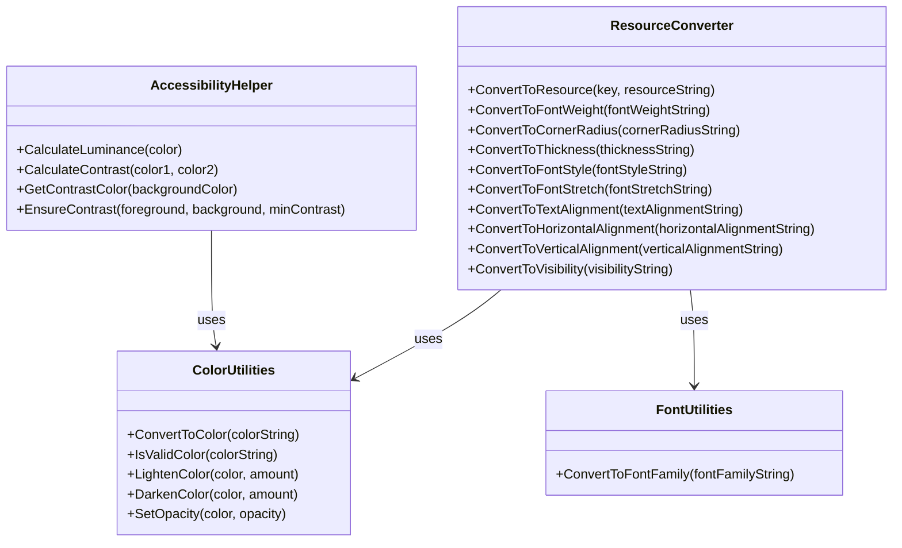

# Theme System Refactoring

## Overview

The theme system has been refactored to improve maintainability, separation of concerns, and code organization. The original `ThemeColorConverter` class was becoming too complex with multiple responsibilities, so it has been split into several focused utility classes.

## New Structure



## Classes

### ResourceConverter

Handles conversion of resource strings to WPF resources based on resource key patterns. This includes:
- Font weights
- Font families (via FontUtilities)
- Corner radii
- Thickness values
- Font styles
- Font stretches
- Text alignments
- Horizontal alignments
- Vertical alignments
- Visibility values
- Colors and brushes (via ColorUtilities)

### ColorUtilities

Handles color-specific operations:
- Converting color strings to Color objects
- Validating color strings
- Lightening colors
- Darkening colors
- Setting opacity

### AccessibilityHelper

Handles accessibility-related calculations:
- Calculating luminance
- Calculating contrast ratios
- Getting contrasting colors
- Ensuring sufficient contrast

### FontUtilities

Handles font-related operations:
- Converting font family strings to FontFamily objects with appropriate fallbacks

## Backward Compatibility

The original `ThemeColorConverter` class has been removed as part of the deprecation plan. All code has been updated to use the new utility classes directly.

## Migration Path

For new code, it's recommended to use the specific utility classes directly rather than going through `ThemeColorConverter`. This will make the code more maintainable and easier to understand.

## Deprecation Plan

The `ThemeColorConverter` class has been deprecated and removed in favor of the new utility classes. The deprecation plan has been completed:

1. **Phase 1: Update Direct Usages (March-April 2025)**
   - ✅ Identify all direct usages of `ThemeColorConverter` in the codebase
   - ✅ Update `EFBThemeManager.cs` to use the new utility classes
   - ✅ Update documentation to reflect the new utility classes
   - ✅ Create migration guide for developers

2. **Phase 2: Mark as Deprecated (May-June 2025)**
   - ✅ Add `[Obsolete]` attributes to all `ThemeColorConverter` methods
   - ✅ Include messages directing developers to the appropriate utility class
   - ✅ Update XML documentation to include deprecation notices
   - ✅ Communicate deprecation to development team
   - ✅ Ensure all new code uses the new utility classes

3. **Phase 3: Remove Compatibility Layer (Q3/Q4 2025)**
   - ✅ Verify all internal code uses the new utility classes
   - ✅ Verify no new code uses the deprecated `ThemeColorConverter`
   - ✅ Update all documentation to remove references to `ThemeColorConverter`
   - ✅ Remove `ThemeColorConverter.cs`
   - ✅ Remove `ThemeColorConverterBackwardCompat.cs`
   - ✅ Update architecture documentation to reflect the removal

For more details, see the [Theme System Deprecation Implementation](../../../memory-bank/theme-system-deprecation-implementation.md).

## Utility Classes Usage Guide

Use the following utility classes for theme-related operations:

1. **ColorUtilities**: For color-related operations
   ```csharp
   var color = ColorUtilities.ConvertToColor("#FF0000");
   var lighterColor = ColorUtilities.LightenColor(color, 0.2);
   var isValid = ColorUtilities.IsValidColor("#FF0000");
   var darkerColor = ColorUtilities.DarkenColor(color, 0.2);
   var transparentColor = ColorUtilities.SetOpacity(color, 0.5);
   ```

2. **AccessibilityHelper**: For accessibility-related calculations
   ```csharp
   var luminance = AccessibilityHelper.CalculateLuminance(color);
   var contrast = AccessibilityHelper.CalculateContrast(color1, color2);
   var contrastColor = AccessibilityHelper.GetContrastColor(backgroundColor);
   var adjustedColor = AccessibilityHelper.EnsureContrast(foreground, background, 4.5);
   ```

3. **FontUtilities**: For font-related operations
   ```csharp
   var fontFamily = FontUtilities.ConvertToFontFamily("Arial, Segoe UI");
   ```

4. **ResourceConverter**: For converting resource strings to WPF resources
   ```csharp
   var resource = ResourceConverter.ConvertToResource("ButtonBackgroundColor", "#FF0000");
   var fontWeight = ResourceConverter.ConvertToFontWeight("Bold");
   var cornerRadius = ResourceConverter.ConvertToCornerRadius("5");
   var thickness = ResourceConverter.ConvertToThickness("1,2,3,4");
   var fontStyle = ResourceConverter.ConvertToFontStyle("Italic");
   var fontStretch = ResourceConverter.ConvertToFontStretch("Condensed");
   var textAlignment = ResourceConverter.ConvertToTextAlignment("Center");
   var horizontalAlignment = ResourceConverter.ConvertToHorizontalAlignment("Left");
   var verticalAlignment = ResourceConverter.ConvertToVerticalAlignment("Top");
   var visibility = ResourceConverter.ConvertToVisibility("Visible");
   ```

## Future Improvements

1. Add unit tests for each utility class
2. Add more specialized utility methods for common theme operations
3. Improve documentation with more examples
