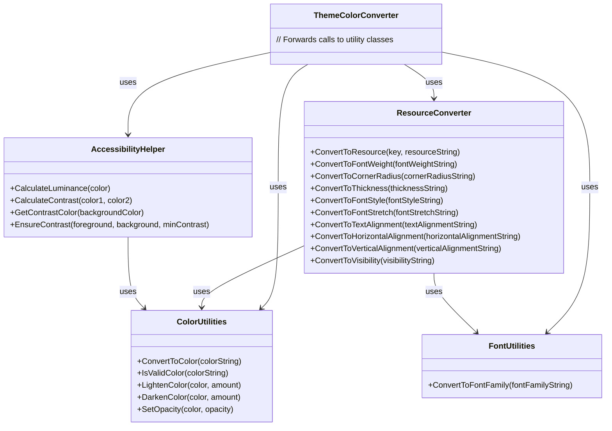

# Theme System Refactoring

## Overview

The theme system has been refactored to improve maintainability, separation of concerns, and code organization. The original `ThemeColorConverter` class was becoming too complex with multiple responsibilities, so it has been split into several focused utility classes.

## New Structure

## Classes

### ResourceConverter

Handles conversion of resource strings to WPF resources based on resource key patterns. This includes:
- Font weights
- Font families (via FontUtilities)
- Corner radii
- Thickness values
- Font styles
- Font stretches
- Text alignments
- Horizontal alignments
- Vertical alignments
- Visibility values
- Colors and brushes (via ColorUtilities)

### ColorUtilities

Handles color-specific operations:
- Converting color strings to Color objects
- Validating color strings
- Lightening colors
- Darkening colors
- Setting opacity

### AccessibilityHelper

Handles accessibility-related calculations:
- Calculating luminance
- Calculating contrast ratios
- Getting contrasting colors
- Ensuring sufficient contrast

### FontUtilities

Handles font-related operations:
- Converting font family strings to FontFamily objects with appropriate fallbacks

### ThemeColorConverter

Maintains backward compatibility by forwarding calls to the appropriate utility classes. This ensures existing code continues to work without changes.

## Backward Compatibility

The original `ThemeColorConverter` class has been preserved but refactored to forward all calls to the new utility classes. This ensures that existing code that uses `ThemeColorConverter` will continue to work without changes.

## Migration Path

For new code, it's recommended to use the specific utility classes directly rather than going through `ThemeColorConverter`. This will make the code more maintainable and easier to understand.

## Future Improvements

1. Consider adding unit tests for each utility class
2. Consider adding more specialized utility methods for common theme operations
3. Consider deprecating `ThemeColorConverter` in favor of the utility classes in a future release
