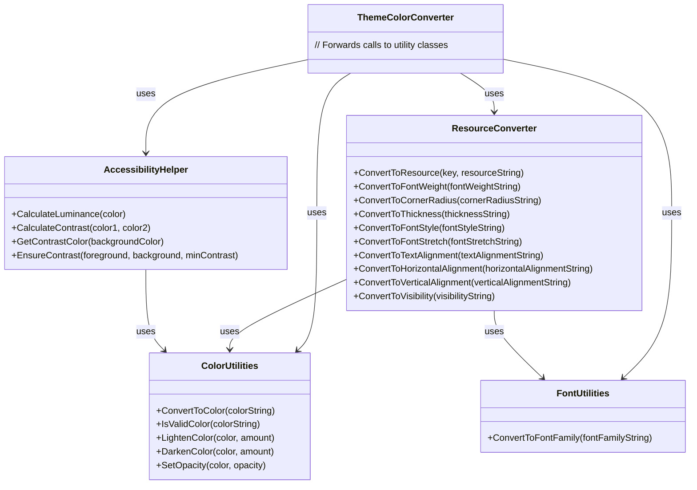

# Theme System Refactoring

## Overview

The theme system has been refactored to improve maintainability, separation of concerns, and code organization. The original `ThemeColorConverter` class was becoming too complex with multiple responsibilities, so it has been split into several focused utility classes.

## New Structure



## Classes

### ResourceConverter

Handles conversion of resource strings to WPF resources based on resource key patterns. This includes:
- Font weights
- Font families (via FontUtilities)
- Corner radii
- Thickness values
- Font styles
- Font stretches
- Text alignments
- Horizontal alignments
- Vertical alignments
- Visibility values
- Colors and brushes (via ColorUtilities)

### ColorUtilities

Handles color-specific operations:
- Converting color strings to Color objects
- Validating color strings
- Lightening colors
- Darkening colors
- Setting opacity

### AccessibilityHelper

Handles accessibility-related calculations:
- Calculating luminance
- Calculating contrast ratios
- Getting contrasting colors
- Ensuring sufficient contrast

### FontUtilities

Handles font-related operations:
- Converting font family strings to FontFamily objects with appropriate fallbacks

### ThemeColorConverter

Maintains backward compatibility by forwarding calls to the appropriate utility classes. This ensures existing code continues to work without changes.

## Backward Compatibility

The original `ThemeColorConverter` class has been preserved but refactored to forward all calls to the new utility classes. This ensures that existing code that uses `ThemeColorConverter` will continue to work without changes.

## Migration Path

For new code, it's recommended to use the specific utility classes directly rather than going through `ThemeColorConverter`. This will make the code more maintainable and easier to understand.

## Deprecation Plan

The `ThemeColorConverter` class has been marked as obsolete and will be deprecated in favor of the new utility classes. The deprecation plan is as follows:

1. **Phase 1: Update Direct Usages (March-April 2025)**
   - ✅ Identify all direct usages of `ThemeColorConverter` in the codebase
   - ✅ Update `EFBThemeManager.cs` to use the new utility classes
   - 🔜 Update remaining direct usages in other files
   - 🔜 Update documentation to reflect the new utility classes
   - 🔜 Create migration guide for developers

2. **Phase 2: Mark as Deprecated (May-June 2025)**
   - ✅ Add `[Obsolete]` attributes to all `ThemeColorConverter` methods
   - ✅ Include messages directing developers to the appropriate utility class
   - 🔜 Update XML documentation to include deprecation notices
   - 🔜 Communicate deprecation to development team
   - 🔜 Ensure all new code uses the new utility classes

3. **Phase 3: Remove Compatibility Layer (Next Major Version - Q3/Q4 2025)**
   - 🔜 Verify all internal code uses the new utility classes
   - 🔜 Verify no new code uses the deprecated `ThemeColorConverter`
   - 🔜 Update all documentation to remove references to `ThemeColorConverter`
   - 🔜 Remove `ThemeColorConverter.cs`
   - 🔜 Remove `ThemeColorConverterBackwardCompat.cs`
   - 🔜 Update architecture documentation to reflect the removal

For more details, see the [Theme System Deprecation Plan](../../../memory-bank/theme-system-deprecation-plan.md).

## Migration Guide

When updating code that uses `ThemeColorConverter`, follow these guidelines:

1. Replace `ThemeColorConverter.ConvertToColor()` with `ColorUtilities.ConvertToColor()`
2. Replace `ThemeColorConverter.IsValidColor()` with `ColorUtilities.IsValidColor()`
3. Replace `ThemeColorConverter.LightenColor()` with `ColorUtilities.LightenColor()`
4. Replace `ThemeColorConverter.DarkenColor()` with `ColorUtilities.DarkenColor()`
5. Replace `ThemeColorConverter.SetOpacity()` with `ColorUtilities.SetOpacity()`
6. Replace `ThemeColorConverter.CalculateLuminance()` with `AccessibilityHelper.CalculateLuminance()`
7. Replace `ThemeColorConverter.CalculateContrast()` with `AccessibilityHelper.CalculateContrast()`
8. Replace `ThemeColorConverter.GetContrastColor()` with `AccessibilityHelper.GetContrastColor()`
9. Replace `ThemeColorConverter.EnsureContrast()` with `AccessibilityHelper.EnsureContrast()`
10. Replace `ThemeColorConverter.ConvertToFontFamily()` with `FontUtilities.ConvertToFontFamily()`
11. Replace `ThemeColorConverter.ConvertToResource()` with `ResourceConverter.ConvertToResource()`
12. Replace `ThemeColorConverter.ConvertToFontWeight()` with `ResourceConverter.ConvertToFontWeight()`
13. Replace `ThemeColorConverter.ConvertToCornerRadius()` with `ResourceConverter.ConvertToCornerRadius()`
14. Replace `ThemeColorConverter.ConvertToThickness()` with `ResourceConverter.ConvertToThickness()`
15. Replace `ThemeColorConverter.ConvertToFontStyle()` with `ResourceConverter.ConvertToFontStyle()`
16. Replace `ThemeColorConverter.ConvertToFontStretch()` with `ResourceConverter.ConvertToFontStretch()`
17. Replace `ThemeColorConverter.ConvertToTextAlignment()` with `ResourceConverter.ConvertToTextAlignment()`
18. Replace `ThemeColorConverter.ConvertToHorizontalAlignment()` with `ResourceConverter.ConvertToHorizontalAlignment()`
19. Replace `ThemeColorConverter.ConvertToVerticalAlignment()` with `ResourceConverter.ConvertToVerticalAlignment()`
20. Replace `ThemeColorConverter.ConvertToVisibility()` with `ResourceConverter.ConvertToVisibility()`

### Example

Before:
```csharp
var color = ThemeColorConverter.ConvertToColor("#FF0000");
var lighterColor = ThemeColorConverter.LightenColor(color, 0.2);
var contrastColor = ThemeColorConverter.GetContrastColor(color);
```

After:
```csharp
var color = ColorUtilities.ConvertToColor("#FF0000");
var lighterColor = ColorUtilities.LightenColor(color, 0.2);
var contrastColor = AccessibilityHelper.GetContrastColor(color);
```

## Future Improvements

1. Add unit tests for each utility class
2. Add more specialized utility methods for common theme operations
3. Improve documentation with more examples
