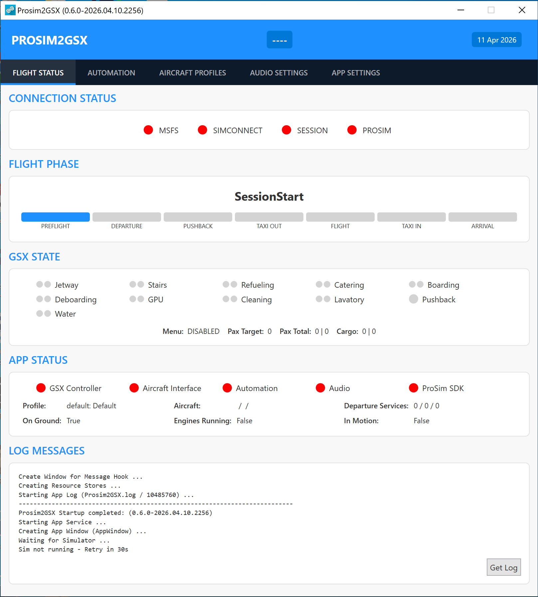
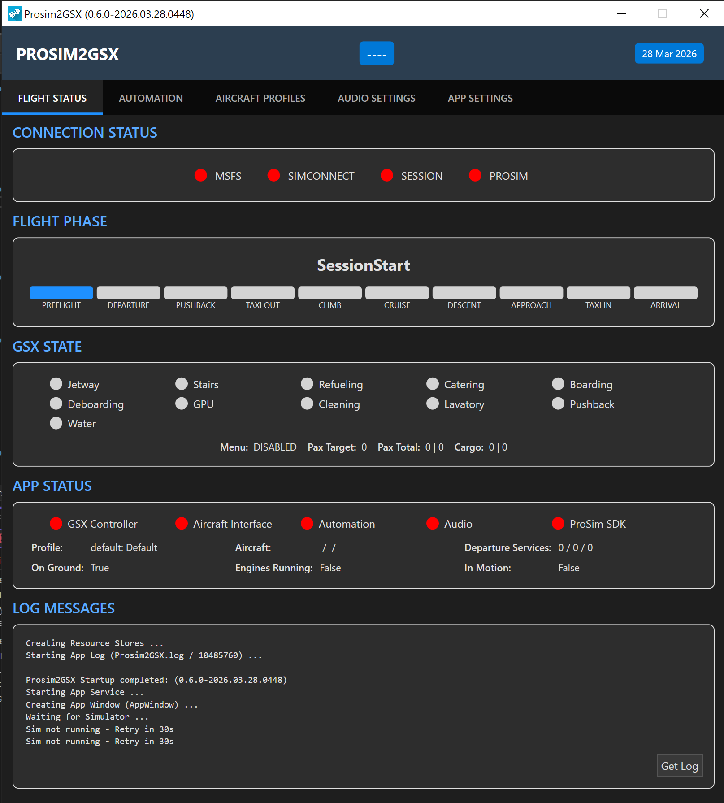

# Prosim2GSX
<br/>
Full and proper GSX Integration and Automation for the ProSim A320! <br/>

- The **Refuel Service is filling the Tanks** as planned (or more correctly GSX and ProSim are "synched")
- Calling **Boarding load's Passengers and Cargo**, as does Deboarding for unloading (or more correctly GSX and ProSim are "synched")
- **Ground Equipment** (GPU, Chocks, PCA) is automatically set or removed
- All **Service Calls** except Pushback, De-Ice and Gate-Selection **can be automated**
- Using the **INT/RAD** Switch as a Shortcut for certain GSX Interactions (i.e. call / confirm Pushback)
- **GSX Audio** and **ATC Volume** can be controlled via the **INT/VHF1-Knob** from the ACP in the Cockpit
- Applications can be **freely mapped** to Audio-Channels
- Can be used, within certain Limits, with the native Integration
- Supports to use the Volume Control without having GSX installed or running (or to solely use the native Integration)

<br/><br/>

## 1 - Introduction

### 1.1 - Requirements

- Windows 10/11, MSFS 2020/2024, ProSim A320 latest :wink:
- A properly working and updated GSX Installation
- Capability to actually read the Readme up until and beyond this Point :stuck_out_tongue_winking_eye:
- The Installer will install the following Software automatically:
  - .NET 10 Desktop Runtime (x64) - Reboot your System if it was installed for the first Time

<br/>

[Download here](https://github.com/psyraxaus/Prosim2GSX/releases/latest)

(Under Assests, the Prosim2GSX-Installer-vXYZ.exe File)
<br/>

### 1.2 - Installation, Update & Removal

Just [Download](https://github.com/psyraxaus/Prosim2GSX/releases/latest) & Run the **Installer** Binary! It will check and install all Requirements the App (or remove it). Your existing Configuration persists through Updates.<br/>
On the second Installer Page you can select if Auto-Start should be set up for Prosim2GSX (recommended for Ease of Use).<br/>
You do **not need to remove** the old Version for an Update (unless instructed) - using 'Remove' in the Installer completely removes Prosim2GSX and removes it from Auto-Start. This also removes your Configuration including Aircraft Profiles and saved Fuel!<br/><br/>

It is highly likely that you need to **Unblock/Exclude** the Installer & App from BitDefender and other AV-/Security-Software.<br/>
**DO NOT** run the Installer or App "as Admin" - it might work, it might fail.<br/><br/>

When **Upgrading** from Versions **before 0.5.0**:
- Remove the old Version first (with the new Installer)!
- You only need to backup your old Config if you want to go back (the old and new Config Formats are incompatible)
- The MobiFlight Module is not required anymore, the Installer will offer an Option to remove it - if MF Connector and PilotsDeck are not detected.
- Even then it is *your Responsibility* to know if the MobiFlight Module is not required for other Addons on your System and safe to remove!

<br/>

Prosim2GSX will display a **little Exclamation Mark** on its SysTray/Notification Area Icon if a **new Version** (both Stable and Development) is available. There is no Version Pop-Up and there will never be.
<br/><br/>

### 1.3 - Auto-Start

When starting it manually, please do so when MSFS is loading or in the **Main Menu**.<br/>
To automatically start it with **FSUIPC or MSFS**, select the respective Option in the **Installer**. Just re-run it if you want to change if and how Prosim2GSX is auto started. Selecting one Option (i.e. MSFS) will also check and remove Prosim2GSX from all other Options (i.e. FSUIPC), so just set & forget.<br/>
For Auto-Start either your FSUIPC7.ini or EXE.xml (MSFS) is modified. The Installer does not create a Backup (not deemed neccessary), so if you want a Backup, do so yourself.<br/><br/>

#### 1.3.1 - Addon Linker

If you use Addon Linker to start your Addons/Tools, you can also add it there:<br/>
**Program to launch** C:\Users\YOURUSERNAME\AppData\Roaming\Prosim2GSX\bin\Prosim2GSX.exe<br/>
**Wait for simconnect** checked<br/>
The Rest can be left at Default.
<br/><br/>

### 1.4 - Release & Dev/Beta Versions

There are two Version Channel for Updates to be released:

1) The "**Dev**" or "Beta" Version is located in the Source Files as [Prosim2GSX-Installer-latest](https://github.com/psyraxaus/Prosim2GSX/blob/master/Prosim2GSX-Installer-latest.exe)
2) The "**Release**" or "Stable" Version is located under [Releases](https://github.com/psyraxaus/Prosim2GSX/releases) (Under Assests, the Prosim2GSX-Installer-vXYZ.exe File)

Whenever there is a new Commit to Code, the -latest Installer will contain these Changes. For example Fixes to open Issues, Changes for ProSim or GSX Updates or new Features added. So that these Changes & Fixes can be tested publicly.<br/>
After some Time and positive/good Feedback, all these Changes will be published as the Release Version.<br/>
So some general Rule-of-Thumbs:

- Most Users should use the Release Version
- If experiencing an Issue, then try if the Dev Versions works better
- When eager to test new Stuff as soon as possible, you're welcome to use the Dev Version, as long as you understand it as something that is being worked on 😉


<br/><br/><br/>

## 2 - Configuration

### 2.1 - ProSim EFB

Make sure your **Default State** is set to either Cold & Dark or Turn-Around with GPU or APU - GSX won't provide any Services when the Engines are running.<br/>
All other relevant EFB Options will automatically be disabled by Prosim2GSX (including Audio Mappings). Note that they are not re-enabled!<br/>

<br/><br/>

### 2.2 - GSX Pro

- Prosim2GSX includes custom **GSX Aircraft Profiles** for all three A322 variants (CFM, IAE, NEO) which are installed automatically to `%appdata%\Virtuali\Airplanes` during installation. If existing profiles are detected, the installer will ask whether you want to overwrite them.
- It is recommended (but not required) to enter your **SimBrief Username** and have **Ignore Time** checked to have correct Information on the VDGS Displays.
- The De-/Boarding Speed of Passengers is dependant on the Passenger Density Setting (GSX In-Game Menu -> GSX Settings -> Timings). Higher Density => faster De/Boarding (But "Extreme" can be to extreme in some Cases).
- Ensure the other two Settings under Timings are on their Default (15s, 1x).
- As with GSX itself, Prosim2GSX runs best when you have a proper Airport Profile installed!
- Up to everyone's *Preference*, but disabling the **Aural Cues** (GSX In-Game Menu -> GSX Settings -> Audio) and setting **Message verbosity** to "*only Important*" (GSX In-Game Menu -> GSX Settings -> Simulation) can improve Immersion! 😉

#### GSX Settings - Simulation

The following settings should be configured on the **Simulation** tab (GSX In-Game Menu -> GSX Settings -> Simulation):


**Enabled (checked):**
- Multiple trips
- Airport walkers
- Good engine start confirmation
- Speed up far vehicles
- Pushback Wingwalkers
- Progressive taxi AI rerouting
- Loaders stay until departure

**Disabled (unchecked):**
- Estimate passengers number
- Always refuel progressively
- Detect custom aircraft system refueling
- Assistance services Auto Mode
- Auto Mode ignore doors
- Automated staircases
- Automated reposition
- Ignore wingspan when parking
- Always ask for pushback
- FollowMe disable flee
- Disable rear staircases if jetway
- Connect Pushback on Boarding
- Ignore crew in boarding/deboarding
- Disable GSX in cruise
- Ignore icing condition in Pushback

<br/><br/>

### 2.3 - Prosim2GSX

The Configuration is done through the **GUI**, open it by **clicking on the System-Tray/Notification-Icon**. You do not need to configure anything to start using Prosim2GSX - although it is *recommended to get yourself familiar* with the Settings. Change them to your Preferences in order to improve your Experience. The default Settings aim to maximize Automation respectively minimize GSX Interaction. All Options have **ToolTips** to explain them further.<br/>
Everything is stored persistently in the *AppConfig.json* File in the Application's Folder - so backup that File in order to backup your Settings!<br/>

<br/>

The GUI uses a modern **EFB-style card layout** with a left-hand navigation tab strip. The interface is fully themeable — select from the built-in themes (Light, Dark, and several airline-inspired options such as Delta, Finnair, Lufthansa and Qantas) or create your own by dropping a JSON file into the `Themes` folder beside the executable. See **[Themes/THEMES.md](Prosim2GSX/Themes/THEMES.md)** for full documentation on creating custom themes.

| Light theme | Dark theme |
|---|---|
|  |  |

<br/><br/>
Allmost all Settings regarding GSX, ProSim and the general Automation can be found in the '**GSX Settings**' View. All Settings in this View are stored in a Profile.<br/>
The '**OFP**' View shows the loaded Operational Flight Plan, lets you assign an Arrival Gate to ATC and GSX, and shows ATIS / METAR for Departure and Arrival when SayIntentions is enabled.<br/>
You can have many different Profiles which are automatically loaded depending on the current Aircraft's Registration, Title or Airline. To manage these Profiles use the '**Aircraft Profiles**' View.<br/>
In order map Applications to the different ACP Audio Channels, use the '**Audio Settings**' View. The Audio Settings are global - thay apply to all Profiles. Volume Control is generally independent from the GSX Integration/Automation.<br/>
All central Settings regarding the Application (so applying to all Profiles) are found in the '**App Settings**' View. The **Theme** selector and the **Use SayIntentions** toggle are also located here — Theme changes apply immediately without a restart.<br/><br/>
Most Settings can be **changed dynamically** on the Fly, **BUT**: only change Settings not relevant in the current Automation/Flight Phase. For Example do not change the Departure Services in the Departure Phase and do not change Profiles while Services are active.<br/><br/>
In general, it is up to **your Preference how much Automation** you want. I you want to keep Control of when Services are Called and/or the Jetway is connected, you can still enjoy the (De-)Boarding and Refueling Syncronization when the Automation-Options are disabled. The only Automation which **can not be disabled**: The Removal of the Ground-Equipment is always active to assist with Departure & Push-Back and Arrival.

<br/><br/>

#### 2.3.1 - GSX Settings

These are basically the core Settings to customize the Automation to your own Service-Flow. All Settings in this View are associated to an Aircraft Profile. The currently loaded Profile's Name is displayed on the Category Selection.<br/>
The Settings are grouped into different Categories:<br/><br/>

**Gate & Doors**

Handling if and when the Jetway and or the Stairs are called or removed.<br/>
It also allows you to completely disable the Door Automation. But even then the Doors will automatically be closed when Pushback or Deice become active!

<br/>

**Ground Equipment**

Configure the Chock-Delay, PCA Handling or the Removal when the Beacon is turned on.<br/>
Note: Basic Ground Equipment Handling (GPU, Chocks) is always active and can not be disabled. Prosim2GSX will automatically place or remove the Equipment on Startup, during Pushback and on Arrival.<br/>
When the **Beacon-orchestrated Pushback Sequence** is enabled (default — see Section 3.1.4), GPU / PCA / Chocks removal happens as part of the sequence's GPU step with its own random delay, rather than on the legacy beacon gate. Either way, the underlying safety interlocks (GPU needs External Power off; Chocks need Brake set) still apply.

<br/>

**GSX Services**

Configure how the GSX Services are handled:
- Reposition on Startup (either use Prosim2GSX for that or the GSX Setting - but not both!)
- The Service Activation (if and when) and Order of the Departure Services (Refuel, Catering, Boarding as well as Lavatory & Water)
- If the Departure Services should already be called while Deboarding
- How Refueling is handled: with a fixed Rate, a fixed Time Target or via Refuel Panel (or if the GSX Service is called at all to support Tankering)
- With the Refuel Panel Method, the Rate is determined by the EFB Settingn
- If and when Pushback should be called automatically
- The **Beacon-orchestrated Pushback Sequence** (`SequenceOnBeacon`, default on) and the random per-step delay bounds for Doors close, Jetway retract, and GPU disconnect (see Section 3.1.4 for the full flow)

<br/>

**Operator Selection**

Enable or Disable the automatic Operator Selection. You can also define Preferences to control which Operator is picked by Prosim2GSX! If no preferred Operator is found, it will use the 'GSX Choice' in the Menu.<br/>
The Preferred Operator List Operator List works only on the *Name* of the Operator as seen in the *GSX Menu*!<br/>
The Strings you add to the Preferred Operator List will be used in a (case insensitive) Substring-Search - so does *Name* listed in the *Menu* contains that Text. The List is evaluated from Top to Bottom - so the higher of two available Operator is choosen.

<br/>

**Company Hubs**

Manage a List of *Airport* ICAO Codes which define "Company Hubs" for this Aircraft Profile. 1 to 4 Letters per Code.<br/>
The Codes are matched in the Order of the List, from Top to Bottom. For each Code, the Departure ICAO is matched if it starts (!) with the Code - so you can define whole Regions.<br/>
If your current Departure Airport is matched, Departure Services with the "Only on Hub" Constraint will be called. Consequently, Services with the "Only on Non-Hub" Constraint, will only be called if the Airport is *not* matched.

<br/>

**Skip Questions**

All Options related to skip / automatically Answer certain GSX Questions or Aircraft Interactions: Crew Question, Tug Question, Follow-Me Question, ProSim Cabin-Calls and reopen the Pushback Menu.

<br/>

**Aircraft Options**

Delay for the Final Loadsheet, Save & Load of the Fuel on Board, Randomization of Passengers on OFP Import.<br/>
By default, Prosim2GSX saves the FOB per Aircraft Registration upon Arrival. When you load the same Registration in another Session, it will load/restore the last saved FOB on Startup. If no saved Fuel Value can be found, it uses the Default Value set under App Settings (3000kg).

<br/><br/>

#### 2.3.2 - OFP

The OFP tab gives you a one-glance view of the loaded Operational Flight Plan, lets you assign an Arrival Gate to both ATC (via SayIntentions) and GSX, and shows live ATIS / METAR for Departure and Arrival when SayIntentions is enabled.


The tab populates in stages:
- **Departure / Arrival ICAO** appear as soon as the Flight Plan is loaded into the MCDU (read directly from `aircraft.fms.origin` / `aircraft.fms.destination`).
- **Route details** (Flight #, planned RWY, Alternate, Cruise FL, Block fuel, Block time, Pax, Air distance) populate after the SimBrief OFP has been imported.
- **ATIS / METAR / wind / runway** are fetched from SayIntentions on tab open and via the **Refresh** button.

##### Arrival Gate Assignment

Type the destination gate identifier (e.g. `B38`, `W34A`) and click **Confirm**. The gate is **queued** but not transmitted yet — both ATC and GSX assignments are deferred until the aircraft reaches cruise (`AutomationState.Flight`), where they fire automatically. You can also click **Send Now** at any time to push the queued gate immediately (e.g. on short final).

The two status lines beneath the buttons report each channel independently:
- **ATC** — uses the SayIntentions `assignGate` API. Requires SayIntentions to be running with a flight loaded.
- **GSX** — drives the GSX in-game menu (Select airport → Apron group → Stand) to set the parking position. The selector navigates the multi-level menu automatically and matches your typed gate against gate-range rows like *"Apron 1W (Gates W34-W48)"*.

If either side fails, click **Send Now** again — only the failed channel is retried.

##### SayIntentions Integration (optional)

[SayIntentions.AI](https://p2.sayintentions.ai/p2/docs/) is an optional ATC-style add-on. Prosim2GSX integrates with it for two purposes: arrival gate assignment and weather (ATIS / METAR) display.

To enable:
1. Install and run **SayIntentions** — see the [SayIntentions documentation](https://p2.sayintentions.ai/p2/docs/) for setup. When a SimBrief OFP is loaded, SayIntentions normally starts a flight session automatically.
2. In Prosim2GSX, open **App Settings** → tick **Use SayIntentions**.

Prosim2GSX reads your API key from `%LOCALAPPDATA%\SayIntentionsAI\flight.json` (the `flight_details.api_key` field) — there's nothing to enter manually. The file is re-read on every API call, so the toggle becomes effective immediately without restarting the app.

Behaviour notes:
- **Arrival gate assignment** requires an *active SayIntentions flight session* (SayIntentions running with a flight loaded — usually automatic when SimBrief is being used). If no session is active you'll see *"No active flight could be found"* on the ATC status line.
- **Weather (ATIS/METAR)** does *not* require an active session — only the API key. A single API call covers both ICAOs.
- When **Use SayIntentions** is unchecked, the OFP tab still works for GSX gate assignment; the ATC channel is simply skipped.

<br/><br/>

#### 2.3.3 - Aircraft Profiles

The Idea behind Aircraft Profiles is to have *different Automation Settings* for *different Operators* without having the Need to change the Settings manually every time.<br/>
The *Profile Name* is only for display Purposes, it doesn't have a functional Impact. The *Match Type* defines on what Aircraft Information the *Match String* will be compared to. The Match String can contain multiple Values separated by a Pipe `|` - for Example `Condor|CFG` for a Match String for the Airline.<br/>
When the Session starts and the Connection to the ProSim EFB was successful, Prosim2GSX will automatically switch to the Profile with the best Match:
1) The Aircraft Registration (as reported by the EFB) is matching exactly (case insensitive)
2) The Aircraft Title or Livery (as reported by the Sim) contains the Match String (case insensitive)
3) The Aircraft Airline (as reported by the Sim) starts with the Match String (case insensitive) - only applies to 2020! Use Title/Livery to match an Airline on 2024.

If there a multiple Results, only the first one will be used. If you want to switch to another Profile, do so before the Departure Phase (OFP was imported).<br/>
The **default Profile** can not be deleted and there can only ever be one Profile using the 'Default' Match Type.

<br/><br/>

#### 2.3.4 - Audio Settings

Prosim2GSX will only start to control Volume once the Plane is **powered** (=DC Essential Bus powered). When the Aircraft is powered, Prosim2GSX will set each Audio-Channel to the configured Startup State (e.g. 100% Volume and unmuted for VHF1). **Only one ACP** Panel is used for Volume Control at any given time. But you can change your Seat Position / Panel at any Time (the Startup State is only applied to the Panel selected at that Time).<br/>
Prosim2GSX will automatically disable the native Volume Control when it starts. If you want to use the native Volume Control, disable the Volume Controller in the App Settings. In any Case: do not let both Apps control the same Stuff!<br/><br/>

When you end your Session (or close Prosim2GSX), Prosim2GSX will try to reset all Audio Sessions of the controlled Applications to their last known State (before it started controlling the Volume). That might not work on Applications which reset their Audio Sessions at the same Time (like GSX). So **GSX can stay muted** when switching to another Plane (if it was muted) - keep that in Mind.<br/>
Prosim2GSX will control **all Audio Sessions** on all Devices for a configured Application by default. You can change the Configuration to limit the Volume Control to a certain Device per Application - but on that Device it will still control all Sessions at once.<br/><br/>

You can map freely Applications to any of the ACP Channels. Per Default ATC Applications are controlled by VHF1, GSX by INT and the Simulator by CAB. You change the Mappings to your Preferences. All Mappings are global - they are not associated to an Aircraft Profile!<br/>
To identify an Application you need to enter it's Binary Name without .exe Extension. The UI will present a List of matching (running!) Applications to your Input to ease Selection. The **Use Mute** Checkbox determines if the **Record Latch** (=Knob is pulled or pushed) is used to mute the Application.<br/><br/>

Some Audio Devices act 'strangely' or throw Exceptions when being scanned by Prosim2GSX for Audio-Sessions. If you have such a Device, you can add it to the Blacklist so that Prosim2GSX ignores it (normally it should automatically add Devices throwing Exceptions).<br/>
But there also Cases where Input (Capture) Devices are reported as Output (Render) Devices which leads to Any2GSX controlling the Volume of your Microphone! In such Cases these "false-output" also need to be added to the Blacklist.<br/>
Matching is done on the Start of the Device Name, but it is recommended to use the exact Device Name for blacklisting. Tip: when you hit Ctrl+C on the Device Dropdown (under App Mappings), the selected Device's Name is automatically pasted to Blacklist Input Field.

<br/><br/>

#### 2.3.5 - App Settings

These global Settings affect all Profiles and basic App Features. In most cases you only need to check if the Weight per Bag matches to your SimBrief Profile (the default Value matches the Default in the official SimBrief Profile).<br/>
You might want to change the Weight Unit used in the UI, but you don't need to match that to SimBrief or the Airplane - it's just for displaying Purposes.<br/>
Depending on your Preferences, you might want to check the Settings to round the planned Block Fuel or skipping Walkaround.<br/>
If you only want to use Prosim2GSX for Volume-Control, uncheck 'Run GSX Controller' - in all other Cases leave it on!<br/>
Tick **Use SayIntentions** to enable the SayIntentions ATC and weather integration on the OFP tab — see Section 2.3.2 for details.

<br/><br/>

#### 2.3.6 - Running ProSim on a Separate Computer

Prosim2GSX supports setups where **ProSim runs on a different PC** to MSFS/Prosim2GSX (a common networked "sim rig" setup). Two small configuration changes are required on the MSFS PC — the one running Prosim2GSX.

**Step 1 — Point Prosim2GSX at the ProSim SDK file on the other computer**

The ProSim SDK (`ProSimSDK.dll`) lives inside your ProSim installation folder on the ProSim PC. Prosim2GSX needs to be able to read that file over the network.

1. On the ProSim PC, locate the folder containing `ProSimSDK.dll` (typically inside the `ProSim...\ProSimA322-System\` or similar folder).
2. **Share that folder** on the network so the MSFS PC can read it. Right-click the folder → *Properties* → *Sharing* → grant read access to the MSFS PC's user account (or everyone on a trusted home network).
3. On the **MSFS PC**, open Prosim2GSX → **App Settings** tab → set the **ProSim SDK Path** to the UNC path of the shared DLL, for example:
   ```
   \\PROSIM-PC\ProSimA320\ProSimA322-System\ProSimSDK.dll
   ```
   Replace `PROSIM-PC` with the actual computer name (or IP address) of the machine running ProSim.
4. **Restart Prosim2GSX** — the SDK is only loaded once at startup.

**Step 2 — Tell Prosim2GSX which computer ProSim is running on**

By default, Prosim2GSX assumes ProSim is on the same PC (`localhost`). For a remote setup you need to change this in the configuration file.

1. **Close Prosim2GSX** first (right-click the tray icon → *Exit*). Editing the config while the app is running will have your changes overwritten on shutdown.
2. Open File Explorer and paste this into the address bar, then press Enter:
   ```
   %appdata%\Prosim2GSX
   ```
3. Open `AppConfig.json` in Notepad (or any text editor).
4. Find the line that looks like this:
   ```json
   "ProSimSdkHostname": "localhost",
   ```
5. Replace `localhost` with the **computer name or IP address of the PC running ProSim**. Keep the quote marks and the trailing comma. Examples:
   ```json
   "ProSimSdkHostname": "PROSIM-PC",
   ```
   or
   ```json
   "ProSimSdkHostname": "192.168.1.50",
   ```
6. Save the file and close Notepad.
7. Start Prosim2GSX again.

**Step 3 — Make sure the two PCs can talk to each other**

- Both computers need to be on the **same local network** (same router / Wi-Fi).
- Ensure **ProSim is running** on the other PC *before* you start Prosim2GSX — or at least before the flight is loaded.
- If Windows Defender Firewall is **enabled** on the ProSim PC, you need to allow two inbound TCP ports so Prosim2GSX on the MSFS PC can reach it:
  - **TCP 8082** — ProSim SDK
  - **TCP 5000** — ProSim EFB (GraphQL / REST / loadsheet)

  If the firewall is disabled on the ProSim PC, skip this and move on.

  You can open the ports either via the GUI or with a single PowerShell command — pick whichever you prefer.

  **Method A — Windows Defender Firewall GUI (on the ProSim PC):**
  1. Press `Win+R`, type `wf.msc`, press Enter.
  2. In the left pane select *Inbound Rules*, then in the right pane click *New Rule…*.
  3. Rule type: *Port* → *Next*.
  4. Select *TCP*, then *Specific local ports* and enter: `8082, 5000` → *Next*.
  5. *Allow the connection* → *Next*.
  6. Leave all three profiles ticked (*Domain*, *Private*, *Public*) — or un-tick *Public* if this PC ever joins untrusted networks → *Next*.
  7. Name the rule `Prosim2GSX (ProSim SDK + EFB)` → *Finish*.

  **Method B — PowerShell (run as Administrator on the ProSim PC):**
  ```powershell
  New-NetFirewallRule -DisplayName "Prosim2GSX (ProSim SDK + EFB)" `
    -Direction Inbound -Action Allow -Protocol TCP -LocalPort 8082,5000
  ```

  To remove the rule later:
  ```powershell
  Remove-NetFirewallRule -DisplayName "Prosim2GSX (ProSim SDK + EFB)"
  ```

**How to check it's working**

- Open the Prosim2GSX window → **FLIGHT STATUS** tab.
- The *App State* section should show a green *Connected* indicator to ProSim after a few seconds.
- If it stays red, check the log file in `%appdata%\Prosim2GSX\log\` — it will say whether the SDK file was found, and whether the connection to the remote host succeeded.

<br/><br/><br/>

## 3 - Usage

### 3.1 - General Service Flow / SOP
Note that Prosim2GSX **does not open a Window** when started - it is designed to run in the Background, the Window/GUI is only there for Configuration! There is no Need to have the GUI opened while running the Sim. When you do open the GUI, it can safely be closed (it only closes that Window, it does not Stop the Binary/App itself).
<br/><br/>

#### 3.1.1 - Pre-Flight

- Ensure you use the **correct SimBrief Airframe** Configuration provided by ProSim (with the correct Registration)!
- Ensure that the **Units** used in SimBrief **match** the Units used in the EFB/Aircraft!
- Ensure your default State is either **Cold & Dark** or **Turn-Around with GPU or APU**!

Besides these general Best Practices, there is nothing Special to consider - Plan your Flight as you always do.
<br/><br/>

#### 3.1.2 - Cockpit Preparation

- Make sure Prosim2GSX was already started **before** starting the Session!
- MSFS2024: When **Walkaround** is configured to be **skipped**, Prosim2GSX refocuses MSFS Window repeatedly. This already starts when the Session is about to become ready. So refrain from doing something else in another Window while Walkaround is skipped.
- **Wait** until Prosim2GSX has finished it Startup Steps like Repositioning (if configured), calling Jetway/Stairs (if configured) and restoring the last stored Shutdown FOB.<br/>You will be informed with the Cabin **"Ding" Sound** when it has finished these Steps. **Wait** for that Signal **before doing anything** in the EFB or powering up the Plane (when starting Cold & Dark).
- If you have disabled to call Jetway/Stairs on Session Start, you can use the **INT/RAD** Switch (move to the INT Position) to call them at your Discretion (before the Flightplan is imported).
- When the Jetway/Stairs are called after Walkaround has ended (either Way), Prosim2GSX will remove ProSim's native Stairs
- Mind that selecting a **Panel-State** in the EFB also changes the **ACP State** - that will override Startup State set by Prosim2GSX.
- After that **import the Flightplan** into the EFB to get the Automatic Service-Flow going -OR- **before** you call any GSX Service manually (if you have disabled the Automations).
- It is recommended to **power-up** the Aircraft **before importing** the Flightplan
- If you plan to use **any EFB Loading** Option, remember that you have the Departure Services configured in a certain Way!

<br/><br/>

#### 3.1.3 - Departure Phase

- If you have **choosen to disable** the Automations, call the GSX Services at your Discretion. Note that you do need to **call all Departure Services** which are set to 'Manual' (so that Prosim2GSX switches properly to the Pushback Phase).
- If you **kept on** the Automations, it is advisable to **disable the GSX Menu** (=Icon not white in the Toolbar) to prevent the Menu being displayed when Services are called by Prosim2GSX. (When using the Default Toolbar, see Addon NOTAMs for Flow)
- **Do not** use *Load Aircraft* in the EFB when you intent to use Prosim2GSX for loading the Aircraft!
- **Do not** use *Reset All* regardless if loading through GSX or EFB!
- Use of **Walkaround Mode** while Services are running is **possible with Constraints**:
  - Do not use Walkaround Mode when Doors are about to be opened/closed (else they can't be handled)
- When and in which Order the GSX Services are called depends on your Configuration, per Default it is Refuel + Catering -> Water -> Boarding. You can use the **INT/RAD** Switch to call the next Service in the Queue - i.e. call Boarding earlier.
- The PCA will be removed anytime the **APU is running** and the APU **Bleed is On** (regardless if you have configured Prosim2GSX to place it).
- When **all** Departure Services are **completed** (typically after Boarding), Prosim2GSX will switch to the Pushback Phase. The **Final Loadsheet** will be transmitted 90 - 150 Seconds (Delay configurable) after the Services are completed. 
- With default Settings, the Rear-Stair on Jetway Stand will be removed once the Services are completed.

<br/><br/>

#### 3.1.4 - Pushback Phase

Prosim2GSX supports **two departure flows** in the Pushback Phase, selected by `SequenceOnBeacon` in the Aircraft Profile. The default (sequence) flow is a realistic, beacon-orchestrated ground-handling chain; the legacy flow is the original independent-trigger behaviour.

##### Default: Beacon-orchestrated Sequence (`SequenceOnBeacon = true`)

The sequence treats **Beacon ON** as the single "about-to-push" signal and runs the ground-handling steps in a realistic order, with randomised delays between each step to mimic real ground-crew timing.

1. **Turn Beacon ON** — Prosim2GSX enters the sequence and waits for APU to be running *and* the Final Loadsheet to have been transmitted. If APU is not running after 2 minutes a warning is logged every 60 s (configurable via `SequenceApuStallTimeoutSec`, `0` disables).
2. **Doors Close** — after a random 15-30 s delay.
3. **Jetway / Stairs retract** — after another random 15-30 s delay.
4. **Ground Equipment cleared** — GPU, PCA and Chocks released after another random 10-20 s delay. The existing safety interlocks still apply (GPU only if External Power disconnected, Chocks only if Brake set).
5. **Ready for Push** — sequence idles here. If `CallPushbackOnBeacon = true`, pushback is called automatically; if `false`, press **INT/RAD** to call it.

During the sequence:
- **INT/RAD** on any step skips that step's remaining random delay and performs its action immediately (e.g. "I'm ready, close the doors now"). At Ready-for-Push it calls pushback.
- **Turning Beacon OFF** pauses the sequence in place; turning it back ON resumes from the same step with no state loss. An APU shutdown behaves the same way.
- The `CloseDoorsOnFinal` and `RemoveJetwayStairsOnFinal` profile options are **ignored** when the sequence is enabled — the sequence owns those transitions.
- The per-step min/max delays are configurable in the Aircraft Profile (`SeqDoorsCloseDelayMin/Max`, `SeqJetwayRetractDelayMin/Max`, `SeqGpuDisconnectDelayMin/Max`).

##### Legacy: Independent Triggers (`SequenceOnBeacon = false`)

- Jetway/Stairs are removed and Doors are closed once the **Final Loadsheet** is received (`CloseDoorsOnFinal`, `RemoveJetwayStairsOnFinal`).
- You can call GSX Pushback with the **INT/RAD** Switch, or automatically via `CallPushbackOnBeacon` once Beacon is on (requires Brake set, Engines off, External Power disconnected).
- With `ClearGroundEquipOnBeacon`, Ground-Equipment is removed once you turn on the Beacon (again: External Power disconnected and Brake set).

##### Common to both flows

- You need to **enable the GSX Menu again** for the Pushback Phase to interact with the Menu! Prosim2GSX does not answer the Deice Question or select Pushback Direction.
- With default Settings, Prosim2GSX will **automatically reopen** the Pushback Direction Menu if the GSX Menu should time out (hides itself again).
- **Ground-Equipment** will also be removed automatically when GSX Pushback/Deice Service is running or when the Engines are running (=start combusting).
- Ground-Equipment is only ever **removed when safe** — i.e. the GPU is only removed when External Power is disconnected or the Chocks when the Brake is set.
- Consider to only call GSX Pushback (either Way) on **Taxi-Out Gates** which are correctly configured in the Airport Profile for that!
- When the Push is running, you can disable the Menu again — you can use the **INT/RAD** Switch to Stop the Push or Confirm the Engine Start (that means Menu Option 1 is always selected when you move the Switch).
- **DO NOT USE ABORT PUSHBACK** (And if only as the very very last Resort, early stopping the Pushback is meant to be commenced with "Stop". If you abort, please set your Parking Brake.)

<br/><br/>

#### 3.1.5 - Taxi-Out Phase

- With default Settings, Prosim2GSX will **automatically answer the Cabin Call** while taxiing
- There is no further Automation or Integration for the Deicing (on Deice Pads), but note that the Operator Selection is also active in this Phase!
- If you loaded your Session **directly on the Runway**, Prosim2GSX will already start in this Phase. So do not spawn on a Runway if you plan to use Departure Services!

<br/><br/>

#### 3.1.6 - Flight Phase

- Enjoy your Flight :wink: Note that Prosim2GSX can be (re)started while you are Airbone. It will continue with the Arrival Services as normal.
- With default Settings, Prosim2GSX will **automatically answer the Cabin Call** on Approach

<br/><br/>

#### 3.1.7 - Taxi-In Phase

- Once the Aircraft is on the Ground again and below 30 Knots, Prosim2GSX will switch to the Taxi-In Phase.
- You can configure Prosim2GSX to (hard) Restart GSX when switching to that Phase
- Please **pre-select** the Gate in the GSX Menu **while** you're **taxiing** to it. If enabled, it will automatically answer the Follow-Me Question with 'No' and select the Operator if needed.
- When using all Automations, you can disable the GSX Menu again after Gate Selection.

<br/><br/>

#### 3.1.8 - Arrival Phase

- The Arrival Phase will only begin once the Aircraft is truly parked: **Brake set, Engines off, Beacon off, and Ground Speed zero** — held stable for a short window (configurable via `ArrivalHoldTicks`, default ~1.5 s). This prevents false triggers during engine-out taxi stops or momentary halts mid-taxi.
- **Chocks** will be placed 10-20 Seconds after the Aircraft is parked. The chock task re-verifies the parked state at placement time, so chocks are never set on an aircraft that has restarted engines or started moving again. When the Chocks are placed, Prosim2GSX presses the overhead **MECH Call** button — Prosim then drives the chime and INT-call lamp flash natively on both ACPs. You can release the Parking Brakes then.
- **GPU** and **PCA** (if configured) will be connected once the Jetway or Stairs are connected (or when Deboarding starts), subject to standard safety checks — chocks in place, engines off, and no External Power already connected. No forced writes; the same ProSim safety interlocks apply.
- With default Settings, Prosim2GSX will **automatically call Deboard** (which in turn calls the Jetway/Stairs). If not configured, you can still call Deboarding manually with the **INT/RAD** Switch. If Deboarding never runs (bypassed, cancelled in the GSX menu, or hung) you can also press **INT/RAD** to **force progression** out of the Arrival Phase — see Section 3.2.
- A cabin chime plays on entry to the Arrival Phase (configurable via `ChimeOnParked`, default on).
- **Dismiss** the Deboard Pop-Up in the **EFB** - Deboarding is handled by Prosim2GSX at its Synchronization!
- **Wait** for Deboarding to **finish** if you plan for a **Turn-Around** - *do not import* a new Flightplan yet!
- If Prosim2GSX is configured to **start Departure Services while Deboarding** (`RunDepartureDuringDeboarding`):
  - Wait until Deboarding is fully running (Passengers are deboarding, Cargo is unloaded) before importing the new OFP
  - Departure Services will be called according to the configured Activation & Order - but do mind that it is up to GSX to decide which Services can run in parallel (i.e. the Fuel Truck will only arrive when Cargo has finised)
  - The new Pax Number will only be applied in the EFB after Deboarding has completed
- If a **new OFP** is detected at any time after Arrival Phase entry — whether *before*, *during*, or *after* Deboarding — Prosim2GSX will **skip the Turn-Around Phase** and go directly to Departure using a soft EFB reset that preserves your new flight plan. If no new OFP is detected, the standard Turn-Around Phase runs with a full EFB reset.
- If Arrival lasts unusually long without Deboarding completing, Prosim2GSX will log a warning every minute (controlled by `ArrivalStallTimeoutSec`, default 10 minutes, `0` to disable). This is a prompt to either press INT/RAD to force progression or investigate the GSX state.

<br/><br/>

#### 3.1.9 - Turn-Around Phase

- The Turn-Around Phase begins once Deboarding has completed *and* no new flight plan has been loaded since Arrival. Prosim2GSX will **reset the EFB** (full reset) to ensure a clean State. A **Cabin Chime** plays once it is ready for import (configurable via `ChimeOnDeboardComplete`, default on).
- If you have already loaded a new OFP in the EFB before Deboarding completes, the Turn-Around Phase is **skipped entirely** and Prosim2GSX switches straight to Departure with a soft EFB reset that preserves your new flight plan.
- As soon as you import a new Flightplan in the EFB, Prosim2GSX will start over with the Departure Phase.
- Prosim2GSX will trigger a SimBrief Reload in GSX so that the VDGS Displays show the new and correct Flight Information.

<br/><br/>

### 3.2 - Service Calls via INT/RAD Switch

You can also use the **INT/RAD** Switch on the ACP (both are monitored) to trigger some Services in certain Situations. Move the Switch to the **INT Position** and **leave it there**. When Prosim2GSX reacts to the Request it will reset the Switch Postion as Confirmation! Services triggerable:

- **Request Jetway/Stairs** - Preparation Phase - If Jetway/Stairs are not called automatically on **Session Start**, you can call them manually with the Switch.
- **Request next Departure Service** - Departure Phase - Call the **next Departure Service**, including Services set to '**Manual**'. In a typical Scenario, you can use the Switch to **start Boarding while Refueling** is still active.
- **Advance / Request Pushback** - Pushback Phase
  - *Sequence mode* (`SequenceOnBeacon = true`, default): INT/RAD **skips the current step's remaining delay** in the beacon-orchestrated sequence — doors close, jetway retracts, GPU disconnects on demand. At the final **Ready-for-Push** state, INT/RAD calls the GSX Pushback Service.
  - *Legacy mode* (`SequenceOnBeacon = false`): calls the GSX Pushback Service immediately and removes Ground-Equipment. When Pushback was already called but not started yet, you can use the Switch again to **reopen the Direction Menu**.
- **Stop / Confirm Pushback** - Pushback Phase - Selects **Menu Option 1** in the GSX Menu, so depending on the current State (and GSX Settings) it will either **Stop Pushback** or **Confirms** the good **Engine-Start**. Applies in both sequence and legacy modes.
- **Request Deboarding**, after Parking Brake set, Engines off and Beacon off. If Automatic Jetway/Stair Operation is enabled, wait for them to be called. Only works when automatic Deboarding is disabled.
- **Force Arrival progression** - Arrival Phase - If Deboarding was never called, was bypassed, or hangs, press the Switch to force the Arrival Phase to end. Prosim2GSX will branch to Turnaround or straight to Departure depending on whether a new OFP has been loaded.
- **Skip Turnaround** while you are in the Turnaround Phase. You should still prefer to trigger the Departure Phase by importing a new OFP in the EFB!

<br/><br/><br/>

## 4 - Addon NOTAMs

### 4.1 - Self-Loading Cargo

Prosim2GSX and **Self-Loading Cargo** (SLC) should work together: Based on User Reports, you need to disable '**Ground Crew**' in SLC!<br/>
Generally you only want one Application to control the Service-Flow and Ground-Equipment.

<br/><br/>

### 4.2 - FlowPro

It is strongly recommended to disable the Option **Skip 'Ready to Fly'**. Else it might happen that Prosim2GSX starts in the Flight State.<br/>
<br/><br/>
In order to enable/disable the GSX Menu-Entry and **prevent** the GSX Menu to open/**pop-up** when Prosim2GSX does the Service Calls, you need to open FlowPro and Scroll on the GSX Icon. Green means on, not-green means off.<br/>

<br/><br/>
NOTE: Please **uninstall** the Plugin **[Flow GSX Launcher](https://de.flightsim.to/file/46482/flow-gsx-launcher)**: it is outdated since that Widget is already included since Flow Version 2023.30.4.13.

<br/><br/><br/>

## 5 - NOTAMs (Usage Tips)

### 5.1 - Usage without GSX (Volume Control only)

Just disable *Run GSX Controller* in the **App Settings** View - that disables all of the GSX Integration and Automation!<br/>
Note that this also includes non GSX related Automations like skipping Walkaround or Cabin-Calls.

<br/><br/>

### 5.2 - Usage with native Integration

- You need to configure the Departure Services to 'Manual by User' so that the native Integration can call them
- You need to have the same Services & Order configured under Departure Services as in the EFB (so if you set Fuel+Catering then Boarding in the EFB, do so in Prosim2GSX)
- You can change the 'Wait for Refuel' EFB Setting, but **do not change** any other Setting (besides the Sequence as above)
- **Do not** use the INT/RAD Switch to call the next Departure Service - the native Integration has to call the Services!
- **Do not** call Refuel, Catering or Boarding manually - the native Integration has to call the Services!
- The same applies when you decide to load/board the Aircraft via EFB only (so no GSX at all)! When the Aircraft loaded directly via the EFB, Prosim2GSX will directly switch to the Pushback Phase.

<br/><br/>

### 5.2 - Usage on VATSIM/IVAO

When flying on a Network it might happen that you need to change the Gate after you have started the Session. It is advisable to **disable** the automatic **Call for Jetway/Stairs** in case you need to switch Gates!<br/>
You can manually call the Jetway/Stairs with the **INT/RAD** Switch once you're settled. *Note* that this only works as long as you don't have imported a Flightplan yet!

<br/><br/><br/>

## 6 - FCOM (Troubleshooting)

1) Ensure you have fully read and understood the Readme 😉
2) Ensure you have checked the Instructions below for common/known Issues
3) Ensure your GSX Installation is working correctly - Prosim2GSX ain't gonna fix it!
4) If you report an Issue because you are *really really* sure that Prosim2GSX is misbehaving: provide a **meaningful Description** of the Issue and attach the **Log-File** covering the Issue ('Log-Directory' in the Systray or `%appdata%\Prosim2GSX\log`). If there are **multiple Flights** in one Log (it is one Log per Day for 3 Days), provide a **rough Timestamp** where/when to look.
5) If your Issue is related to Volume Control, it is strongly recommended to attach the AudioDebug.txt File from the Log Directory (=> 'Write Debug Info' Button in the 'Audio Settings' View)


**NOTE**: It is my personal Decision to provide support or not. So if you don't put any Effort in reading the Readme or properly reporting your Issue, I won't put any Effort in doing any Support or even responding at all. **You need** to help me in order for **me to help you**! 😉<br/><br/>


You can use the '**FLIGHT STATUS**' View of the UI to monitor the current State of Prosim2GSX:
<br/><br/>

- The **Sim State** Section reports on the Connection to MSFS - it should be all green.
- The **GSX State** Section reports the State of GSX and it Services. Prosim2GSX can only do as good as the Information provided by GSX!
- The **App State** Section reports most noteably reports the current Phase you are in and how many Departure Services are queued - besides the general State of its Services and Connection to the ProSim.
- The **Message Log** Section prints all informational (and above) Messages from the Log - it gives you a rough Idea what Prosim2GSX is doing.

**NOTE**: Although a **Screenshot** of the UI might be helpful in certain Situations, it is **not enough** to report an Issue! Always include the **Log-File**!

<br/><br/>

### 6.1 - Does not Start

- It does not open a Window if you expect that. The GUI is only needed for Configuration and can be opened by clicking on the Icon in the SysTray / Notification Area (these Icons beside your Clock)
- Ensure you have rebooted your PC after .NET 10 was installed
- Check if the .NET Runtimes are correctly installed by running the Command `dotnet --list-runtimes` - it should show an Entry like `Microsoft.WindowsDesktop.App` (with Version 10.0.x).
- Please just don't "run as Admin" because you think that is needed. You can try if that helps, but it should run just fine without that!
- Certain AV/Security Software might require setting an Exception

<br/><br/>

### 6.2 - There are no Log Files

- Please just don't "run as Admin" because you think that is needed. You can try if that helps, but it should run just fine without that!

<br/><br/>

### 6.3 - Prosim2GSX is stuck in a Reposition Loop

Some Issue in your Setup causes a Situation where Prosim2GSX can't read/evaluate the GSX Menu File. But during Reposition (and other Service Calls) Prosim2GSX checks actively to be in the right Menu before selecting anything - so it is stuck in a Loop because it can't get that Information.

- This can happen if GSX is not correctly linked in the Community Folder, use the FSDT Installer to Relink it (and do Check!)
- In past and rare Cases, a complete Reinstall of GSX was needed. Use the Offline Installer (see below) for that.

But generally it would be advisable to eliminate the Root Cause. Maybe a Reinstall through the Offline Installer (see below) or even a complete fresh/clean installation of GSX - in Case your Installation is somehow "corrupted".

<br/><br/>

### 6.4 - Prosim2GSX in Flight/Taxi-In when starting on the Ground

- Can be caused by FlowPro - check the recommended [Settings](#42---FlowPro).

<br/><br/>

### 6.5 - Jetway does not connect

There can be certain Situations where the Jetways stops responding. This an 100% Asobo-Problem: Any Application, including GSX, is then not able to call Jetways anymore via SimEvent ("TOGGLE_JETWAY"). When you are in such a Situation, confirm it by use "Toggle Jetway" in the ProSim EFB. If it still does not move, you experience that MSFS-"Feature".<br/>
This can be caused by too many SimObjects being spawned, check the Tips below to reduce the Object Count.<br/>
The only Workaround is to request the Jetway via ATC Menu. But beware: That does not toggle the mentioned Event, so no Application (i.e. GSX) can detect that the Jetway is connected.<br/>
The Workaround is only for the Visuals, GSX (and therefor Prosim2GSX) should handle the Situation and should be able to deboard the Plane (you won't see any Passengers either Way though).

<br/><br/>

### 6.6 - Refuel Stops / Problems with Boarding or Deboarding / other Erratic Behavior

It is also likely that you have Issues with the SimConnect Interface (the API which both GSX and Prosim2GSX use) being overloaded by too many SimObjects (one of these Things Asobo is incapable or unwilling of fixing).<br/>
In most Cases this is caused by AI Aircraft or other Tools spawning SimObjects (e.g. Nool VDGS or even GSX itself). Reduce the Number of SimObjects and check if it works better then:

- Remove Microsoft Fireworks (see below)
- If only tried while connecting to an Online Network, try if it works in an Offline Session
- Disable Road and Boat Traffic in the MSFS Settings
- Disable Traffic in the MSFS Settings (Airport Vehicle / Ground Aircraft / Worker)
- Reduce the amount of AI Planes in your Tool's Settings
- External AI Tools might have the Option to spawn Ground Services for AI Aircraft (AIG-TC e.g.) - be sure to disable that!
- Disable AI Traffic all together - whether it be MSFS or an external Tool
- Disable "Ground Clutter" in GSX (FSDT Installer -> Config)
- Disable other Addons spawning SimObjects

<br/>

**Remove Microsoft Fireworks**

- Go to the Content Manager
- Search for 'Fireworks'
- The "City Update 3: Texas" should be listed -> go do List View
- Remove the Package "Microsoft Fireworks"

<br/>

**Offline Installer**

There have been also Cases where the GSX Installation was somehow "corrupted". You can try to run the Check in the FSDT Installer multiple Times or use the [offline Installer](https://www.fsdreamteam.com/forum/index.php/topic,26826.0.html) (run a Check again after using that Installer). Else a complete fresh / clean Installation of GSX might be required.<br/>

<br/>

### 6.7 - ProSim runs on another PC (networked setup)

This is a supported configuration — see section **2.3.6 - Running ProSim on a Separate Computer** for the step-by-step instructions. If you followed those steps and it still won't connect:

- Double-check the UNC path to `ProSimSDK.dll` actually opens when you paste it into File Explorer on the MSFS PC. If Explorer can't reach it, Prosim2GSX can't either.
- Double-check `ProSimSdkHostname` in `%appdata%\Prosim2GSX\AppConfig.json` matches the other PC's name or IP (no `http://`, no port number — just the hostname or IP).
- Confirm inbound **TCP 8082** (ProSim SDK) and **TCP 5000** (ProSim EFB) are allowed on the ProSim PC — see section **2.3.6**, Step 3 for the exact firewall rule.

<br/>
