# Prosim2GSX Data Flow Diagram

This document describes the data flow within the Prosim2GSX application, showing how information moves between components and external systems.

## Main Data Flow Diagram

The following diagram shows the high-level data flow in Prosim2GSX:

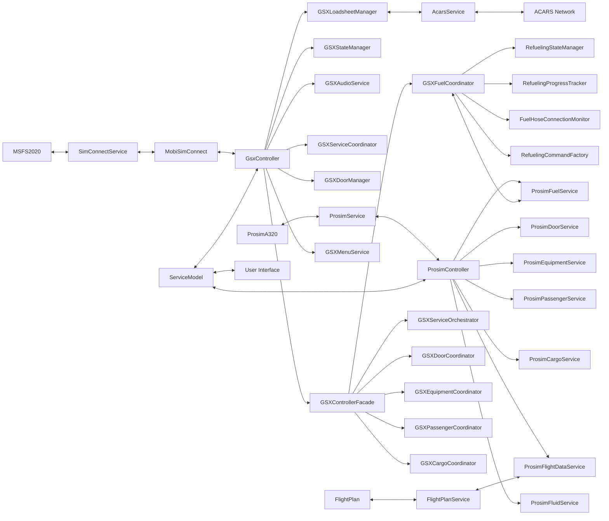

## Key Data Flows

### 1. Configuration Flow

Configuration data flows from the user interface to the ServiceModel and then to the various components:

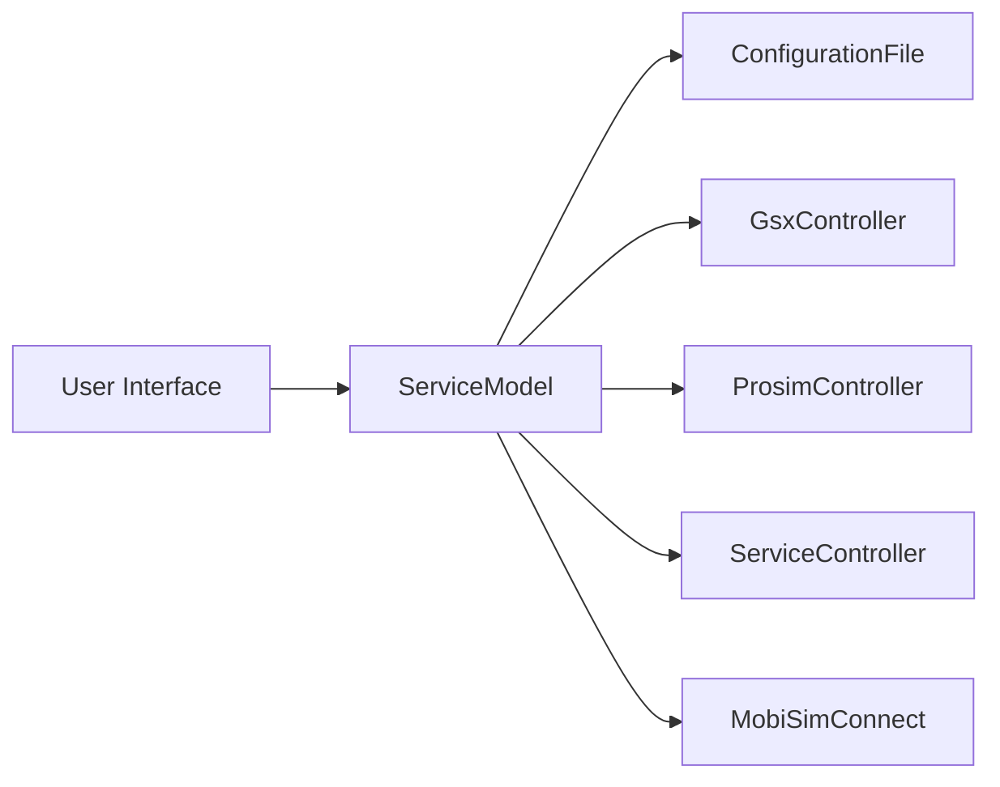

**Description**:
- User configures settings via the UI
- Settings are stored in the ServiceModel
- ServiceModel persists settings to ConfigurationFile
- Components read settings from ServiceModel
- Components adjust behavior based on settings

### 2. Flight Plan Flow

Flight plan data flows from ProsimA320 to the application and then to GSX:

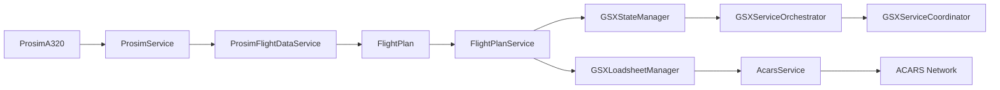

**Description**:
- Flight plan is loaded in ProsimA320
- ProsimFlightDataService detects new flight plan
- FlightPlanService parses and validates flight plan
- GSXStateManager transitions to appropriate state
- GSXServiceOrchestrator coordinates services based on flight plan
- GSXLoadsheetManager generates loadsheet
- AcarsService transmits loadsheet to ACARS network

### 3. Service Flow

Service data flows from GSX to ProSim and back:

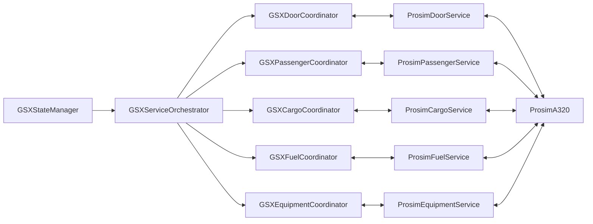

**Description**:
- GSXStateManager determines current flight state
- GSXServiceOrchestrator selects appropriate services
- Coordinators manage specific service areas
- ProSim services interact with ProsimA320
- Data flows bidirectionally between GSX and ProSim

### 4. Passenger Flow

Passenger data flows between ProSim and GSX:

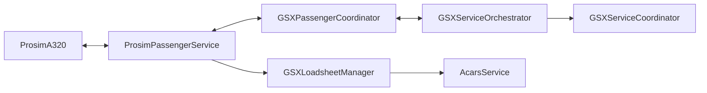

**Description**:
- ProsimPassengerService provides passenger data
- GSXPassengerCoordinator coordinates passenger operations
- GSXServiceOrchestrator manages service timing
- GSXLoadsheetManager generates loadsheet with passenger data
- AcarsService transmits loadsheet to ACARS network

### 5. Cargo Flow

Cargo data flows between ProSim and GSX:

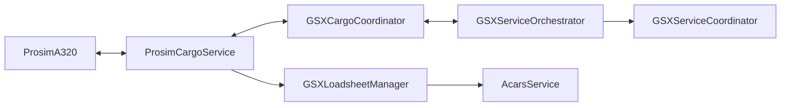

**Description**:
- ProsimCargoService provides cargo data
- GSXCargoCoordinator coordinates cargo operations
- GSXServiceOrchestrator manages service timing
- GSXLoadsheetManager includes cargo data in loadsheet
- AcarsService transmits loadsheet to ACARS network

### 6. Fuel Flow

Fuel data flows between ProSim and GSX:

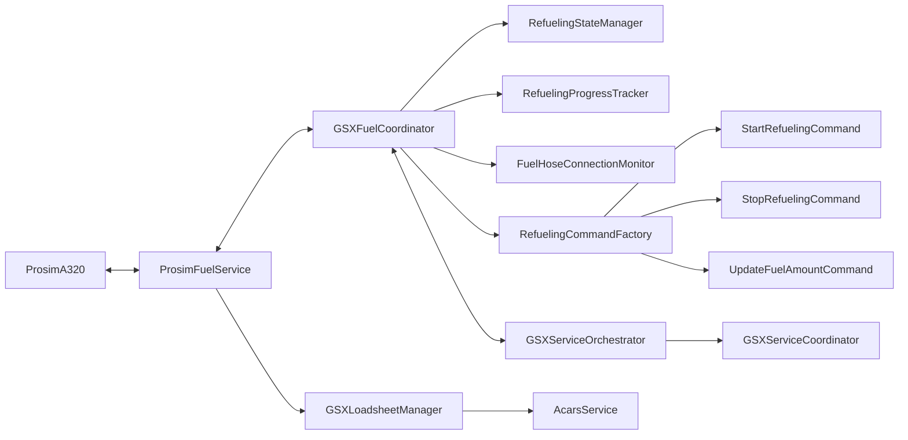

**Description**:
- ProsimFuelService provides fuel data
- GSXFuelCoordinator coordinates fuel operations
- RefuelingStateManager tracks refueling state
- RefuelingProgressTracker monitors refueling progress
- FuelHoseConnectionMonitor detects fuel hose connections
- RefuelingCommandFactory creates commands for fuel operations
- GSXServiceOrchestrator manages service timing
- GSXLoadsheetManager includes fuel data in loadsheet
- AcarsService transmits loadsheet to ACARS network

### 7. Door Flow

Door data flows between ProSim and GSX:

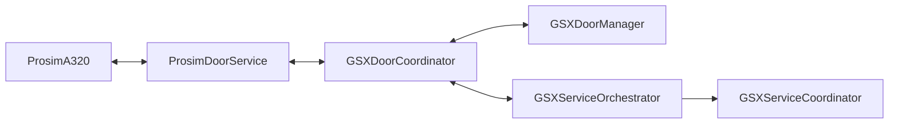

**Description**:
- ProsimDoorService provides door state information
- GSXDoorCoordinator coordinates door operations
- GSXDoorManager controls doors based on service needs
- GSXServiceOrchestrator monitors door toggle LVARs
- GSXServiceCoordinator manages service timing

### 8. Audio Control Flow

Audio control data flows from ProSim to GSX:

**Description**:
- ProsimController detects changes in cockpit controls
- GSXAudioService adjusts audio levels
- CoreAudioSessionManager interacts with Windows Audio
- Audio levels are adjusted for GSX and other applications

## Data Transformation

### Flight Plan Data

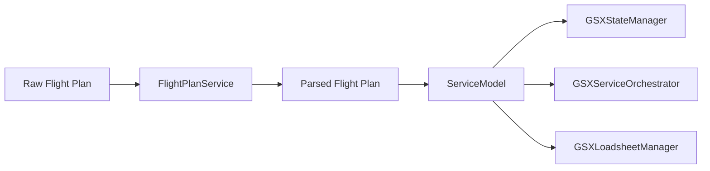

**Transformations**:
1. Raw flight plan data from ProsimA320
2. Parsed and validated flight plan data
3. Flight plan data stored in ServiceModel
4. Flight plan data used for state transitions
5. Flight plan data used for service coordination
6. Flight plan data used for loadsheet generation

### Passenger Data

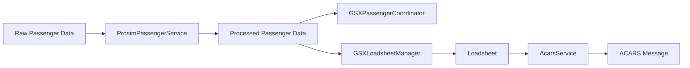

**Transformations**:
1. Raw passenger data from ProsimA320
2. Processed passenger data with counts and status
3. Passenger data used for boarding/deboarding coordination
4. Passenger data included in loadsheet
5. Loadsheet formatted for ACARS transmission
6. ACARS message sent to network

### Fuel Data

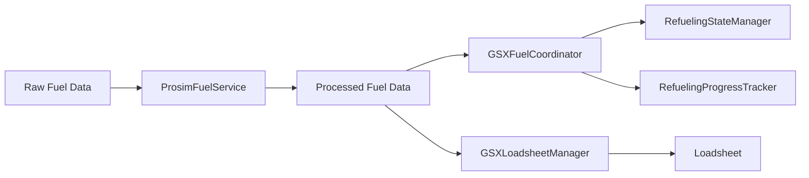

**Transformations**:
1. Raw fuel data from ProsimA320
2. Processed fuel data with quantities and status
3. Fuel data used for refueling coordination
4. Fuel state tracked by RefuelingStateManager
5. Refueling progress tracked by RefuelingProgressTracker
6. Fuel data included in loadsheet

## Data Storage

### Persistent Storage

1. **Configuration File**
   - Format: XML
   - Location: Application directory
   - Content: User settings and preferences
   - Access: Read/write by ConfigurationFile class

2. **State File**
   - Format: JSON
   - Location: Application directory
   - Content: Current state and state history
   - Access: Read/write by GSXStateManager

### In-Memory Storage

1. **ServiceModel**
   - Content: Application configuration and state
   - Access: Read/write by all components
   - Lifetime: Application session

2. **State History**
   - Content: History of state transitions
   - Access: Read/write by GSXStateManager
   - Lifetime: Application session (with optional persistence)

3. **Flight Plan Data**
   - Content: Current flight plan information
   - Access: Read by various components
   - Lifetime: Until new flight plan is loaded

## Event-Based Communication

The application uses event-based communication for data flow between components:

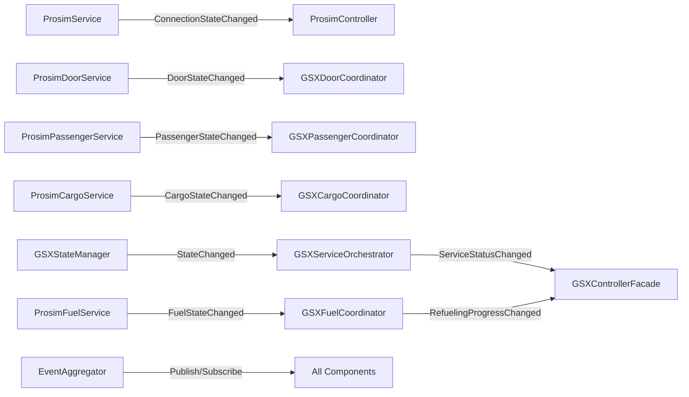

**Event Types**:
1. **State Events**: Notify of state changes in the system
2. **Service Events**: Notify of service status changes
3. **Data Events**: Notify of data changes (fuel, passengers, cargo, etc.)
4. **Connection Events**: Notify of connection status changes
5. **Progress Events**: Notify of progress updates for long-running operations

## Circular Dependency Resolution

The application uses a specific pattern to resolve circular dependencies in data flow:

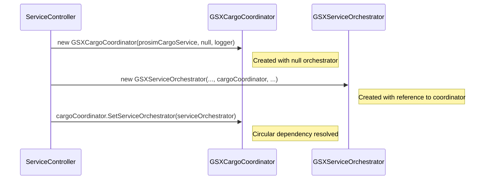

**Resolution Pattern**:
1. Create first component with null dependency
2. Create second component with reference to first component
3. Set the circular dependency on the first component
4. Both components now have references to each other
