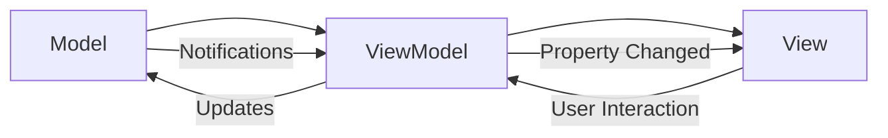
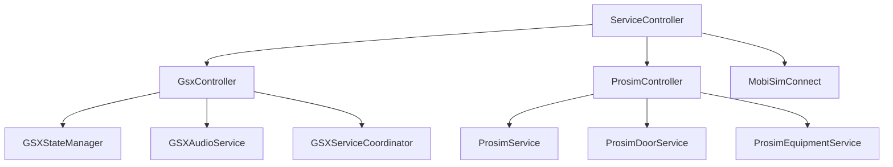
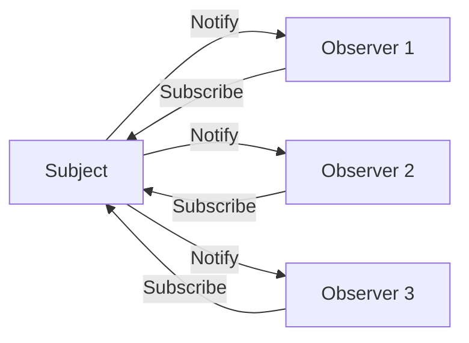
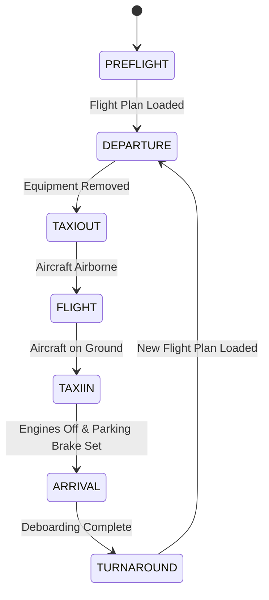
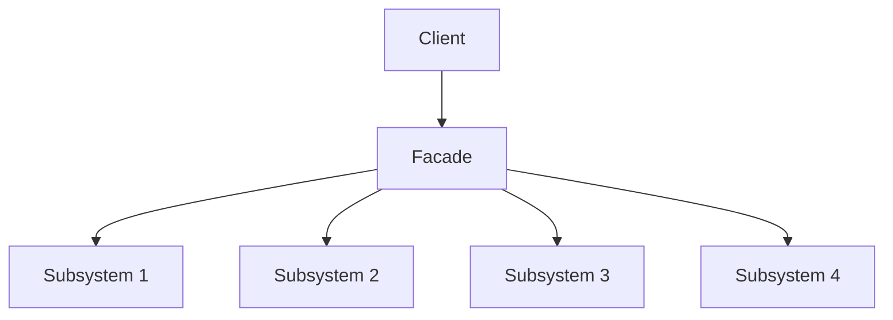
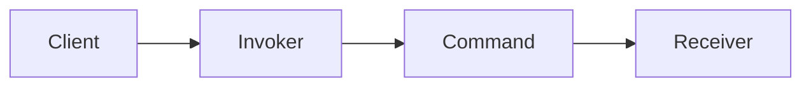
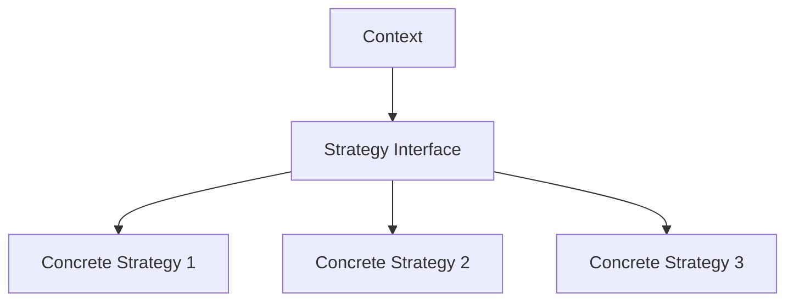
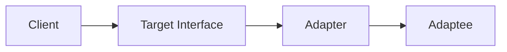
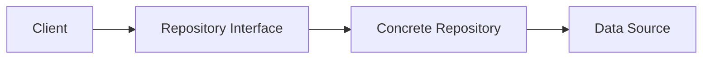
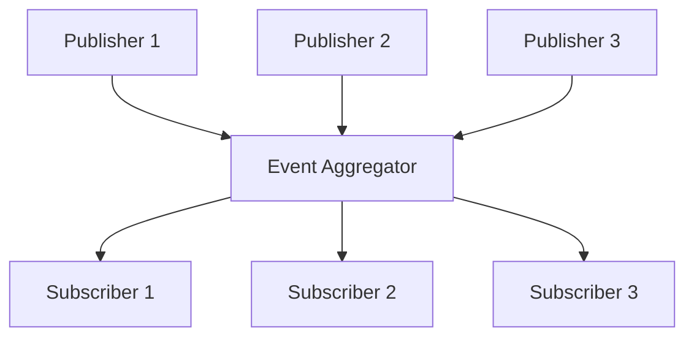

# Prosim2GSX Design Patterns

This document describes the design patterns used in the Prosim2GSX application. Understanding these patterns is essential for maintaining and extending the codebase.

## 1. Model-View-ViewModel (MVVM)

The UI follows the MVVM pattern to separate the user interface from the business logic.

### Implementation



- **Model**: ServiceModel and other data classes
  - Contains business logic and data
  - Provides data access and manipulation
  - Raises events when data changes

- **View**: MainWindow and NotifyIconResources
  - Displays data to the user
  - Captures user input
  - Binds to ViewModel properties and commands

- **ViewModel**: NotifyIconViewModel
  - Exposes data from the Model to the View
  - Handles user interactions via commands
  - Implements INotifyPropertyChanged for UI updates
  - Mediates between View and Model

### Example

```csharp
// ViewModel implementation
public class NotifyIconViewModel : INotifyPropertyChanged
{
    private readonly ServiceModel _serviceModel;
    private bool _isConnected;
    
    public NotifyIconViewModel(ServiceModel serviceModel)
    {
        _serviceModel = serviceModel;
        _serviceModel.ConnectionStateChanged += OnConnectionStateChanged;
        
        ExitCommand = new RelayCommand(ExecuteExit);
        SettingsCommand = new RelayCommand(ExecuteSettings);
    }
    
    public bool IsConnected
    {
        get => _isConnected;
        set
        {
            if (_isConnected != value)
            {
                _isConnected = value;
                OnPropertyChanged();
            }
        }
    }
    
    public ICommand ExitCommand { get; }
    public ICommand SettingsCommand { get; }
    
    private void OnConnectionStateChanged(object sender, ConnectionStateChangedEventArgs e)
    {
        IsConnected = e.IsConnected;
    }
    
    private void ExecuteExit()
    {
        Application.Current.Shutdown();
    }
    
    private void ExecuteSettings()
    {
        // Show settings window
    }
    
    public event PropertyChangedEventHandler PropertyChanged;
    
    protected virtual void OnPropertyChanged([CallerMemberName] string propertyName = null)
    {
        PropertyChanged?.Invoke(this, new PropertyChangedEventArgs(propertyName));
    }
}
```

### Benefits

- **Separation of Concerns**: UI logic is separated from business logic
- **Testability**: ViewModels can be tested without the View
- **Designer Support**: Designers can work on the View while developers work on the ViewModel
- **Code Reuse**: ViewModels can be reused across different Views

## 2. Dependency Injection

Components receive their dependencies through constructors, promoting loose coupling and testability.

### Implementation



- Services are injected into controllers
- Controllers are injected into managers
- All dependencies are explicit and can be mocked for testing

### Example

```csharp
// Constructor injection
public class GSXFuelCoordinator : IGSXFuelCoordinator
{
    private readonly IProsimFuelService _fuelService;
    private readonly ILogger _logger;
    private IGSXServiceOrchestrator _serviceOrchestrator;
    
    public GSXFuelCoordinator(
        IProsimFuelService fuelService,
        IGSXServiceOrchestrator serviceOrchestrator,
        ILogger logger)
    {
        _fuelService = fuelService ?? throw new ArgumentNullException(nameof(fuelService));
        _serviceOrchestrator = serviceOrchestrator; // Can be null initially
        _logger = logger ?? throw new ArgumentNullException(nameof(logger));
        
        _refuelingStateManager = new RefuelingStateManager(logger);
        _refuelingProgressTracker = new RefuelingProgressTracker(logger);
        _fuelHoseConnectionMonitor = new FuelHoseConnectionMonitor(fuelService, logger);
        _refuelingCommandFactory = new RefuelingCommandFactory(fuelService, logger);
        
        // Subscribe to events
        _fuelService.FuelStateChanged += OnFuelStateChanged;
    }
    
    // Setter injection for circular dependency
    public void SetServiceOrchestrator(IGSXServiceOrchestrator serviceOrchestrator)
    {
        _serviceOrchestrator = serviceOrchestrator ?? throw new ArgumentNullException(nameof(serviceOrchestrator));
    }
    
    // Implementation...
}
```

### Benefits

- **Loose Coupling**: Components depend on abstractions, not concrete implementations
- **Testability**: Dependencies can be mocked for unit testing
- **Flexibility**: Implementations can be swapped without changing dependent code
- **Maintainability**: Dependencies are explicit and visible

## 3. Observer Pattern

The application uses event-based communication for state changes.

### Implementation



- SimConnect subscribes to simulator variables
- Controllers observe model changes
- UI updates based on property change notifications
- Services raise events for state changes
- Components subscribe to events from other components

### Example

```csharp
// Event publisher
public class ProsimFuelService : IProsimFuelService
{
    public event EventHandler<FuelStateChangedEventArgs> FuelStateChanged;
    
    private void UpdateFuelState(double centerTankKg, double leftTankKg, double rightTankKg)
    {
        // Update internal state
        _centerTankKg = centerTankKg;
        _leftTankKg = leftTankKg;
        _rightTankKg = rightTankKg;
        
        // Notify subscribers
        OnFuelStateChanged(new FuelStateChangedEventArgs(
            centerTankKg,
            leftTankKg,
            rightTankKg,
            TotalFuelKg
        ));
    }
    
    protected virtual void OnFuelStateChanged(FuelStateChangedEventArgs e)
    {
        FuelStateChanged?.Invoke(this, e);
    }
    
    // Implementation...
}

// Event subscriber
public class GSXFuelCoordinator : IGSXFuelCoordinator
{
    private readonly IProsimFuelService _fuelService;
    
    public GSXFuelCoordinator(IProsimFuelService fuelService, /* other dependencies */)
    {
        _fuelService = fuelService;
        
        // Subscribe to events
        _fuelService.FuelStateChanged += OnFuelStateChanged;
    }
    
    private void OnFuelStateChanged(object sender, FuelStateChangedEventArgs e)
    {
        // Handle fuel state change
        _currentFuelKg = e.TotalFuelKg;
        
        // Update refueling progress if refueling is in progress
        if (_refuelingStateManager.CurrentState == RefuelingState.Refueling)
        {
            _refuelingProgressTracker.UpdateProgress(_targetFuelKg, _currentFuelKg);
        }
    }
    
    // Implementation...
}
```

### Benefits

- **Loose Coupling**: Publishers don't need to know about subscribers
- **Flexibility**: Subscribers can be added or removed at runtime
- **Scalability**: Multiple subscribers can respond to the same event
- **Maintainability**: Changes to publishers don't affect subscribers

## 4. State Machine Pattern

The GSXStateManager implements a state machine to manage the flight lifecycle.

### Implementation



- Clear states representing flight phases
- Well-defined transitions between states
- State-specific behaviors
- Event-based notification of state changes

### Example

```csharp
public class GSXStateManager : IGSXStateManager
{
    private FlightState _currentState;
    private readonly ILogger _logger;
    private readonly List<StateTransitionRecord> _stateHistory;
    
    public FlightState CurrentState
    {
        get => _currentState;
        private set => _currentState = value;
    }
    
    public event EventHandler<StateChangedEventArgs<FlightState>> StateChanged;
    
    public GSXStateManager(ILogger logger)
    {
        _logger = logger;
        _currentState = FlightState.PREFLIGHT;
        _stateHistory = new List<StateTransitionRecord>();
    }
    
    public bool TryTransitionTo(FlightState newState)
    {
        if (!IsValidTransition(CurrentState, newState))
        {
            _logger.LogWarning($"Invalid state transition from {CurrentState} to {newState}");
            return false;
        }
        
        var previousState = CurrentState;
        
        // Execute exit actions for the current state
        ExecuteExitActions(previousState);
        
        // Update the state
        CurrentState = newState;
        
        // Record the transition
        RecordStateTransition(previousState, newState);
        
        // Execute entry actions for the new state
        ExecuteEntryActions(newState);
        
        // Raise the state changed event
        OnStateChanged(new StateChangedEventArgs<FlightState>(previousState, newState));
        
        _logger.LogInformation($"State transitioned from {previousState} to {newState}");
        return true;
    }
    
    private bool IsValidTransition(FlightState currentState, FlightState newState)
    {
        switch (currentState)
        {
            case FlightState.PREFLIGHT:
                return newState == FlightState.DEPARTURE;
            case FlightState.DEPARTURE:
                return newState == FlightState.TAXIOUT;
            case FlightState.TAXIOUT:
                return newState == FlightState.FLIGHT;
            case FlightState.FLIGHT:
                return newState == FlightState.TAXIIN;
            case FlightState.TAXIIN:
                return newState == FlightState.ARRIVAL;
            case FlightState.ARRIVAL:
                return newState == FlightState.TURNAROUND;
            case FlightState.TURNAROUND:
                return newState == FlightState.DEPARTURE;
            default:
                return false;
        }
    }
    
    // Implementation...
}
```

### Benefits

- **Predictable Behavior**: State transitions are well-defined and controlled
- **Reduced Complexity**: State-specific behavior is encapsulated
- **Maintainability**: Adding new states or transitions is straightforward
- **Debugging**: State history can be tracked for troubleshooting

## 5. Facade Pattern

The GsxController and ProsimController act as facades for their respective subsystems.

### Implementation



- Provides a simplified interface to complex subsystems
- Delegates to specialized services
- Coordinates between services
- Hides implementation details from clients

### Example

```csharp
public class GSXControllerFacade : IGSXControllerFacade
{
    private readonly IGSXStateManager _stateManager;
    private readonly IGSXServiceOrchestrator _serviceOrchestrator;
    private readonly IGSXDoorCoordinator _doorCoordinator;
    private readonly IGSXEquipmentCoordinator _equipmentCoordinator;
    private readonly IGSXPassengerCoordinator _passengerCoordinator;
    private readonly IGSXCargoCoordinator _cargoCoordinator;
    private readonly IGSXFuelCoordinator _fuelCoordinator;
    private readonly ILogger _logger;
    
    public GSXControllerFacade(
        IGSXStateManager stateManager,
        IGSXServiceOrchestrator serviceOrchestrator,
        IGSXDoorCoordinator doorCoordinator,
        IGSXEquipmentCoordinator equipmentCoordinator,
        IGSXPassengerCoordinator passengerCoordinator,
        IGSXCargoCoordinator cargoCoordinator,
        IGSXFuelCoordinator fuelCoordinator,
        ILogger logger)
    {
        _stateManager = stateManager;
        _serviceOrchestrator = serviceOrchestrator;
        _doorCoordinator = doorCoordinator;
        _equipmentCoordinator = equipmentCoordinator;
        _passengerCoordinator = passengerCoordinator;
        _cargoCoordinator = cargoCoordinator;
        _fuelCoordinator = fuelCoordinator;
        _logger = logger;
        
        // Subscribe to events
        _stateManager.StateChanged += OnStateChanged;
        _serviceOrchestrator.ServiceStatusChanged += OnServiceStatusChanged;
        _fuelCoordinator.RefuelingProgressChanged += OnRefuelingProgressChanged;
    }
    
    public void Initialize()
    {
        _logger.LogInformation("Initializing GSX Controller Facade");
        
        // Initialize all coordinators
        _doorCoordinator.Initialize();
        _equipmentCoordinator.Initialize();
        _passengerCoordinator.Initialize();
        _cargoCoordinator.Initialize();
        _fuelCoordinator.Initialize();
        
        // Initialize service orchestrator
        _serviceOrchestrator.Initialize();
        
        // Initialize state manager
        _stateManager.Initialize();
    }
    
    public void StartBoarding()
    {
        _logger.LogInformation("Starting boarding");
        _serviceOrchestrator.StartBoardingService();
    }
    
    public void StartRefueling()
    {
        _logger.LogInformation("Starting refueling");
        _fuelCoordinator.StartRefueling();
    }
    
    // Implementation...
}
```

### Benefits

- **Simplicity**: Clients interact with a single interface
- **Reduced Dependencies**: Clients depend on the facade, not the subsystems
- **Decoupling**: Subsystems are decoupled from clients
- **Layering**: Provides a clear separation between layers

## 6. Command Pattern

The application uses the command pattern in several places, particularly in the GSXFuelCoordinator.

### Implementation



- Encapsulates operations as objects
- Decouples operation request from execution
- Provides consistent interface for different operations
- Supports operation composition and sequencing

### Example

```csharp
// Command interface
public interface IRefuelingCommand
{
    Task ExecuteAsync(CancellationToken cancellationToken = default);
}

// Command factory
public class RefuelingCommandFactory
{
    private readonly IProsimFuelService _fuelService;
    private readonly ILogger _logger;
    
    public RefuelingCommandFactory(IProsimFuelService fuelService, ILogger logger)
    {
        _fuelService = fuelService;
        _logger = logger;
    }
    
    public IRefuelingCommand CreateStartRefuelingCommand(double targetFuelKg)
    {
        return new StartRefuelingCommand(_fuelService, targetFuelKg, _logger);
    }
    
    public IRefuelingCommand CreateStopRefuelingCommand()
    {
        return new StopRefuelingCommand(_fuelService, _logger);
    }
    
    public IRefuelingCommand CreateUpdateFuelAmountCommand(double targetFuelKg)
    {
        return new UpdateFuelAmountCommand(_fuelService, targetFuelKg, _logger);
    }
}

// Concrete command
public class StartRefuelingCommand : IRefuelingCommand
{
    private readonly IProsimFuelService _fuelService;
    private readonly double _targetFuelKg;
    private readonly ILogger _logger;
    
    public StartRefuelingCommand(IProsimFuelService fuelService, double targetFuelKg, ILogger logger)
    {
        _fuelService = fuelService;
        _targetFuelKg = targetFuelKg;
        _logger = logger;
    }
    
    public async Task ExecuteAsync(CancellationToken cancellationToken = default)
    {
        _logger.LogInformation($"Executing StartRefuelingCommand with target fuel: {_targetFuelKg} kg");
        
        try
        {
            await _fuelService.StartRefuelingAsync(_targetFuelKg, cancellationToken);
        }
        catch (Exception ex)
        {
            _logger.LogError(ex, "Failed to start refueling");
            throw;
        }
    }
}

// Command invoker
public class GSXFuelCoordinator : IGSXFuelCoordinator
{
    private readonly RefuelingCommandFactory _refuelingCommandFactory;
    
    public GSXFuelCoordinator(/* dependencies */)
    {
        _refuelingCommandFactory = new RefuelingCommandFactory(fuelService, logger);
    }
    
    public async Task StartRefuelingAsync(CancellationToken cancellationToken = default)
    {
        var command = _refuelingCommandFactory.CreateStartRefuelingCommand(_targetFuelKg);
        await command.ExecuteAsync(cancellationToken);
    }
    
    // Implementation...
}
```

### Benefits

- **Decoupling**: Separates the object that invokes the operation from the one that performs it
- **Extensibility**: New commands can be added without changing existing code
- **Composability**: Commands can be combined to create complex operations
- **Undo/Redo**: Commands can store state for undoing operations
- **Queueing**: Commands can be queued for later execution

## 7. Strategy Pattern

The application uses the strategy pattern for service operations.

### Implementation



- Different strategies for different flight phases
- Interchangeable service implementations
- Common interfaces for similar operations
- Runtime selection of appropriate strategy

### Example

```csharp
// Strategy interface
public interface IPassengerService
{
    Task<int> GetPassengerCountAsync();
    Task<bool> StartBoardingAsync(int passengerCount);
    Task<bool> StartDeboarding();
    event EventHandler<PassengerStateChangedEventArgs> PassengerStateChanged;
}

// Context
public class GSXPassengerCoordinator : IGSXPassengerCoordinator
{
    private readonly IPassengerService _passengerService;
    private readonly IGSXServiceOrchestrator _serviceOrchestrator;
    private readonly ILogger _logger;
    
    public GSXPassengerCoordinator(
        IPassengerService passengerService,
        IGSXServiceOrchestrator serviceOrchestrator,
        ILogger logger)
    {
        _passengerService = passengerService;
        _serviceOrchestrator = serviceOrchestrator;
        _logger = logger;
        
        // Subscribe to events
        _passengerService.PassengerStateChanged += OnPassengerStateChanged;
    }
    
    public async Task StartBoardingAsync(CancellationToken cancellationToken = default)
    {
        _logger.LogInformation("Starting boarding");
        
        try
        {
            var passengerCount = await _passengerService.GetPassengerCountAsync();
            await _passengerService.StartBoardingAsync(passengerCount);
            
            // Notify service orchestrator
            _serviceOrchestrator.NotifyBoardingStarted();
        }
        catch (Exception ex)
        {
            _logger.LogError(ex, "Failed to start boarding");
            throw;
        }
    }
    
    // Implementation...
}
```

### Benefits

- **Flexibility**: Strategies can be swapped at runtime
- **Encapsulation**: Each strategy encapsulates its own algorithm
- **Testability**: Strategies can be tested in isolation
- **Maintainability**: New strategies can be added without changing existing code

## 8. Adapter Pattern

The ProsimInterface and MobiSimConnect classes act as adapters.

### Implementation



- Convert external API calls to internal format
- Provide consistent interface to different subsystems
- Hide implementation details of external systems
- Allow for easy replacement of external dependencies

### Example

```csharp
// Target interface
public interface ISimConnectService
{
    bool IsConnected { get; }
    Task<bool> ConnectAsync();
    Task DisconnectAsync();
    Task<T> GetSimVarAsync<T>(string simVar);
    Task SetSimVarAsync<T>(string simVar, T value);
    event EventHandler<ConnectionStateChangedEventArgs> ConnectionStateChanged;
}

// Adapter
public class SimConnectService : ISimConnectService
{
    private readonly SimConnect _simConnect;
    private readonly ILogger _logger;
    private bool _isConnected;
    
    public bool IsConnected => _isConnected;
    
    public event EventHandler<ConnectionStateChangedEventArgs> ConnectionStateChanged;
    
    public SimConnectService(ILogger logger)
    {
        _logger = logger;
        _simConnect = new SimConnect();
        
        // Set up SimConnect event handlers
        _simConnect.OnRecvOpen += OnSimConnectOpen;
        _simConnect.OnRecvQuit += OnSimConnectQuit;
        _simConnect.OnRecvException += OnSimConnectException;
    }
    
    public async Task<bool> ConnectAsync()
    {
        try
        {
            _logger.LogInformation("Connecting to SimConnect");
            
            // Connect to SimConnect
            _simConnect.Connect("Prosim2GSX");
            
            // Wait for connection to be established
            var connectionTask = new TaskCompletionSource<bool>();
            EventHandler onOpen = (s, e) => connectionTask.TrySetResult(true);
            _simConnect.OnRecvOpen += onOpen;
            
            try
            {
                return await connectionTask.Task.TimeoutAfter(TimeSpan.FromSeconds(10));
            }
            finally
            {
                _simConnect.OnRecvOpen -= onOpen;
            }
        }
        catch (Exception ex)
        {
            _logger.LogError(ex, "Failed to connect to SimConnect");
            return false;
        }
    }
    
    public async Task<T> GetSimVarAsync<T>(string simVar)
    {
        if (!IsConnected)
            throw new InvalidOperationException("Not connected to SimConnect");
            
        try
        {
            // Request sim variable
            var requestId = Guid.NewGuid().GetHashCode();
            _simConnect.AddToDataDefinition(requestId, simVar, null, SIMCONNECT_DATATYPE.FLOAT64, 0, SimConnect.SIMCONNECT_UNUSED);
            _simConnect.RequestDataOnSimObject(requestId, requestId, SimConnect.SIMCONNECT_OBJECT_ID_USER, SIMCONNECT_PERIOD.ONCE);
            
            // Wait for response
            var responseTask = new TaskCompletionSource<object>();
            EventHandler<SimConnect.RecvSimobjectDataByTypeEventArgs> onData = null;
            onData = (s, e) => {
                if (e.RequestID == requestId)
                {
                    responseTask.TrySetResult(e.Data[0]);
                    _simConnect.OnRecvSimobjectDataByType -= onData;
                }
            };
            _simConnect.OnRecvSimobjectDataByType += onData;
            
            try
            {
                var result = await responseTask.Task.TimeoutAfter(TimeSpan.FromSeconds(5));
                return (T)Convert.ChangeType(result, typeof(T));
            }
            finally
            {
                _simConnect.OnRecvSimobjectDataByType -= onData;
            }
        }
        catch (Exception ex)
        {
            _logger.LogError(ex, $"Failed to get sim variable: {simVar}");
            throw;
        }
    }
    
    // Implementation...
}
```

### Benefits

- **Compatibility**: Allows incompatible interfaces to work together
- **Reusability**: Existing code can be reused with new interfaces
- **Flexibility**: External dependencies can be replaced without affecting clients
- **Isolation**: Changes to external systems are isolated to the adapter

## 9. Repository Pattern

The FlightPlanService implements the repository pattern.

### Implementation



- Centralizes data access logic
- Provides abstraction over data sources
- Handles data persistence and retrieval
- Encapsulates data access operations

### Example

```csharp
// Repository interface
public interface IFlightPlanService
{
    Task<FlightPlan> LoadFlightPlanAsync(string flightNumber);
    Task<bool> SaveFlightPlanAsync(FlightPlan flightPlan);
    Task<IEnumerable<string>> GetAvailableFlightPlansAsync();
    event EventHandler<FlightPlanLoadedEventArgs> FlightPlanLoaded;
}

// Concrete repository
public class FlightPlanService : IFlightPlanService
{
    private readonly string _flightPlanDirectory;
    private readonly ILogger _logger;
    
    public event EventHandler<FlightPlanLoadedEventArgs> FlightPlanLoaded;
    
    public FlightPlanService(string flightPlanDirectory, ILogger logger)
    {
        _flightPlanDirectory = flightPlanDirectory;
        _logger = logger;
    }
    
    public async Task<FlightPlan> LoadFlightPlanAsync(string flightNumber)
    {
        try
        {
            _logger.LogInformation($"Loading flight plan for flight {flightNumber}");
            
            var filePath = Path.Combine(_flightPlanDirectory, $"{flightNumber}.xml");
            
            if (!File.Exists(filePath))
            {
                _logger.LogWarning($"Flight plan file not found: {filePath}");
                return null;
            }
            
            // Load and parse flight plan
            var flightPlan = await Task.Run(() => ParseFlightPlanFile(filePath));
            
            // Raise event
            OnFlightPlanLoaded(new FlightPlanLoadedEventArgs(flightPlan));
            
            return flightPlan;
        }
        catch (Exception ex)
        {
            _logger.LogError(ex, $"Failed to load flight plan for flight {flightNumber}");
            throw;
        }
    }
    
    private FlightPlan ParseFlightPlanFile(string filePath)
    {
        using var reader = XmlReader.Create(filePath, new XmlReaderSettings
        {
            DtdProcessing = DtdProcessing.Prohibit,
            XmlResolver = null
        });
        
        var flightPlan = new FlightPlan();
        
        // Parse XML and populate flight plan
        // ...
        
        return flightPlan;
    }
    
    // Implementation...
}
```

### Benefits

- **Centralization**: Data access logic is centralized in one place
- **Abstraction**: Clients are decoupled from data access details
- **Testability**: Repositories can be mocked for testing
- **Maintainability**: Changes to data access affect only the repository

## 10. Event Aggregator Pattern

The application uses the event aggregator pattern for event-based communication.

### Implementation



- Centralized event hub
- Publishers and subscribers are decoupled
- Events are routed to interested subscribers
- Reduces direct dependencies between components

### Example

```csharp
// Event aggregator interface
public interface IEventAggregator
{
    void Publish<TEvent>(TEvent eventData) where TEvent : class;
    void Subscribe<TEvent>(Action<TEvent> handler) where TEvent : class;
    void Unsubscribe<TEvent>(Action<TEvent> handler) where TEvent : class;
}

// Event aggregator implementation
public class EventAggregator : IEventAggregator
{
    private readonly Dictionary<Type, List<object>> _handlers = new Dictionary<Type, List<object>>();
    private readonly object _lock = new object();
    
    public void Publish<TEvent>(TEvent eventData) where TEvent : class
    {
        if (eventData == null)
            throw new ArgumentNullException(nameof(eventData));
            
        var eventType = typeof(TEvent);
        
        List<object> handlers;
        lock (_lock)
        {
            if (!_handlers.TryGetValue(eventType, out handlers))
                return;
                
            handlers = handlers.ToList(); // Create a copy to avoid modification during iteration
        }
        
        foreach (var handler in handlers)
        {
            ((Action<TEvent>)handler)(eventData);
        }
    }
    
    public void Subscribe<TEvent>(Action<TEvent> handler) where TEvent : class
    {
        if (handler == null)
            throw new ArgumentNullException(nameof(handler));
            
        var eventType = typeof(TEvent);
        
        lock (_lock)
        {
            if (!_handlers.TryGetValue(eventType, out var handlers))
            {
                handlers = new List<object>();
                _handlers[eventType] = handlers;
            }
            
            if (!handlers.Contains(handler))
                handlers.Add(handler);
        }
    }
    
    public void Unsubscribe<TEvent>(Action<TEvent> handler) where TEvent : class
    {
        if (handler == null)
            throw new ArgumentNullException(nameof(handler));
            
        var eventType = typeof(TEvent);
        
        lock (_lock)
        {
            if (_handlers.TryGetValue(eventType, out var handlers))
            {
                handlers.Remove(handler);
                
                if (handlers.Count == 0)
                    _handlers.Remove(eventType);
            }
        }
    }
}

// Usage
public class GSXFuelCoordinator : IGSXFuelCoordinator
{
    private readonly IEventAggregator _eventA
