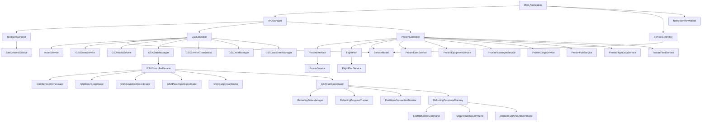

# Prosim2GSX Architecture Overview

This document provides a comprehensive overview of the Prosim2GSX architecture, including component relationships, data flow, and design patterns.

## Main Architecture Diagram

The following diagram shows the high-level architecture of Prosim2GSX, including all major components and their relationships:

## Component Descriptions

### Core Components

1. **Main Application (MainWindow)**
   - Entry point for the application
   - Manages the UI and system tray icon
   - Coordinates between controllers and view models

2. **IPCManager**
   - Central hub for inter-process communication
   - Manages connections to external systems (SimConnect, ProSim)
   - Provides access to controllers for other components

3. **ServiceController**
   - Manages the application's service lifecycle
   - Coordinates startup and shutdown sequences
   - Monitors system state and handles reconnection

4. **ServiceModel**
   - Stores application configuration and state
   - Provides settings for all components
   - Persists configuration through ConfigurationFile

### Integration Components

1. **MobiSimConnect**
   - Interfaces with Microsoft Flight Simulator via SimConnect
   - Subscribes to simulator variables and events
   - Provides methods to read/write simulator data

2. **GsxController**
   - Manages interaction with GSX in MSFS2020
   - Controls GSX services (boarding, deboarding, refueling, etc.)
   - Handles flight state transitions and service timing
   - Manages audio control for GSX and other applications

3. **ProsimController**
   - Interfaces with ProsimA320
   - Synchronizes flight plan data
   - Manages passenger, cargo, and fuel data
   - Controls ground equipment in ProSim

4. **ProsimInterface**
   - Low-level interface to ProSim SDK
   - Handles data conversion between systems
   - Provides abstraction for ProSim API calls

5. **FlightPlan**
   - Manages flight plan data
   - Loads and parses flight plans from ProsimA320
   - Provides structured access to flight information

6. **AcarsService**
   - Handles ACARS communication
   - Sends and receives messages via ACARS networks
   - Formats loadsheets and other flight information

### Modularized Services

1. **SimConnectService**
   - Provides abstraction over SimConnect API
   - Handles connection to MSFS2020
   - Manages simulator variables and events
   - Implements error handling and reconnection logic

2. **ProsimService**
   - Provides abstraction over ProSim SDK
   - Handles connection to ProsimA320
   - Manages ProSim variables and events
   - Implements error handling and reconnection logic

3. **FlightPlanService**
   - Loads and parses flight plans
   - Provides structured access to flight plan data
   - Handles flight plan file operations
   - Raises events when flight plans change

4. **ProsimDoorService**
   - Controls aircraft doors in ProSim
   - Provides door state information
   - Raises events for door state changes
   - Centralizes door management logic

5. **ProsimEquipmentService**
   - Manages ground equipment in ProSim
   - Controls GPU, PCA, and chocks
   - Provides equipment state information
   - Raises events for equipment state changes

6. **ProsimPassengerService**
   - Manages passenger data in ProSim
   - Controls boarding and deboarding
   - Provides passenger count information
   - Raises events for passenger state changes

7. **ProsimCargoService**
   - Manages cargo data in ProSim
   - Controls cargo loading and unloading
   - Provides cargo weight information
   - Raises events for cargo state changes

8. **ProsimFuelService**
   - Manages fuel data in ProSim
   - Controls refueling operations
   - Provides fuel quantity information
   - Raises events for fuel state changes

9. **ProsimFlightDataService**
   - Manages flight data in ProSim
   - Provides access to flight parameters
   - Formats flight data for other components
   - Raises events for flight data changes

10. **ProsimFluidService**
    - Manages hydraulic fluid data in ProSim
    - Controls fluid levels and servicing
    - Provides fluid quantity information
    - Raises events for fluid state changes

11. **GSXMenuService**
    - Interacts with GSX menu system
    - Selects menu items and operators
    - Manages menu navigation
    - Provides abstraction for GSX menu interaction

12. **GSXAudioService**
    - Controls audio for GSX and other applications
    - Adjusts volume based on cockpit controls
    - Provides audio reset functionality
    - Manages audio device detection and control
    - Implements thread safety with locks
    - Provides event-based communication for audio state changes
    - Offers both synchronous and asynchronous methods with cancellation support

13. **GSXStateManager**
    - Manages flight state transitions
    - Provides state query methods
    - Raises events when state changes
    - Centralizes state management logic
    - Implements state validation and state-specific behavior
    - Tracks state history for debugging purposes
    - Provides state prediction capabilities
    - Implements timeout handling with cancellation support
    - Supports state persistence with JSON serialization

14. **GSXServiceCoordinator**
    - Coordinates GSX services (boarding, refueling, etc.)
    - Manages service timing and sequencing
    - Raises events for service status changes
    - Centralizes service operation logic

15. **GSXDoorManager**
    - Manages aircraft door operations
    - Controls door opening/closing based on service needs
    - Raises events for door state changes
    - Handles door toggle requests from GSX

16. **GSXLoadsheetManager**
    - Generates and sends loadsheets
    - Formats loadsheet data for ACARS transmission
    - Calculates weight and balance information
    - Raises events when loadsheets are generated

17. **GSXControllerFacade**
    - Provides a simplified interface to the GSX subsystem
    - Initializes and manages GSX services
    - Delegates to specialized services
    - Handles high-level error recovery

18. **GSXServiceOrchestrator**
    - Coordinates service execution based on state
    - Manages service timing and dependencies
    - Provides event-based communication for service execution status
    - Predicts services that will be executed next
    - Monitors door toggle LVARs for reactive door control
    - Registers callbacks for pre/post service execution

19. **GSXDoorCoordinator**
    - Manages door operations and state tracking
    - Coordinates door operations with services
    - Provides event-based communication for door state changes
    - Implements synchronous and asynchronous door operation methods
    - Respects service toggles when managing doors
    - Includes circuit breaker protection against rapid state changes

20. **GSXEquipmentCoordinator**
    - Manages equipment operations and state tracking
    - Coordinates equipment operations with services
    - Provides event-based communication for equipment state changes
    - Implements synchronous and asynchronous equipment operation methods
    - Tracks equipment state for better coordination

21. **GSXPassengerCoordinator**
    - Manages passenger boarding and deboarding
    - Tracks passenger counts
    - Coordinates passenger operations with services
    - Provides event-based communication for passenger state changes
    - Implements synchronous and asynchronous passenger operation methods
    - Tracks boarding/deboarding progress

22. **GSXCargoCoordinator**
    - Manages cargo loading and unloading
    - Tracks cargo states
    - Coordinates cargo operations with services
    - Provides event-based communication for cargo state changes
    - Implements synchronous and asynchronous cargo operation methods
    - Tracks loading/unloading progress

23. **GSXFuelCoordinator**
    - Manages refueling operations
    - Tracks fuel states
    - Coordinates fuel operations with services
    - Provides event-based communication for fuel state changes
    - Implements synchronous and asynchronous fuel operation methods with cancellation support
    - Tracks refueling progress and fuel quantity
    - Monitors fuel hose connections
    - Uses Command pattern for fuel operations
    - Includes the following components:
      - **RefuelingStateManager**: Manages refueling state transitions
      - **RefuelingProgressTracker**: Tracks refueling progress percentage
      - **FuelHoseConnectionMonitor**: Detects fuel hose connections
      - **RefuelingCommandFactory**: Creates command objects for fuel operations
      - **StartRefuelingCommand**: Command to start refueling
      - **StopRefuelingCommand**: Command to stop refueling
      - **UpdateFuelAmountCommand**: Command to update fuel amount

### UI Components

1. **NotifyIconViewModel**
   - Manages the system tray icon and context menu
   - Provides commands for user interaction
   - Controls application visibility
