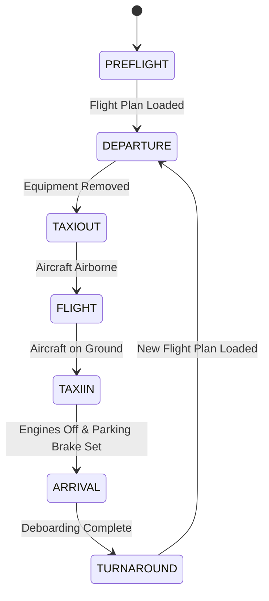

# Prosim2GSX State Transition Diagram

This document describes the state machine implemented in the GSXStateManager, which is responsible for managing the flight lifecycle in Prosim2GSX.

## State Diagram

The following diagram shows the states and transitions in the flight lifecycle:



## State Descriptions

### PREFLIGHT
- **Description**: Initial state when the application starts or after a reset
- **Entry Actions**:
  - Connect to ProsimA320 and MSFS
  - Position aircraft at gate (if configured)
  - Connect jetway/stairs (if configured)
  - Place ground equipment
- **Exit Actions**:
  - Prepare for departure services
- **Valid Transitions**:
  - PREFLIGHT → DEPARTURE (when flight plan is loaded)

### DEPARTURE
- **Description**: Aircraft is at the gate preparing for departure
- **Entry Actions**:
  - Call refueling service
  - Call catering service
  - Call boarding service
  - Send final loadsheet
- **Exit Actions**:
  - Remove ground equipment
- **Valid Transitions**:
  - DEPARTURE → TAXIOUT (when ground equipment is removed)

### TAXIOUT
- **Description**: Aircraft is taxiing to the runway
- **Entry Actions**:
  - Monitor aircraft state
  - Prepare for takeoff
- **Exit Actions**:
  - None
- **Valid Transitions**:
  - TAXIOUT → FLIGHT (when aircraft is airborne)

### FLIGHT
- **Description**: Aircraft is in flight
- **Entry Actions**:
  - Minimal interaction
  - Monitor flight progress
- **Exit Actions**:
  - Prepare for arrival
- **Valid Transitions**:
  - FLIGHT → TAXIIN (when aircraft is on ground)

### TAXIIN
- **Description**: Aircraft is taxiing to the gate
- **Entry Actions**:
  - Monitor aircraft state
  - Prepare for arrival services
- **Exit Actions**:
  - None
- **Valid Transitions**:
  - TAXIIN → ARRIVAL (when engines are off and parking brake is set)

### ARRIVAL
- **Description**: Aircraft is at the gate after landing
- **Entry Actions**:
  - Connect jetway/stairs
  - Place ground equipment
  - Call deboarding service
- **Exit Actions**:
  - None
- **Valid Transitions**:
  - ARRIVAL → TURNAROUND (when deboarding is complete)

### TURNAROUND
- **Description**: Aircraft is at the gate between flights
- **Entry Actions**:
  - Wait for new flight plan
  - Reset for next departure
- **Exit Actions**:
  - None
- **Valid Transitions**:
  - TURNAROUND → DEPARTURE (when new flight plan is loaded)

## State Transition Conditions

### Flight Plan Loaded
- **Condition**: A valid flight plan is loaded in ProsimA320
- **Verification**: FlightPlanService raises FlightPlanLoadedEvent
- **Actions**:
  - Parse flight plan
  - Extract departure and arrival information
  - Update ServiceModel with flight plan data

### Equipment Removed
- **Condition**: All ground equipment (GPU, PCA, chocks) is removed
- **Verification**: ProsimEquipmentService reports all equipment disconnected
- **Actions**:
  - Verify doors are closed
  - Verify jetway/stairs are disconnected

### Aircraft Airborne
- **Condition**: Aircraft is in the air
- **Verification**: SimConnectService reports altitude above threshold and positive vertical speed
- **Actions**:
  - None

### Aircraft on Ground
- **Condition**: Aircraft has landed
- **Verification**: SimConnectService reports altitude below threshold and on-ground flag
- **Actions**:
  - None

### Engines Off & Parking Brake Set
- **Condition**: Aircraft engines are shut down and parking brake is set
- **Verification**: ProsimFlightDataService reports engines off and parking brake set
- **Actions**:
  - Prepare for arrival services

### Deboarding Complete
- **Condition**: All passengers have deboarded
- **Verification**: ProsimPassengerService reports zero passengers on board
- **Actions**:
  - Prepare for turnaround services

### New Flight Plan Loaded
- **Condition**: A new flight plan is loaded in ProsimA320
- **Verification**: FlightPlanService raises FlightPlanLoadedEvent with different flight number
- **Actions**:
  - Parse new flight plan
  - Extract departure and arrival information
  - Update ServiceModel with new flight plan data

## State-Specific Behaviors

The GSXStateManager implements state-specific behaviors through the following mechanisms:

1. **Entry Actions**: Actions executed when entering a state
2. **Exit Actions**: Actions executed when exiting a state
3. **State-Specific Methods**: Methods that behave differently based on the current state
4. **State Validation**: Validation of operations based on the current state

### Implementation Details

The GSXStateManager uses the following pattern for state transitions:

```csharp
public bool TryTransitionTo(FlightState newState)
{
    if (!IsValidTransition(CurrentState, newState))
    {
        _logger.LogWarning($"Invalid state transition from {CurrentState} to {newState}");
        return false;
    }

    var previousState = CurrentState;
    
    // Execute exit actions for the current state
    ExecuteExitActions(previousState);
    
    // Update the state
    CurrentState = newState;
    
    // Record the transition
    RecordStateTransition(previousState, newState);
    
    // Execute entry actions for the new state
    ExecuteEntryActions(newState);
    
    // Raise the state changed event
    OnStateChanged(new StateChangedEventArgs<FlightState>(previousState, newState));
    
    _logger.LogInformation($"State transitioned from {previousState} to {newState}");
    return true;
}
```

## State History Tracking

The GSXStateManager tracks state history for debugging and analysis purposes:

```csharp
private void RecordStateTransition(FlightState previousState, FlightState newState)
{
    var transition = new StateTransitionRecord
    {
        PreviousState = previousState,
        NewState = newState,
        Timestamp = DateTime.UtcNow
    };
    
    _stateHistory.Add(transition);
    
    // Trim history if it exceeds the maximum size
    if (_stateHistory.Count > MaxStateHistorySize)
    {
        _stateHistory.RemoveAt(0);
    }
}
```

## State Prediction

The GSXStateManager provides state prediction capabilities to anticipate upcoming state transitions:

```csharp
public FlightState PredictNextState(AircraftParameters parameters)
{
    switch (CurrentState)
    {
        case FlightState.PREFLIGHT:
            if (parameters.HasFlightPlan)
                return FlightState.DEPARTURE;
            break;
        case FlightState.DEPARTURE:
            if (!parameters.HasGroundEquipment)
                return FlightState.TAXIOUT;
            break;
        case FlightState.TAXIOUT:
            if (parameters.IsAirborne)
                return FlightState.FLIGHT;
            break;
        case FlightState.FLIGHT:
            if (!parameters.IsAirborne)
                return FlightState.TAXIIN;
            break;
        case FlightState.TAXIIN:
            if (parameters.EnginesOff && parameters.ParkingBrakeSet)
                return FlightState.ARRIVAL;
            break;
        case FlightState.ARRIVAL:
            if (parameters.PassengersOnBoard == 0)
                return FlightState.TURNAROUND;
            break;
        case FlightState.TURNAROUND:
            if (parameters.HasFlightPlan && parameters.FlightNumber != _lastFlightNumber)
                return FlightState.DEPARTURE;
            break;
    }
    
    return CurrentState; // No change predicted
}
```

## Timeout Handling

The GSXStateManager implements timeout handling for states that should not persist indefinitely:

```csharp
public void StartStateTimeout(TimeSpan timeout, CancellationToken cancellationToken = default)
{
    _stateTimeoutCts?.Cancel();
    _stateTimeoutCts = CancellationTokenSource.CreateLinkedTokenSource(cancellationToken);
    
    Task.Delay(timeout, _stateTimeoutCts.Token)
        .ContinueWith(t =>
        {
            if (t.IsCanceled)
                return;
                
            OnStateTimeout(new StateTimeoutEventArgs(CurrentState, timeout));
            
            // Attempt to transition to the next logical state
            var parameters = _aircraftParametersProvider.GetCurrentParameters();
            var predictedState = PredictNextState(parameters);
            
            if (predictedState != CurrentState)
            {
                TryTransitionTo(predictedState);
            }
        }, TaskScheduler.Default);
}
```

## State Persistence

The GSXStateManager supports state persistence to maintain state across application restarts:

```csharp
public void SaveState()
{
    var stateData = new StateData
    {
        CurrentState = CurrentState,
        LastTransitionTime = _stateHistory.LastOrDefault()?.Timestamp ?? DateTime.UtcNow,
        StateHistory = _stateHistory.ToList()
    };
    
    var json = JsonConvert.SerializeObject(stateData, Formatting.Indented);
    File.WriteAllText(_stateFilePath, json);
}

public void RestoreState()
{
    if (!File.Exists(_stateFilePath))
        return;
        
    try
    {
        var json = File.ReadAllText(_stateFilePath);
        var stateData = JsonConvert.DeserializeObject<StateData>(json);
        
        if (stateData != null)
        {
            CurrentState = stateData.CurrentState;
            _stateHistory = new List<StateTransitionRecord>(stateData.StateHistory);
            
            OnStateRestored(new StateRestoredEventArgs(CurrentState, stateData.LastTransitionTime));
        }
    }
    catch (Exception ex)
    {
        _logger.LogError(ex, "Failed to restore state");
    }
}
