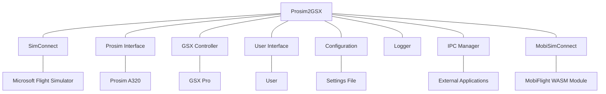

# System Patterns: Prosim2GSX

## Architecture Overview

Prosim2GSX follows a modular architecture with clear separation of concerns. The system is built as a Windows desktop application that runs alongside MSFS and Prosim, acting as a bridge between these systems and GSX Pro.



## Key Components

### Core Controllers

1. **ProsimController**
   - Interfaces with Prosim A320 through the Prosim SDK
   - Monitors aircraft state, fuel levels, passenger counts
   - Receives and processes events from Prosim
   - Sends commands to Prosim when needed

2. **GsxController**
   - Manages communication with GSX Pro
   - Initiates service calls based on aircraft state
   - Monitors GSX service status
   - Synchronizes GSX state with Prosim

3. **ServiceController**
   - Orchestrates the service flow between systems
   - Implements the business logic for when services should be called
   - Manages the state machine for ground operations
   - Handles timing and sequencing of operations

### Communication Interfaces

1. **MobiSimConnect**
   - Interfaces with the MobiFlight WASM module
   - Provides access to MSFS variables and events
   - Enables monitoring of aircraft state in MSFS

2. **ProsimInterface**
   - Wraps the Prosim SDK for easier integration
   - Provides event-based communication with Prosim
   - Abstracts Prosim-specific implementation details

3. **IPCManager**
   - Handles inter-process communication
   - Enables integration with external applications
   - Provides a communication channel for audio control

### Support Systems

1. **ConfigurationFile**
   - Manages persistent settings
   - Handles loading and saving of user preferences
   - Provides defaults for unconfigured options

2. **Logger**
   - Records application events and errors
   - Supports troubleshooting and debugging
   - Maintains history of operations

3. **FlightPlan**
   - Represents the current flight plan
   - Stores fuel, passenger, and cargo information
   - Used for synchronization between systems

## Design Patterns

### State Tracking Pattern
The system implements a comprehensive state tracking pattern across multiple services:

- **Core Approach**:
  - Boolean flags track the state of various operations
  - Public properties expose the state to other components
  - State transitions are clearly defined and logged
  - State is reset appropriately when operations complete
  - Thread synchronization ensures consistent state

- **Implementation in Key Services**:
  - **LoadsheetService**: Tracks generation state for preliminary and final loadsheets
  - **GsxRefuelingService**: Tracks refueling process state (requested, active, paused, completed)
  - **GsxMenuService**: Tracks menu readiness and operator selection

- **Benefits**:
  - Better coordination between components
  - Improved error detection and recovery
  - Enhanced logging with context-aware messages
  - Clear visibility of system state for debugging
  - Prevention of duplicate operations
  - Thread-safe state transitions

- **Example from GsxRefuelingService**:
  ```csharp
  // State tracking properties
  private bool _refuelingCompleted = false;
  private bool _initialFuelSet = false;
  private bool _refuelingRequested = false;
  private bool _refuelingActive = false;
  private bool _refuelingPaused = false;
  private bool _fuelHoseConnected = false;

  // Public interface for state access
  public bool IsRefuelingComplete => _refuelingCompleted;
  public bool IsInitialFuelSet => _initialFuelSet;
  public bool IsRefuelingRequested => _refuelingRequested;
  public bool IsRefuelingActive => _refuelingActive;
  public bool IsRefuelingPaused => _refuelingPaused;
  public bool IsFuelHoseConnected => _fuelHoseConnected;
  ```

### Thread-Safe UI Update Pattern
The system implements a thread-safe UI update pattern to address issues with background threads attempting to update UI elements:

- **Core Components**:
  - `ExecuteOnUIThread`: Helper method in ViewModelBase that ensures actions are executed on the UI thread
  - Thread-safe EventAggregator implementation that dispatches events to the UI thread when needed
  - Consistent pattern for marshaling operations from background threads to the UI thread

- **Implementation**:
  ```csharp
  // In ViewModelBase.cs
  protected void ExecuteOnUIThread(Action action)
  {
      if (action == null) return;
      
      if (Application.Current?.Dispatcher?.CheckAccess() == true)
      {
          action();
      }
      else
      {
          Application.Current?.Dispatcher?.Invoke(action);
      }
  }
  
  // Usage in ViewModels 
  private void OnSomeEventFromBackgroundThread(SomeEventArgs e)
  {
      ExecuteOnUIThread(() =>
      {
          // Update UI-bound properties here
          SomeProperty = e.SomeValue;
          AnotherProperty = e.AnotherValue;
          OnPropertyChanged(nameof(SomeProperty));
          OnPropertyChanged(nameof(AnotherProperty));
      });
  }
  ```

- **EventAggregator Thread Safety**:
  The EventAggregator ensures that events are always published on the UI thread when they might affect UI elements:
  ```csharp
  public void Publish<TEvent>(TEvent eventToPublish) where TEvent : EventBase
  {
      // ... existing code ...
  
      // Always dispatch UI-related events to the UI thread
      if (Application.Current != null && !Application.Current.Dispatcher.CheckAccess())
      {
          Application.Current.Dispatcher.Invoke(() => PublishToSubscribers(eventToPublish, subscriptions));
      }
      else
      {
          PublishToSubscribers(eventToPublish, subscriptions);
      }
  }
  ```

- **Benefits**:
  - Prevents InvalidOperationException due to cross-thread access to UI elements
  - Centralizes thread marshaling logic in a single, reusable method
  - Provides a consistent pattern for handling thread safety across the application
  - Improves application stability, especially during operations that trigger multiple UI updates
  - Eliminates crashes during critical phases like service state changes
  - Makes code more maintainable by separating thread concerns from business logic

### Event Aggregator Pattern
The system implements an event aggregator pattern to decouple components and improve UI responsiveness:

- **Core Components**:
  - `EventBase`: Abstract base class for all events
  - `IEventAggregator`: Interface defining publish/subscribe methods
  - `EventAggregator`: Singleton implementation with thread-safe operations
  - `SubscriptionToken`: Token-based system for managing subscriptions
  - `Dictionary<Type, List<object>>`: Internal storage for event subscriptions
  - `Dictionary<SubscriptionToken, object>`: Mapping between tokens and subscriptions
  - Thread-safe locking mechanism using a private `_lockObject`

- **Event Types**:
  - `ServiceStatusChangedEvent`: For ground service status changes
  - `ConnectionStatusChangedEvent`: For connection status changes
  - `FlightPhaseChangedEvent`: For flight phase transitions
  - `DataRefChangedEvent`: For Prosim dataref changes
  - `LvarChangedEvent`: For MSFS LVAR changes
  - `FlightPlanChangedEvent`: For flight plan updates
  - `RetryFlightPlanLoadEvent`: For triggering flight plan reload attempts
  - `AudioStateChangedEvent`: For audio system state changes

- **Implementation**:
  - Publishers call `EventAggregator.Instance.Publish<TEvent>(event)` to broadcast events
  - Subscribers call `EventAggregator.Instance.Subscribe<TEvent>(handler)` to register handlers
  - Subscribers receive a token that can be used to unsubscribe later
  - Thread-safe implementation ensures reliable operation in a multi-threaded environment
  - UI components use `Dispatcher.Invoke` to update UI elements from event handlers
  - Proper cleanup is implemented to prevent memory leaks
  - Exception handling in the Publish method prevents event handler exceptions from affecting other handlers
  - Events are processed synchronously to ensure proper ordering
  - The EventAggregator is implemented as a singleton using Lazy<T> with LazyThreadSafetyMode.ExecutionAndPublication

- **Example**:
  ```csharp
  // Publishing an event
  EventAggregator.Instance.Publish(new ServiceStatusChangedEvent("Jetway", ServiceStatus.Active));
  
  // Subscribing to events
  _subscriptionTokens.Add(EventAggregator.Instance.Subscribe<ServiceStatusChangedEvent>(OnServiceStatusChanged));
  
  // Handling events
  private void OnServiceStatusChanged(ServiceStatusChangedEvent evt)
  {
      Dispatcher.Invoke(() => {
          // Update UI based on service status
          switch (evt.ServiceName)
          {
              case "Jetway":
                  JetwayStatusIndicator.Fill = GetBrushForStatus(evt.Status);
                  break;
              // Other cases...
          }
      });
  }
  
  // Unsubscribing from events
  foreach (var token in _subscriptionTokens)
  {
      EventAggregator.Instance.Unsubscribe<EventBase>(token);
  }
  ```

### MVVM (Model-View-ViewModel)
The UI components follow the MVVM pattern, separating the user interface (View) from the business logic (ViewModel) and data (Model).

- **Models**: ServiceModel and other data structures
- **ViewModels**: NotifyIconViewModel and others
- **Views**: MainWindow.xaml and other UI components

### Dynamic Theming System
The application implements a dynamic theming system that allows customization of the UI based on airline themes:

- **Core Components**:
  - `Theme`: Class representing a theme with name, description, and colors
  - `ThemeColors`: Class containing color properties for various UI elements
  - `FlightPhaseColors`: Class containing colors for different flight phases
  - `ThemeManager`: Singleton class that handles loading, applying, and switching themes
  - `ThemeResources.xaml`: ResourceDictionary containing default theme resources

- **Theme Storage**:
  - Themes are stored as JSON files in the Themes directory
  - Each theme file contains color definitions for all UI elements
  - JSON format allows for easy creation and modification of themes
  - Theme files are loaded dynamically at runtime
  - Theme files are automatically copied to the output directory during build
  - The project file includes a wildcard pattern to ensure all theme JSON files are included

- **Color Conversion**:
  - Hex color strings in JSON (e.g., "#1E90FF") are converted to System.Windows.Media.Color objects
  - Conversion is handled by helper methods in the Theme classes
  - This approach allows for human-readable color definitions in theme files

- **Theme Application**:
  - ThemeManager loads all available themes from the Themes directory
  - The current theme is stored in application settings
  - When a theme is applied, all UI resources are updated with the theme's colors
  - The UI automatically updates to reflect the new theme

- **User Interface**:
  - Theme selection is available in the Settings tab
  - Users can switch between themes at runtime
  - A refresh button allows reloading themes without restarting the application
  - The theme directory path is displayed for users who want to create custom themes

- **Default Themes**:
  - Light: Default light theme with blue accents
  - Dark: Dark theme with blue accents on dark backgrounds
  - Airline Themes: Qantas (red), Delta (blue), Lufthansa (yellow), Finnair (blue)
  - Custom themes can be added by creating new JSON files in the Themes directory

- **Implementation**:
  ```csharp
  // Loading themes
  private void LoadThemesFromDirectory(string directory)
  {
      _themes.Clear();
      
      foreach (string file in Directory.GetFiles(directory, "*.json"))
      {
          try
          {
              string json = File.ReadAllText(file);
              Theme theme = JsonSerializer.Deserialize<Theme>(json, new JsonSerializerOptions 
              { 
                  PropertyNameCaseInsensitive = true
              });
              
              if (theme != null && !string.IsNullOrEmpty(theme.Name))
              {
                  _themes[theme.Name] = theme;
              }
          }
          catch (Exception ex)
          {
              Logger.Log(LogLevel.Warning, "ThemeManager", $"Failed to load theme file {file}: {ex.Message}");
          }
      }
  }
  
  // Applying a theme
  public void ApplyTheme(string themeName)
  {
      if (_themes.ContainsKey(themeName))
      {
          _currentTheme = _themes[themeName];
          _serviceModel.SetSetting("currentTheme", themeName);
          ApplyThemeToResources();
      }
  }
  
  // Updating UI resources
  private void ApplyThemeToResources()
  {
      var resources = Application.Current.Resources;
      
      resources["PrimaryColor"] = new SolidColorBrush(_currentTheme.Colors.GetPrimaryColor());
      resources["SecondaryColor"] = new SolidColorBrush(_currentTheme.Colors.GetSecondaryColor());
      // ... other color resources
  }
  ```

### First-Time Setup Pattern
The application implements a first-time setup pattern to ensure critical configuration is completed before the main application starts:

- **Core Components**:
  - `FirstTimeSetupDialog`: A dedicated dialog for first-time configuration
  - `App.xaml.cs`: Startup logic that checks for default configuration values
  - `ServiceModel`: Model that stores and validates configuration

- **Implementation**:
  - During application startup, the system checks if the SimBrief ID is set to the default value (0)
  - If the default value is detected, the first-time setup dialog is displayed
  - The dialog provides a user-friendly interface for entering and validating the SimBrief ID
  - Real-time validation ensures the ID is not empty, not "0", and is a valid numeric value
  - The dialog provides clear feedback on validation status
  - The user must enter a valid ID to proceed; canceling the dialog exits the application
  - Once a valid ID is provided, it's saved to the configuration and the application continues normal initialization

- **Benefits**:
  - Ensures critical configuration is completed before the application attempts to use it
  - Prevents crashes that could occur when using default or invalid configuration values
  - Provides a better user experience than error messages after startup
  - Centralizes validation logic in a dedicated component
  - Replaces the previous event-based approach that could lead to crashes

- **Example**:
  ```csharp
  // In App.xaml.cs
  if (Model.SimBriefID == "0")
  {
      // Show the first-time setup dialog
      var setupDialog = new FirstTimeSetupDialog(Model);
      bool? result = setupDialog.ShowDialog();
      
      // If the user cancels, exit the application
      if (result != true)
      {
          Logger.Log(LogLevel.Information, "App:OnStartup", 
              "User cancelled first-time setup. Exiting application.");
          Current.Shutdown();
          return;
      }
      
      // At this point, the user has entered a valid SimBrief ID
      Logger.Log(LogLevel.Information, "App:OnStartup", 
          $"User entered SimBrief ID: {Model.SimBriefID}");
  }
  
  // In FirstTimeSetupDialog.xaml.cs
  private void ValidateSimBriefID()
  {
      string id = txtSimbriefID.Text.Trim();
      
      // Check if the ID is empty
      if (string.IsNullOrWhiteSpace(id))
      {
          txtValidationMessage.Text = "Please enter a SimBrief ID.";
          btnContinue.IsEnabled = false;
          _idValidated = false;
          return;
      }
      
      // Check if the ID is "0"
      if (id == "0")
      {
          txtValidationMessage.Text = "The SimBrief ID cannot be 0. Please enter a valid ID.";
          btnContinue.IsEnabled = false;
          _idValidated = false;
          return;
      }
      
      // Check if the ID is a valid number
      if (!int.TryParse(id, out _))
      {
          txtValidationMessage.Text = "The SimBrief ID must be a numeric value.";
          btnContinue.IsEnabled = false;
          _idValidated = false;
          return;
      }
      
      // If we get here, the ID is valid
      txtValidationMessage.Text = "SimBrief ID validated successfully!";
      txtValidationMessage.Foreground = System.Windows.Media.Brushes.Green;
      btnContinue.IsEnabled = true;
      _idValidated = true;
      
      // Save the ID to the model
      _model.SetSetting("pilotID", id);
      _model.SimBriefID = id;
  }
  ```

### EFB-Style UI Design Pattern
The application implements an Electronic Flight Bag (EFB) style user interface design pattern, which is common in modern aviation applications:

- **Header Bar**: A prominent header bar with application title and navigation controls (color based on theme)
- **Tabbed Interface**: Content organized into logical tabs (FLIGHT STATUS and SETTINGS)
- **Status Indicators**: Visual indicators using color-coded circles to show connection and service states
- **Flight Phase Visualization**: A progress bar showing the current flight phase with clear visual feedback
- **Categorized Settings**: Settings organized into logical categories with clear headers
- **Modern Styling**: Consistent use of rounded corners, proper spacing, and theme-based color scheme
- **Responsive Layout**: UI elements that adapt to different states and provide clear visual feedback
- **Navigation Icons**: Simplified navigation using icon-based buttons in the header
- **Date Display**: Current date displayed in the header for situational awareness
- **Consistent Visual Language**: Uniform styling of UI elements (buttons, checkboxes, text fields, etc.)
- **Dynamic Theming**: UI colors change based on the selected theme, allowing airline-specific branding

This design pattern enhances usability by:
- Providing clear visual hierarchy and organization
- Using familiar aviation-style interface elements
- Offering immediate visual feedback on system status
- Maintaining consistency across all UI components
- Improving readability and reducing visual clutter
- Allowing personalization through theme selection

### Observer Pattern
The system uses events and event handlers extensively to communicate state changes between components:

- Controllers subscribe to events from external systems
- UI components observe changes in ViewModels
- Services react to state changes in the aircraft
- LVAR changes trigger registered callbacks through the MobiSimConnect callback system
- Prosim dataref changes trigger registered callbacks through the ProsimController dataref subscription system
- The event aggregator system extends this pattern with a centralized publish/subscribe mechanism

### Dataref Subscription Pattern
The system implements a comprehensive subscription pattern for Prosim dataref changes:

- Components register handlers for specific Prosim dataref changes via ProsimController
- A dedicated monitoring system periodically checks for changes in subscribed datarefs
- When a dataref value changes, all registered handlers are invoked with old and new values
- Thread-safe implementation ensures reliable operation in a multi-threaded environment
- Proper lifecycle management prevents memory leaks and resource exhaustion
- Multiple handlers can be registered for the same dataref, enabling flexible event handling
- Error handling is built into the monitoring system to prevent cascading failures
- Example of dataref subscription for cockpit door state:
  ```csharp
  // Register a handler for cockpit door state changes
  ProsimController.SubscribeToDataRef("system.switches.S_PED_COCKPIT_DOOR", cockpitDoorHandler);
  
  // Handler implementation
  private void OnCockpitDoorStateChanged(string dataRef, dynamic oldValue, dynamic newValue)
  {
      if (dataRef == "system.switches.S_PED_COCKPIT_DOOR")
      {
          // Determine door state based on switch position
          bool doorOpen = (int)newValue == 1;
          
          // Update GSX LVAR to match door state
          SimConnect.WriteLvar("FSDT_GSX_COCKPIT_DOOR_OPEN", doorOpen ? 1 : 0);
      }
  }
  ```

### Callback Pattern
The system implements a callback pattern for LVAR value changes:

- Components register callbacks for specific LVAR changes via MobiSimConnect
- When an LVAR value changes, registered callbacks are invoked with old and new values
- Callbacks are used to implement reactive behavior to simulator state changes
- Specific callbacks handle critical state changes like fuel hose connection/disconnection
- The refueling process uses callbacks to pause/resume based on fuel hose state
- Catering service state changes are monitored via dedicated callbacks:
  ```csharp
  private void OnCateringStateChanged(float newValue, float oldValue, string lvarName)
  {
      cateringState = newValue;
      Logger.Log(LogLevel.Debug, "GSXController", $"Catering state changed to {newValue}");
      
      if (newValue == 6 && !cateringFinished)
      {
          cateringFinished = true;
          Logger.Log(LogLevel.Information, "GSXController", $"Catering service completed");
      }
  }
  ```
- Service toggle changes trigger door operations via callbacks:
  ```csharp
  private void OnServiceToggleChanged(float newValue, float oldValue, string lvarName)
  {
      if (serviceToggles.ContainsKey(lvarName) && oldValue == SERVICE_TOGGLE_OFF && newValue == SERVICE_TOGGLE_ON)
      {
          serviceToggles[lvarName]();
      }
  }
  ```
- Error handling is built into the callback execution to prevent crashes

### Flight Phase State Machine
The service flow follows a sophisticated state machine pattern:

- **Flight States**:
  - `PREFLIGHT`: Initial state when the application starts
  - `DEPARTURE`: After flight plan is loaded, during boarding and refueling
  - `TAXIOUT`: After ground equipment is removed, during taxi to runway
  - `FLIGHT`: When aircraft is airborne
  - `TAXIIN`: After landing, during taxi to gate
  - `ARRIVAL`: After engines off and parking brake set, during deboarding
  - `TURNAROUND`: After deboarding complete, waiting for new flight plan

- **State Transitions**:
  - `PREFLIGHT` → `DEPARTURE`: Triggered by flight plan loading
  - `DEPARTURE` → `TAXIOUT`: Triggered by parking brake set, beacon on, and external power disconnected
  - `TAXIOUT` → `FLIGHT`: Triggered by aircraft becoming airborne
  - `FLIGHT` → `TAXIIN`: Triggered by aircraft landing
  - `TAXIIN` → `ARRIVAL`: Triggered by engines off, parking brake set, and ground speed near zero
  - `ARRIVAL` → `TURNAROUND`: Triggered by deboarding completion
  - `TURNAROUND` → `DEPARTURE`: Triggered by new flight plan loading

- **State Handlers**:
  - Each state has a dedicated handler method in GsxController (e.g., HandlePreflightState)
  - Handlers implement state-specific logic and check for transition conditions
  - State transitions are managed by the FlightStateService
  - Events are published when state transitions occur

- **Sub-State Machines**:
  - The refueling process implements a mini-state machine with states for active, paused, and completed
  - Boarding and deboarding processes have their own state tracking
  - Ground services (jetway, GPU, PCA) have individual state tracking
  - State transitions are triggered by both GSX events and aircraft conditions

### Dependency Injection
Components are designed with loose coupling in mind:

- Controllers accept interfaces rather than concrete implementations
- Services can be replaced or mocked for testing
- Configuration is injected rather than hardcoded

### Singleton
Some components are implemented as singletons to ensure a single instance:

- Configuration manager
- Logger
- Communication interfaces

### Standard Logging Pattern
The system implements the standard .NET ILogger pattern to provide consistent logging across the application:

- **Core Components**:
  - `ILoggerFactory`: Standard .NET interface for creating logger instances
  - `ILogger<T>`: Generic typed logger interface for category-based logging
  - `Serilog`: Implementation provider for actual log output
  - `ServiceLocator`: Centralized logger factory and creation point

- **Implementation**:
  ```csharp
  // Creating a logger through ServiceLocator
  private readonly ILogger<MyClass> _logger = ServiceLocator.GetLogger<MyClass>();
  
  // Usage in classes
  _logger.LogInformation("Starting operation");
  _logger.LogDebug("Processing item {ItemId}", itemId);
  _logger.LogError(exception, "Error occurred: {Message}", exception.Message);
  ```

- **Benefits**:
  - Clean separation between logging interface and implementation
  - Consistent logging patterns across the application
  - Category-based filtering and structured logging support
  - Ability to change logging implementation without modifying code
  - Preparation for extracting services to standalone libraries
  - Elimination of duplicate log entries through simplified configuration

### Dictionary-Based Action Mapping
The system uses dictionary-based action mapping for service toggles:

- Service toggle LVAR names are mapped to specific door operation actions
- This approach centralizes the mapping logic and improves maintainability
- Actions are triggered based on LVAR state changes
- The pattern allows for easy addition of new service toggle mappings
- Similar mapping approach is used for other state-based actions like refueling control
- Implementation in GsxController:
  ```csharp
  // Dictionary to map service toggle LVAR names to door operations
  private readonly Dictionary<string, Action> serviceToggles = new Dictionary<string, Action>();
  
  // Initialization in constructor
  serviceToggles.Add("FSDT_GSX_AIRCRAFT_SERVICE_1_TOGGLE", () => OperateFrontDoor());
  serviceToggles.Add("FSDT_GSX_AIRCRAFT_SERVICE_2_TOGGLE", () => OperateAftDoor());
  serviceToggles.Add("FSDT_GSX_AIRCRAFT_CARGO_1_TOGGLE", () => OperateFrontCargoDoor());
  serviceToggles.Add("FSDT_GSX_AIRCRAFT_CARGO_2_TOGGLE", () => OperateAftCargoDoor());
  
  // Usage in callback handler
  private void OnServiceToggleChanged(float newValue, float oldValue, string lvarName)
  {
      if (serviceToggles.ContainsKey(lvarName) && oldValue == SERVICE_TOGGLE_OFF && newValue == SERVICE_TOGGLE_ON)
      {
          serviceToggles[lvarName]();
      }
  }
  ```
- Catering service door operations are implemented using this pattern:
  ```csharp
  // Dictionary to map service toggle LVAR names to door operations
  private readonly Dictionary<string, Action> serviceToggles = new Dictionary<string, Action>();
  
  // Initialization in constructor
  serviceToggles.Add("FSDT_GSX_AIRCRAFT_SERVICE_1_TOGGLE", () => OperateFrontDoor());
  serviceToggles.Add("FSDT_GSX_AIRCRAFT_SERVICE_2_TOGGLE", () => OperateAftDoor());
  serviceToggles.Add("FSDT_GSX_AIRCRAFT_CARGO_1_TOGGLE", () => OperateFrontCargoDoor());
  serviceToggles.Add("FSDT_GSX_AIRCRAFT_CARGO_2_TOGGLE", () => OperateAftCargoDoor());
  ```

## Component Relationships

### UI Update Flow with Event Aggregator
1. GsxController monitors service states, connection statuses, and flight phases
2. When a state change is detected, GsxController publishes an appropriate event through the EventAggregator
3. MainWindow, which has subscribed to these events, receives the event notification
4. Event handlers in MainWindow update the UI elements using Dispatcher.Invoke for thread safety
5. This decoupled approach allows the UI to be updated without direct dependencies on the controllers
6. The MainWindow subscribes to events in its constructor and unsubscribes in its Closing handler
7. Each event type has a dedicated handler method in MainWindow (e.g., OnServiceStatusChanged)
8. UI elements are updated based on the event data, such as changing indicator colors for service status
9. The event aggregator ensures that events are delivered to all subscribers regardless of where they were published
6. Example flow for service status updates:
   - GsxController detects a change in jetway status
   - GsxController publishes a ServiceStatusChangedEvent
   - MainWindow's OnServiceStatusChanged handler is invoked
   - The handler updates the JetwayStatusIndicator with the appropriate color

### Cockpit Door State Flow
1. ProsimController monitors the cockpit door switch state via dataref subscription
2. When the cockpit door switch changes, the OnCockpitDoorStateChanged handler is invoked
3. The handler determines the door state based on the switch position (0=Normal/Closed, 1=Unlock/Open, 2=Lock/Closed)
4. The GSX LVAR (FSDT_GSX_COCKPIT_DOOR_OPEN) is updated to match the door state (0=closed, 1=open)
5. GSX uses this LVAR to control cabin sound muffling when the cockpit door is closed
6. The cockpit door indicator in Prosim is also updated to reflect the current state
7. Additionally, a DataRefChangedEvent is published through the EventAggregator
8. The event is received by any components that have subscribed to DataRefChangedEvent
9. This allows for real-time UI updates and other components to react to door state changes

### Initialization Flow
1. Application starts and initializes core components
2. Connections are established with MSFS, Prosim, and GSX
3. Configuration is loaded
4. UI is initialized
5. Event handlers are registered
6. System begins monitoring for state changes

### Service Orchestration
1. ServiceController monitors aircraft state through ProsimController and MobiSimConnect
2. When conditions are met for a service (e.g., flight plan loaded), ServiceController triggers the appropriate action
3. GsxController executes the service call to GSX
4. System monitors for service completion
5. When service completes, state is synchronized between systems

### Refueling Process Flow
1. **Initialization and State Setup:**
   - `GsxRefuelingService` initializes with connections to required services
   - `SetInitialFuel()` prepares the initial fuel state in Prosim
   - `SetHydraulicFluidLevels()` sets initial hydraulic fluid values
   - State tracking ensures these initialization steps happen only once

2. **Refueling Request:**
   - GSX controller checks for refueling conditions
   - `RequestRefueling()` opens the GSX menu and selects the refueling option
   - `_refuelingRequested` flag is set to track that refueling has been requested
   - A `ServiceStatusChangedEvent` is published to notify the system

3. **Activation and Monitoring:**
   - `SetRefuelingActive()` changes state to active and starts in paused state
   - `_refuelingActive` and `_refuelingPaused` flags track the current state
   - `StartRefueling()` is called on the Prosim refueling service to prepare fuel systems
   - LVAR callback monitors for fuel hose connection/disconnection

4. **Fuel Hose Management:**
   - `OnFuelHoseStateChanged()` callback handles fuel hose state changes
   - When hose connects: `_fuelHoseConnected = true`, `_refuelingPaused = false`, `ResumeRefueling()`
   - When hose disconnects: `_fuelHoseConnected = false`, `_refuelingPaused = true`, `PauseRefueling()`
   - All state changes are logged with appropriate level and category

5. **Processing and Completion:**
   - `ProcessRefueling()` is called regularly to check progress and update fuel levels
   - Prosim refueling service handles the actual fuel addition
   - When refueling completes: `_refuelingActive = false`, `_refuelingCompleted = true`, `StopRefueling()`
   - `StopRefueling()` explicitly terminates the refueling process and publishes completion events

### Loadsheet Generation Flow
1. **Thread-Safe Generation Process:**
   - The loadsheet generation process is protected by a dedicated lock object (`_loadsheetLock`)
   - State tracking flags prevent multiple simultaneous attempts to generate the same loadsheet type
   - A clear distinction between "requested" state and "generating" process is maintained
   - The `finally` block ensures state flags are always reset, even on exceptions
   - Loadsheet generation is tracked for both preliminary and final loadsheets independently

2. **Server Status Checking:**
   - Before attempting to generate a loadsheet, the system checks if the Prosim EFB server is running and accessible
   - A simple GET request is sent to the server's health endpoint
   - If the server is not available, the operation is aborted with a clear error message
   - This prevents unnecessary attempts to generate loadsheets when the server is not available
   - The server status check is implemented in both GsxLoadsheetService and ProsimLoadsheetService
   - The check uses a short timeout (5 seconds) to avoid hanging the application
   - The result is returned as a Task<bool> that can be awaited by the caller

3. **Loadsheet Generation:**
   - The system uses Prosim's native loadsheet functionality to generate loadsheets
   - A POST request is sent to the Prosim EFB server's loadsheet generation endpoint
   - The request includes the type of loadsheet to generate (Preliminary or Final)
   - The system tracks whether a loadsheet has already been requested for the current flight
   - Flags are reset when a new flight plan is loaded
   - Comprehensive logging with loadsheet-specific categories aids in troubleshooting

4. **Error Handling:**
   - Detailed HTTP status code interpretation with specific troubleshooting steps for different error types
   - Retry logic with exponential backoff for transient failures
   - Comprehensive logging of request/response details for troubleshooting
   - Timeout handling to detect connection issues quickly
   - Exception handling for TaskCanceledException (timeout), HttpRequestException (network issues), and general exceptions

### Menu Service Flow
1. **Menu Opening:**
   - `OpenMenu()` resets the menu ready flag and activates the GSX menu
   - Writing to LVAR `FSDT_GSX_MENU_OPEN` triggers the menu display
   - Menu opening is logged with `LogCategory.Menu` for better filtering

2. **Menu Item Selection:**
   - `SelectMenuItem()` includes optional waiting for menu readiness
   - Menu ready flag is reset before selection to track new selection
   - LVAR `FSDT_GSX_MENU_CHOICE` is set with adjusted index value
   - Small delay (100ms) follows selection to allow GSX to process
   - Selection is logged with detailed information about the choice

3. **Menu Readiness Management:**
   - `WaitForMenuReady()` polls the `IsGsxMenuReady` flag with a counter
   - Reasonable timeout (1000 iterations * 100ms = 100 seconds) prevents infinite waiting
   - Completion time is logged for performance analysis

4. **Operator Selection Handling:**
   - `IsOperatorSelectionActive()` checks menu file content
   - Detects specific text patterns indicating operator selection is required
   - Returns -1 (
