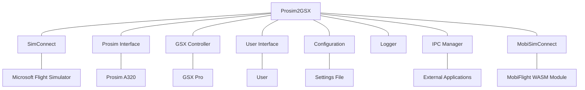

# System Patterns: Prosim2GSX

## Architecture Overview

Prosim2GSX follows a modular architecture with clear separation of concerns. The system is built as a Windows desktop application that runs alongside MSFS and Prosim, acting as a bridge between these systems and GSX Pro.



## Key Components

### Core Controllers

1. **ProsimController**
   - Interfaces with Prosim A320 through the Prosim SDK
   - Monitors aircraft state, fuel levels, passenger counts
   - Receives and processes events from Prosim
   - Sends commands to Prosim when needed

2. **GsxController**
   - Manages communication with GSX Pro
   - Initiates service calls based on aircraft state
   - Monitors GSX service status
   - Synchronizes GSX state with Prosim

3. **ServiceController**
   - Orchestrates the service flow between systems
   - Implements the business logic for when services should be called
   - Manages the state machine for ground operations
   - Handles timing and sequencing of operations

### Communication Interfaces

1. **MobiSimConnect**
   - Interfaces with the MobiFlight WASM module
   - Provides access to MSFS variables and events
   - Enables monitoring of aircraft state in MSFS

2. **ProsimInterface**
   - Wraps the Prosim SDK for easier integration
   - Provides event-based communication with Prosim
   - Abstracts Prosim-specific implementation details

3. **IPCManager**
   - Handles inter-process communication
   - Enables integration with external applications
   - Provides a communication channel for audio control

### Support Systems

1. **ConfigurationFile**
   - Manages persistent settings
   - Handles loading and saving of user preferences
   - Provides defaults for unconfigured options

2. **Logger**
   - Records application events and errors
   - Supports troubleshooting and debugging
   - Maintains history of operations

3. **FlightPlan**
   - Represents the current flight plan
   - Stores fuel, passenger, and cargo information
   - Used for synchronization between systems

## Design Patterns

### Event Aggregator Pattern
The system implements an event aggregator pattern to decouple components and improve UI responsiveness:

- **Core Components**:
  - `EventBase`: Abstract base class for all events
  - `IEventAggregator`: Interface defining publish/subscribe methods
  - `EventAggregator`: Singleton implementation with thread-safe operations
  - `SubscriptionToken`: Token-based system for managing subscriptions

- **Event Types**:
  - `ServiceStatusChangedEvent`: For ground service status changes
  - `ConnectionStatusChangedEvent`: For connection status changes
  - `FlightPhaseChangedEvent`: For flight phase transitions
  - `DataRefChangedEvent`: For Prosim dataref changes
  - `LvarChangedEvent`: For MSFS LVAR changes

- **Implementation**:
  - Publishers call `EventAggregator.Instance.Publish<TEvent>(event)` to broadcast events
  - Subscribers call `EventAggregator.Instance.Subscribe<TEvent>(handler)` to register handlers
  - Subscribers receive a token that can be used to unsubscribe later
  - Thread-safe implementation ensures reliable operation in a multi-threaded environment
  - UI components use `Dispatcher.Invoke` to update UI elements from event handlers
  - Proper cleanup is implemented to prevent memory leaks

- **Example**:
  ```csharp
  // Publishing an event
  EventAggregator.Instance.Publish(new ServiceStatusChangedEvent("Jetway", ServiceStatus.Active));
  
  // Subscribing to events
  _subscriptionTokens.Add(EventAggregator.Instance.Subscribe<ServiceStatusChangedEvent>(OnServiceStatusChanged));
  
  // Handling events
  private void OnServiceStatusChanged(ServiceStatusChangedEvent evt)
  {
      Dispatcher.Invoke(() => {
          // Update UI based on service status
          switch (evt.ServiceName)
          {
              case "Jetway":
                  JetwayStatusIndicator.Fill = GetBrushForStatus(evt.Status);
                  break;
              // Other cases...
          }
      });
  }
  
  // Unsubscribing from events
  foreach (var token in _subscriptionTokens)
  {
      EventAggregator.Instance.Unsubscribe<EventBase>(token);
  }
  ```

### MVVM (Model-View-ViewModel)
The UI components follow the MVVM pattern, separating the user interface (View) from the business logic (ViewModel) and data (Model).

- **Models**: ServiceModel and other data structures
- **ViewModels**: NotifyIconViewModel and others
- **Views**: MainWindow.xaml and other UI components

### Observer Pattern
The system uses events and event handlers extensively to communicate state changes between components:

- Controllers subscribe to events from external systems
- UI components observe changes in ViewModels
- Services react to state changes in the aircraft
- LVAR changes trigger registered callbacks through the MobiSimConnect callback system
- Prosim dataref changes trigger registered callbacks through the ProsimController dataref subscription system
- The event aggregator system extends this pattern with a centralized publish/subscribe mechanism

### Dataref Subscription Pattern
The system implements a comprehensive subscription pattern for Prosim dataref changes:

- Components register handlers for specific Prosim dataref changes via ProsimController
- A dedicated monitoring system periodically checks for changes in subscribed datarefs
- When a dataref value changes, all registered handlers are invoked with old and new values
- Thread-safe implementation ensures reliable operation in a multi-threaded environment
- Proper lifecycle management prevents memory leaks and resource exhaustion
- Multiple handlers can be registered for the same dataref, enabling flexible event handling
- Error handling is built into the monitoring system to prevent cascading failures
- Example of dataref subscription for cockpit door state:
  ```csharp
  // Register a handler for cockpit door state changes
  ProsimController.SubscribeToDataRef("system.switches.S_PED_COCKPIT_DOOR", cockpitDoorHandler);
  
  // Handler implementation
  private void OnCockpitDoorStateChanged(string dataRef, dynamic oldValue, dynamic newValue)
  {
      if (dataRef == "system.switches.S_PED_COCKPIT_DOOR")
      {
          // Determine door state based on switch position
          bool doorOpen = (int)newValue == 1;
          
          // Update GSX LVAR to match door state
          SimConnect.WriteLvar("FSDT_GSX_COCKPIT_DOOR_OPEN", doorOpen ? 1 : 0);
      }
  }
  ```

### Callback Pattern
The system implements a callback pattern for LVAR value changes:

- Components register callbacks for specific LVAR changes via MobiSimConnect
- When an LVAR value changes, registered callbacks are invoked with old and new values
- Callbacks are used to implement reactive behavior to simulator state changes
- Specific callbacks handle critical state changes like fuel hose connection/disconnection
- The refueling process uses callbacks to pause/resume based on fuel hose state
- Catering service state changes are monitored via dedicated callbacks:
  ```csharp
  private void OnCateringStateChanged(float newValue, float oldValue, string lvarName)
  {
      cateringState = newValue;
      Logger.Log(LogLevel.Debug, "GSXController", $"Catering state changed to {newValue}");
      
      if (newValue == 6 && !cateringFinished)
      {
          cateringFinished = true;
          Logger.Log(LogLevel.Information, "GSXController", $"Catering service completed");
      }
  }
  ```
- Service toggle changes trigger door operations via callbacks:
  ```csharp
  private void OnServiceToggleChanged(float newValue, float oldValue, string lvarName)
  {
      if (serviceToggles.ContainsKey(lvarName) && oldValue == SERVICE_TOGGLE_OFF && newValue == SERVICE_TOGGLE_ON)
      {
          serviceToggles[lvarName]();
      }
  }
  ```
- Error handling is built into the callback execution to prevent crashes

### State Machine
The service flow follows a state machine pattern:

- Each flight phase has defined states (pre-flight, boarding, departure, etc.)
- Transitions between states are triggered by specific events
- Actions are performed when entering or exiting states
- The refueling process implements a mini-state machine with states for active, paused, and completed
- State transitions are triggered by both GSX events and fuel hose connection status

### Dependency Injection
Components are designed with loose coupling in mind:

- Controllers accept interfaces rather than concrete implementations
- Services can be replaced or mocked for testing
- Configuration is injected rather than hardcoded

### Singleton
Some components are implemented as singletons to ensure a single instance:

- Configuration manager
- Logger
- Communication interfaces

### Dictionary-Based Action Mapping
The system uses dictionary-based action mapping for service toggles:

- Service toggle LVAR names are mapped to specific door operation actions
- This approach centralizes the mapping logic and improves maintainability
- Actions are triggered based on LVAR state changes
- The pattern allows for easy addition of new service toggle mappings
- Similar mapping approach is used for other state-based actions like refueling control
- Catering service door operations are implemented using this pattern:
  ```csharp
  // Dictionary to map service toggle LVAR names to door operations
  private readonly Dictionary<string, Action> serviceToggles = new Dictionary<string, Action>();
  
  // Initialization in constructor
  serviceToggles.Add("FSDT_GSX_AIRCRAFT_SERVICE_1_TOGGLE", () => OperateFrontDoor());
  serviceToggles.Add("FSDT_GSX_AIRCRAFT_SERVICE_2_TOGGLE", () => OperateAftDoor());
  serviceToggles.Add("FSDT_GSX_AIRCRAFT_CARGO_1_TOGGLE", () => OperateFrontCargoDoor());
  serviceToggles.Add("FSDT_GSX_AIRCRAFT_CARGO_2_TOGGLE", () => OperateAftCargoDoor());
  ```

## Component Relationships

### UI Update Flow with Event Aggregator
1. GsxController monitors service states, connection statuses, and flight phases
2. When a state change is detected, GsxController publishes an appropriate event through the EventAggregator
3. MainWindow, which has subscribed to these events, receives the event notification
4. Event handlers in MainWindow update the UI elements using Dispatcher.Invoke for thread safety
5. This decoupled approach allows the UI to be updated without direct dependencies on the controllers
6. Example flow for service status updates:
   - GsxController detects a change in jetway status
   - GsxController publishes a ServiceStatusChangedEvent
   - MainWindow's OnServiceStatusChanged handler is invoked
   - The handler updates the JetwayStatusIndicator with the appropriate color

### Cockpit Door State Flow
1. ProsimController monitors the cockpit door switch state via dataref subscription
2. When the cockpit door switch changes, the OnCockpitDoorStateChanged handler is invoked
3. The handler determines the door state based on the switch position (0=Normal/Closed, 1=Unlock/Open, 2=Lock/Closed)
4. The GSX LVAR (FSDT_GSX_COCKPIT_DOOR_OPEN) is updated to match the door state (0=closed, 1=open)
5. GSX uses this LVAR to control cabin sound muffling when the cockpit door is closed
6. The cockpit door indicator in Prosim is also updated to reflect the current state
7. Additionally, a DataRefChangedEvent is published through the EventAggregator

### Initialization Flow
1. Application starts and initializes core components
2. Connections are established with MSFS, Prosim, and GSX
3. Configuration is loaded
4. UI is initialized
5. Event handlers are registered
6. System begins monitoring for state changes

### Service Orchestration
1. ServiceController monitors aircraft state through ProsimController and MobiSimConnect
2. When conditions are met for a service (e.g., flight plan loaded), ServiceController triggers the appropriate action
3. GsxController executes the service call to GSX
4. System monitors for service completion
5. When service completes, state is synchronized between systems

### Refueling Process Flow
1. GSXController initiates refueling by calling the GSX refueling service
2. ProsimController initializes refueling with target fuel calculation (rounded to nearest 100)
3. Fuel hose connection state is monitored via LVAR callbacks
4. When hose is connected, refueling is active; when disconnected, refueling is paused
5. Refueling continues until target fuel level is reached or GSX reports completion
6. Center of gravity calculations are performed for accurate loadsheet data using the GetZfwCG() and GetTowCG() methods

### Center of Gravity Calculation Flow
1. **Zero Fuel Weight CG (MACZFW) Calculation:**
   - Current fuel values are stored for later restoration
   - All fuel tanks are temporarily set to zero (ACT1, ACT2, center, left, right)
   - A small delay allows the simulator to recalculate the CG
   - The CG value is read directly from Prosim via the "aircraft.cg" dataref
   - Original fuel values are restored to all tanks
   - The MACZFW value is returned as a percentage

2. **Take Off Weight CG (MACTOW) Calculation:**
   - System checks if current fuel amount is close to planned fuel amount
   - If fuel amounts are similar, current CG is used directly
   - If recalculation is needed:
     - Current fuel values are stored
     - Fuel is distributed according to A320 fuel loading pattern:
       - Wing tanks are filled first (up to capacity)
       - Remaining fuel goes to center tank
       - ACT tanks are left empty
     - A small delay allows the simulator to recalculate the CG
     - The CG value is read directly from Prosim
     - Original fuel values are restored
   - The MACTOW value is returned as a percentage

3. **CG Values Usage:**
   - CG values are included in both preliminary and final loadsheets
   - Changes in CG values between preliminary and final loadsheets are marked with "//"
   - A tolerance threshold is used to determine significant CG changes (0.5% for MAC values)

### Catering Service Door Flow
1. GSXController monitors catering service state via LVAR callbacks
2. When catering service enters waiting state (state 4), passenger doors can be opened
3. Service toggle LVARs trigger door operation callbacks when changed from 0 to 1
4. Door operations are executed based on the current catering state:
   - During waiting state: Doors are opened to allow catering service
   - During finished state: Doors are closed if they were open
   - During completed state: Cargo doors can be opened for loading
5. Cargo doors are automatically closed when cargo loading reaches 100%
6. ProsimController executes the actual door operations in Prosim A320

### Data Flow
1. Flight plan data flows from Prosim to Prosim2GSX
2. Service requests flow from Prosim2GSX to GSX
3. Service status flows from GSX to Prosim2GSX
4. Synchronized state flows from Prosim2GSX to Prosim
5. Configuration flows bidirectionally between UI and ConfigurationFile
6. LVAR changes flow from MSFS to registered callbacks via MobiSimConnect
7. Door operation commands flow from GSXController to ProsimController
8. CG calculation data flows from ProsimController to GsxController for loadsheet generation
9. Loadsheet data flows from GsxController to ACARS system (when enabled)
10. Events flow from controllers to UI components via the EventAggregator

## Error Handling

- Graceful degradation when components are unavailable
- Retry mechanisms for transient failures
- Logging of errors for troubleshooting
- User notifications for critical issues
- Recovery procedures for common failure scenarios
- Exception handling in LVAR callbacks to prevent cascading failures
- Value change validation to prevent unnecessary callback executions
- Exception handling in event handlers to prevent event propagation failures
- Thread-safe event publishing and subscription management
