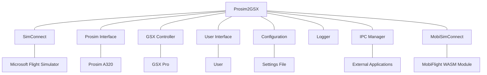

# System Patterns: Prosim2GSX

## Architecture Overview

Prosim2GSX follows a modular architecture with clear separation of concerns. The system is built as a Windows desktop application that runs alongside MSFS and Prosim, acting as a bridge between these systems and GSX Pro.

## Key Components

### Core Controllers

1. **ProsimController**
   - Interfaces with Prosim A320 through the Prosim SDK
   - Monitors aircraft state, fuel levels, passenger counts
   - Receives and processes events from Prosim
   - Sends commands to Prosim when needed

2. **GsxController**
   - Manages communication with GSX Pro
   - Initiates service calls based on aircraft state
   - Monitors GSX service status
   - Synchronizes GSX state with Prosim

3. **ServiceController**
   - Orchestrates the service flow between systems
   - Implements the business logic for when services should be called
   - Manages the state machine for ground operations
   - Handles timing and sequencing of operations

### Communication Interfaces

1. **MobiSimConnect**
   - Interfaces with the MobiFlight WASM module
   - Provides access to MSFS variables and events
   - Enables monitoring of aircraft state in MSFS

2. **ProsimInterface**
   - Wraps the Prosim SDK for easier integration
   - Provides event-based communication with Prosim
   - Abstracts Prosim-specific implementation details

3. **IPCManager**
   - Handles inter-process communication
   - Enables integration with external applications
   - Provides a communication channel for audio control

### Support Systems

1. **ConfigurationFile**
   - Manages persistent settings
   - Handles loading and saving of user preferences
   - Provides defaults for unconfigured options

2. **Logger**
   - Records application events and errors
   - Supports troubleshooting and debugging
   - Maintains history of operations

3. **FlightPlan**
   - Represents the current flight plan
   - Stores fuel, passenger, and cargo information
   - Used for synchronization between systems

## Design Patterns

### MVVM (Model-View-ViewModel)
The UI components follow the MVVM pattern, separating the user interface (View) from the business logic (ViewModel) and data (Model).

- **Models**: ServiceModel and other data structures
- **ViewModels**: NotifyIconViewModel and others
- **Views**: MainWindow.xaml and other UI components

### Observer Pattern
The system uses events and event handlers extensively to communicate state changes between components:

- Controllers subscribe to events from external systems
- UI components observe changes in ViewModels
- Services react to state changes in the aircraft
- LVAR changes trigger registered callbacks through the MobiSimConnect callback system

### Callback Pattern
The system implements a callback pattern for LVAR value changes:

- Components register callbacks for specific LVAR changes via MobiSimConnect
- When an LVAR value changes, registered callbacks are invoked with old and new values
- Callbacks are used to implement reactive behavior to simulator state changes
- Specific callbacks handle critical state changes like fuel hose connection/disconnection
- The refueling process uses callbacks to pause/resume based on fuel hose state
- Error handling is built into the callback execution to prevent crashes

### State Machine
The service flow follows a state machine pattern:

- Each flight phase has defined states (pre-flight, boarding, departure, etc.)
- Transitions between states are triggered by specific events
- Actions are performed when entering or exiting states
- The refueling process implements a mini-state machine with states for active, paused, and completed
- State transitions are triggered by both GSX events and fuel hose connection status

### Dependency Injection
Components are designed with loose coupling in mind:

- Controllers accept interfaces rather than concrete implementations
- Services can be replaced or mocked for testing
- Configuration is injected rather than hardcoded

### Singleton
Some components are implemented as singletons to ensure a single instance:

- Configuration manager
- Logger
- Communication interfaces

### Dictionary-Based Action Mapping
The system uses dictionary-based action mapping for service toggles:

- Service toggle LVAR names are mapped to specific door operation actions
- This approach centralizes the mapping logic and improves maintainability
- Actions are triggered based on LVAR state changes
- The pattern allows for easy addition of new service toggle mappings
- Similar mapping approach is used for other state-based actions like refueling control

## Component Relationships

### Initialization Flow
1. Application starts and initializes core components
2. Connections are established with MSFS, Prosim, and GSX
3. Configuration is loaded
4. UI is initialized
5. Event handlers are registered
6. System begins monitoring for state changes

### Service Orchestration
1. ServiceController monitors aircraft state through ProsimController and MobiSimConnect
2. When conditions are met for a service (e.g., flight plan loaded), ServiceController triggers the appropriate action
3. GsxController executes the service call to GSX
4. System monitors for service completion
5. When service completes, state is synchronized between systems

### Refueling Process Flow
1. GSXController initiates refueling by calling the GSX refueling service
2. ProsimController initializes refueling with target fuel calculation
3. Fuel hose connection state is monitored via LVAR callbacks
4. When hose is connected, refueling is active; when disconnected, refueling is paused
5. Refueling continues until target fuel level is reached or GSX reports completion
6. Center of gravity calculations are performed for accurate loadsheet data

### Data Flow
1. Flight plan data flows from Prosim to Prosim2GSX
2. Service requests flow from Prosim2GSX to GSX
3. Service status flows from GSX to Prosim2GSX
4. Synchronized state flows from Prosim2GSX to Prosim
5. Configuration flows bidirectionally between UI and ConfigurationFile
6. LVAR changes flow from MSFS to registered callbacks via MobiSimConnect

## Error Handling

- Graceful degradation when components are unavailable
- Retry mechanisms for transient failures
- Logging of errors for troubleshooting
- User notifications for critical issues
- Recovery procedures for common failure scenarios
- Exception handling in LVAR callbacks to prevent cascading failures
- Value change validation to prevent unnecessary callback executions
