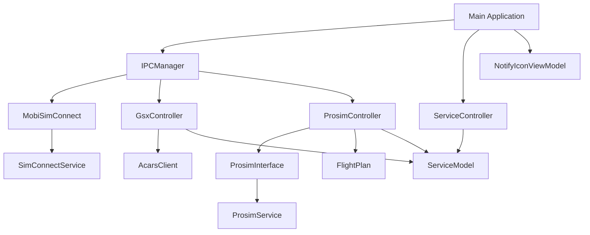
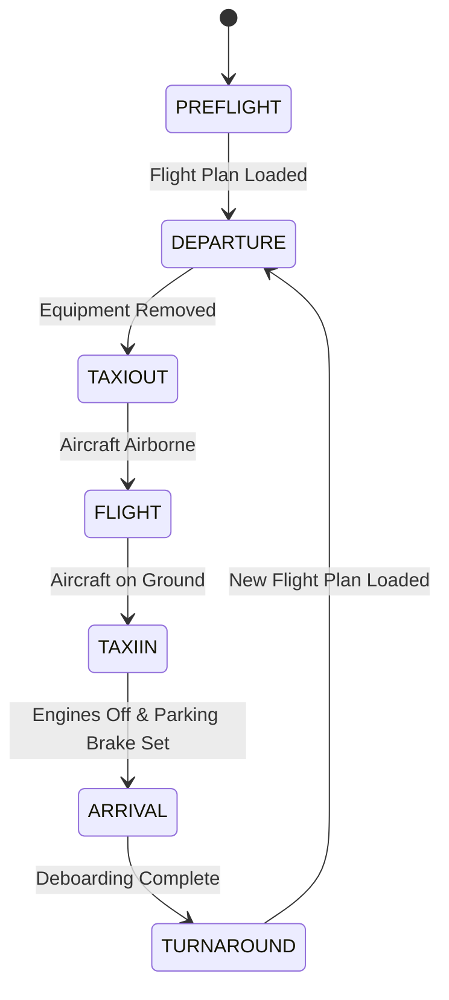
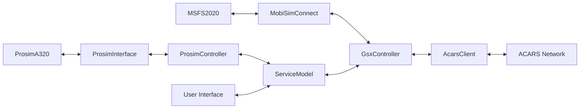

# System Patterns: Prosim2GSX

## Architecture Overview

Prosim2GSX follows a modular architecture with clear separation of concerns. The application is structured around several key components that work together to provide seamless integration between ProsimA320 and GSX in Microsoft Flight Simulator 2020.

## Component Relationships

### Core Components

1. **Main Application (MainWindow)**
   - Entry point for the application
   - Manages the UI and system tray icon
   - Coordinates between controllers and view models

2. **IPCManager**
   - Central hub for inter-process communication
   - Manages connections to external systems (SimConnect, ProSim)
   - Provides access to controllers for other components

3. **ServiceController**
   - Manages the application's service lifecycle
   - Coordinates startup and shutdown sequences
   - Monitors system state and handles reconnection

4. **ServiceModel**
   - Stores application configuration and state
   - Provides settings for all components
   - Persists configuration through ConfigurationFile

### Integration Components

1. **MobiSimConnect**
   - Interfaces with Microsoft Flight Simulator via SimConnect
   - Subscribes to simulator variables and events
   - Provides methods to read/write simulator data

2. **GsxController**
   - Manages interaction with GSX in MSFS2020
   - Controls GSX services (boarding, deboarding, refueling, etc.)
   - Handles flight state transitions and service timing
   - Manages audio control for GSX and other applications

3. **ProsimController**
   - Interfaces with ProsimA320
   - Synchronizes flight plan data
   - Manages passenger, cargo, and fuel data
   - Controls ground equipment in ProSim

4. **ProsimInterface**
   - Low-level interface to ProSim SDK
   - Handles data conversion between systems
   - Provides abstraction for ProSim API calls

5. **FlightPlan**
   - Manages flight plan data
   - Loads and parses flight plans from ProsimA320
   - Provides structured access to flight information

6. **AcarsClient**
   - Handles ACARS communication
   - Sends and receives messages via ACARS networks
   - Formats loadsheets and other flight information

### UI Components

1. **NotifyIconViewModel**
   - Manages the system tray icon and context menu
   - Provides commands for user interaction
   - Controls application visibility

## State Management

The application uses a state machine pattern to manage the flight lifecycle:

Each state has specific behaviors and triggers specific actions:

1. **PREFLIGHT**
   - Connect to ProsimA320 and MSFS
   - Position aircraft at gate (if configured)
   - Connect jetway/stairs (if configured)
   - Place ground equipment

2. **DEPARTURE**
   - Call refueling service
   - Call catering service
   - Call boarding service
   - Send final loadsheet
   - Remove ground equipment

3. **TAXIOUT**
   - Monitor aircraft state
   - Prepare for takeoff

4. **FLIGHT**
   - Minimal interaction
   - Monitor flight progress

5. **TAXIIN**
   - Monitor aircraft state
   - Prepare for arrival services

6. **ARRIVAL**
   - Connect jetway/stairs
   - Place ground equipment
   - Call deboarding service

7. **TURNAROUND**
   - Wait for new flight plan
   - Reset for next departure

## Design Patterns

### 1. Model-View-ViewModel (MVVM)
The UI follows the MVVM pattern:
- **Model**: ServiceModel and other data classes
- **View**: MainWindow and NotifyIconResources
- **ViewModel**: NotifyIconViewModel

### 2. Dependency Injection
Components receive their dependencies through constructors, promoting loose coupling and testability.

### 3. Observer Pattern
The application uses event-based communication for state changes:
- SimConnect subscribes to simulator variables
- Controllers observe model changes
- UI updates based on property change notifications

### 4. State Machine
The GsxController implements a state machine to manage the flight lifecycle, with clear transitions between states.

### 5. Facade Pattern
The ProsimInterface and MobiSimConnect classes provide simplified interfaces to complex subsystems.

## Data Flow

1. **Configuration Flow**:
   - User configures settings via UI
   - Settings stored in ServiceModel
   - Controllers read settings from ServiceModel

2. **Flight Plan Flow**:
   - Flight plan loaded in ProsimA320
   - ProsimController detects and parses flight plan
   - GsxController uses flight plan data to coordinate services

3. **Service Flow**:
   - GsxController determines current flight state
   - Based on state, calls appropriate GSX services
   - Synchronizes data with ProsimController

4. **Audio Control Flow**:
   - Cockpit controls adjusted in ProsimA320
   - ProsimController detects changes
   - GsxController adjusts audio levels for external applications

## Technical Decisions

### 1. SimConnect for MSFS Integration
- Provides stable API for interacting with MSFS
- Allows reading/writing simulator variables
- Enables subscription to simulator events

### 2. ProSim SDK for ProsimA320 Integration
- Official SDK provides reliable access to ProsimA320
- Allows reading/writing ProSim variables
- Enables monitoring of ProSim events

### 3. System Tray Application
- Minimizes UI footprint
- Allows application to run in background
- Provides easy access to configuration

### 4. State-Based Service Management
- Clear state transitions based on flight phase
- Predictable behavior for service calls
- Easier to debug and maintain

### 5. Configurable Automation
- All automation features can be enabled/disabled
- Allows users to customize their experience
- Accommodates different workflows and preferences
