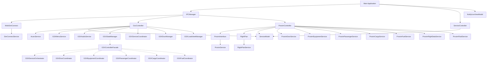
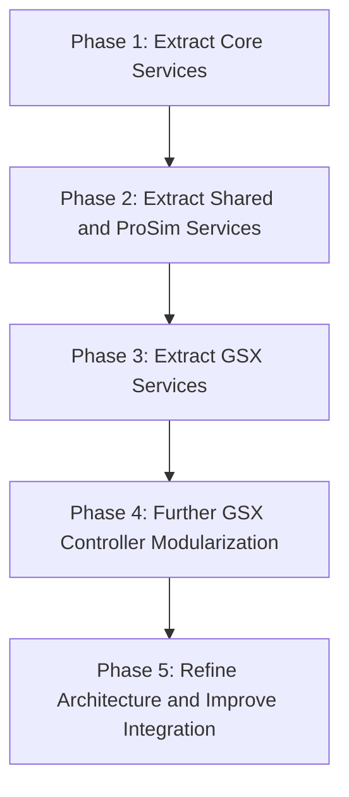
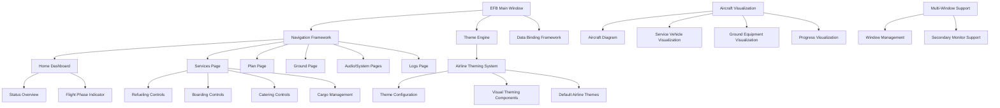
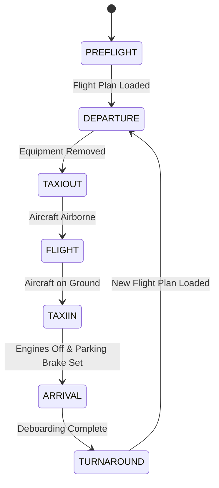
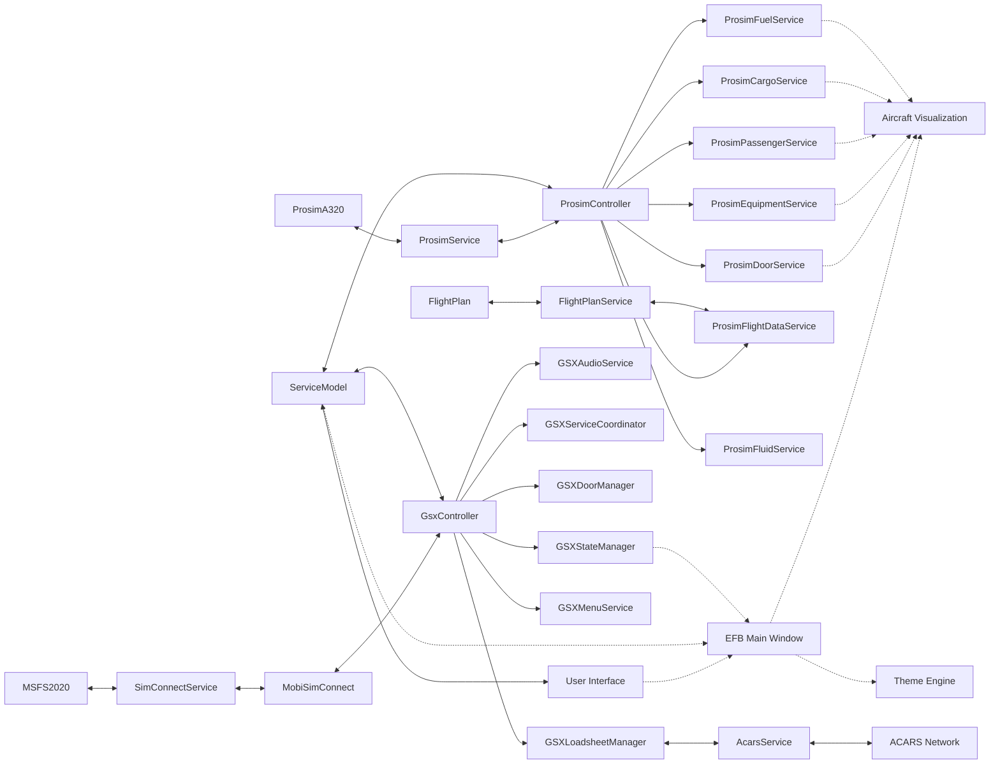

# System Patterns: Prosim2GSX

## Architecture Overview

Prosim2GSX follows a modular architecture with clear separation of concerns. The application is structured around several key components that work together to provide seamless integration between ProsimA320 and GSX in Microsoft Flight Simulator 2020.

The architecture is currently undergoing significant modularization to improve maintainability, testability, and extensibility. This modularization is being implemented in phases, with each phase focusing on extracting specific functionality into well-defined services with clear interfaces.

## Modularization Approach

The modularization is being implemented in phases, with each phase focusing on a specific area of functionality:

### Phase 1: Core Services (Completed)
- Extracted SimConnectService and ProsimService
- Created interfaces for better testability
- Improved error handling and logging

### Phase 2: Shared and ProSim Services (Completed)
- Extracted AcarsService, FlightPlanService
- Extracted ProsimDoorService, ProsimEquipmentService
- Extracted ProsimPassengerService, ProsimCargoService
- Extracted ProsimFuelService, ProsimFlightDataService, ProsimFluidService
- Created shared service interfaces (IPassengerService, ICargoService, IFuelService)

### Phase 3: GSX Services (In Progress)
- Completed GSXMenuService implementation
- Completed GSXAudioService implementation
- Planned GSXStateManager, GSXServiceCoordinator
- Planned GSXDoorManager, GSXLoadsheetManager
- Planned refinement of GsxController

### Phase 4: Further GSX Controller Modularization (Planned)
- Create GSXControllerFacade
- Enhance GSXStateMachine
- Create GSXServiceOrchestrator
- Create coordinators for doors, equipment, passengers, cargo, and fuel

### Phase 5: Refine Architecture and Improve Integration (Planned)
- Refine service interactions
- Improve controller architecture
- Implement comprehensive testing

## Component Relationships

### Core Components

1. **Main Application (MainWindow)**
   - Entry point for the application
   - Manages the UI and system tray icon
   - Coordinates between controllers and view models

2. **IPCManager**
   - Central hub for inter-process communication
   - Manages connections to external systems (SimConnect, ProSim)
   - Provides access to controllers for other components

3. **ServiceController**
   - Manages the application's service lifecycle
   - Coordinates startup and shutdown sequences
   - Monitors system state and handles reconnection

4. **ServiceModel**
   - Stores application configuration and state
   - Provides settings for all components
   - Persists configuration through ConfigurationFile

### Integration Components

1. **MobiSimConnect**
   - Interfaces with Microsoft Flight Simulator via SimConnect
   - Subscribes to simulator variables and events
   - Provides methods to read/write simulator data

2. **GsxController**
   - Manages interaction with GSX in MSFS2020
   - Controls GSX services (boarding, deboarding, refueling, etc.)
   - Handles flight state transitions and service timing
   - Manages audio control for GSX and other applications

3. **ProsimController**
   - Interfaces with ProsimA320
   - Synchronizes flight plan data
   - Manages passenger, cargo, and fuel data
   - Controls ground equipment in ProSim

4. **ProsimInterface**
   - Low-level interface to ProSim SDK
   - Handles data conversion between systems
   - Provides abstraction for ProSim API calls

5. **FlightPlan**
   - Manages flight plan data
   - Loads and parses flight plans from ProsimA320
   - Provides structured access to flight information

6. **AcarsService**
   - Handles ACARS communication
   - Sends and receives messages via ACARS networks
   - Formats loadsheets and other flight information

### Implemented Modularized Services

1. **SimConnectService**
   - Provides abstraction over SimConnect API
   - Handles connection to MSFS2020
   - Manages simulator variables and events
   - Implements error handling and reconnection logic

2. **ProsimService**
   - Provides abstraction over ProSim SDK
   - Handles connection to ProsimA320
   - Manages ProSim variables and events
   - Implements error handling and reconnection logic

3. **FlightPlanService**
   - Loads and parses flight plans
   - Provides structured access to flight plan data
   - Handles flight plan file operations
   - Raises events when flight plans change

4. **ProsimDoorService**
   - Controls aircraft doors in ProSim
   - Provides door state information
   - Raises events for door state changes
   - Centralizes door management logic

5. **ProsimEquipmentService**
   - Manages ground equipment in ProSim
   - Controls GPU, PCA, and chocks
   - Provides equipment state information
   - Raises events for equipment state changes

6. **ProsimPassengerService**
   - Manages passenger data in ProSim
   - Controls boarding and deboarding
   - Provides passenger count information
   - Raises events for passenger state changes

7. **ProsimCargoService**
   - Manages cargo data in ProSim
   - Controls cargo loading and unloading
   - Provides cargo weight information
   - Raises events for cargo state changes

8. **ProsimFuelService**
   - Manages fuel data in ProSim
   - Controls refueling operations
   - Provides fuel quantity information
   - Raises events for fuel state changes

9. **ProsimFlightDataService**
   - Manages flight data in ProSim
   - Provides access to flight parameters
   - Formats flight data for other components
   - Raises events for flight data changes

10. **ProsimFluidService**
    - Manages hydraulic fluid data in ProSim
    - Controls fluid levels and servicing
    - Provides fluid quantity information
    - Raises events for fluid state changes

11. **GSXMenuService**
    - Interacts with GSX menu system
    - Selects menu items and operators
    - Manages menu navigation
    - Provides abstraction for GSX menu interaction

12. **GSXAudioService**
    - Controls audio for GSX and other applications
    - Adjusts volume based on cockpit controls
    - Provides audio reset functionality
    - Manages audio device detection and control
    - Implements thread safety with locks
    - Provides event-based communication for audio state changes
    - Offers both synchronous and asynchronous methods with cancellation support

### Planned Modularized Services

1. **GSXStateManager**
   - Manages flight state transitions
   - Provides state query methods
   - Raises events when state changes
   - Centralizes state management logic
   - Implements state validation and state-specific behavior

2. **GSXServiceCoordinator**
   - Coordinates GSX services (boarding, refueling, etc.)
   - Manages service timing and sequencing
   - Raises events for service status changes
   - Centralizes service operation logic

3. **GSXDoorManager**
   - Manages aircraft door operations
   - Controls door opening/closing based on service needs
   - Raises events for door state changes
   - Handles door toggle requests from GSX

4. **GSXLoadsheetManager**
   - Generates and sends loadsheets
   - Formats loadsheet data for ACARS transmission
   - Calculates weight and balance information
   - Raises events when loadsheets are generated

5. **GSXControllerFacade**
   - Provides a simplified interface to the GSX subsystem
   - Initializes and manages GSX services
   - Delegates to specialized services
   - Handles high-level error recovery

6. **GSXServiceOrchestrator**
   - Coordinates service execution based on state
   - Manages service timing and dependencies
   - Provides event-based communication for service execution status

7. **GSXDoorCoordinator**
   - Manages door operations and state tracking
   - Coordinates door operations with services
   - Provides event-based communication for door state changes

8. **GSXEquipmentCoordinator**
   - Manages equipment operations and state tracking
   - Coordinates equipment operations with services
   - Provides event-based communication for equipment state changes

9. **GSXPassengerCoordinator**
   - Manages passenger boarding and deboarding
   - Tracks passenger counts
   - Coordinates passenger operations with services
   - Provides event-based communication for passenger state changes

10. **GSXCargoCoordinator**
    - Manages cargo loading and unloading
    - Tracks cargo states
    - Coordinates cargo operations with services
    - Provides event-based communication for cargo state changes

11. **GSXFuelCoordinator**
    - Manages refueling operations
    - Tracks fuel states
    - Coordinates fuel operations with services
    - Provides event-based communication for fuel state changes

### UI Components

1. **NotifyIconViewModel**
   - Manages the system tray icon and context menu
   - Provides commands for user interaction
   - Controls application visibility

### Planned EFB UI Architecture

The future Electronic Flight Bag (EFB) style user interface will follow a more sophisticated architecture that resembles actual EFBs used by A320 pilots. This UI will be implemented after the completion of the modularization effort.

The EFB UI will introduce several new components:

1. **EFB Main Window**
   - Primary container for the EFB interface
   - Supports detaching to secondary monitor
   - Provides window management controls

2. **Navigation Framework**
   - Tab-based navigation system
   - Page transition animations
   - Navigation history and state preservation

3. **Theme Engine**
   - JSON-based theme configuration
   - Dynamic resource dictionary management
   - Airline-specific theming support

4. **Aircraft Visualization**
   - Interactive A320 aircraft diagram
   - Service vehicle visualization
   - Ground equipment visualization
   - Enhanced progress indicators

5. **Flight Phase Integration**
   - Contextual UI adaptation based on flight phase
   - Proactive notifications for upcoming actions
   - Countdown timers for ongoing processes

## State Management

The application uses a state machine pattern to manage the flight lifecycle:

Each state has specific behaviors and triggers specific actions:

1. **PREFLIGHT**
   - Connect to ProsimA320 and MSFS
   - Position aircraft at gate (if configured)
   - Connect jetway/stairs (if configured)
   - Place ground equipment

2. **DEPARTURE**
   - Call refueling service
   - Call catering service
   - Call boarding service
   - Send final loadsheet
   - Remove ground equipment

3. **TAXIOUT**
   - Monitor aircraft state
   - Prepare for takeoff

4. **FLIGHT**
   - Minimal interaction
   - Monitor flight progress

5. **TAXIIN**
   - Monitor aircraft state
   - Prepare for arrival services

6. **ARRIVAL**
   - Connect jetway/stairs
   - Place ground equipment
   - Call deboarding service

7. **TURNAROUND**
   - Wait for new flight plan
   - Reset for next departure

## Design Patterns

### 1. Model-View-ViewModel (MVVM)
The UI follows the MVVM pattern:
- **Model**: ServiceModel and other data classes
- **View**: MainWindow and NotifyIconResources
- **ViewModel**: NotifyIconViewModel

The planned EFB UI will extend this pattern with:
- **View**: EFB-specific views and controls
- **ViewModel**: Page-specific view models with enhanced data binding
- **Model**: Extended ServiceModel with additional EFB-specific properties

### 2. Dependency Injection
Components receive their dependencies through constructors, promoting loose coupling and testability:
- Services are injected into controllers
- Controllers are injected into managers
- All dependencies are explicit and can be mocked for testing

### 3. Observer Pattern
The application uses event-based communication for state changes:
- SimConnect subscribes to simulator variables
- Controllers observe model changes
- UI updates based on property change notifications
- Services raise events for state changes
- Components subscribe to events from other components

### 4. State Machine
The GSXStateManager implements a state machine to manage the flight lifecycle:
- Clear states representing flight phases
- Well-defined transitions between states
- State-specific behaviors
- Event-based notification of state changes

### 5. Facade Pattern
The GsxController acts as a facade for the GSX subsystem:
- Provides a simplified interface to complex subsystems
- Delegates to specialized services
- Coordinates between services
- Hides implementation details from clients

### 6. Strategy Pattern
The application uses the strategy pattern for service operations:
- Different strategies for different flight phases
- Interchangeable service implementations
- Common interfaces for similar operations
- Runtime selection of appropriate strategy

### 7. Command Pattern
The GSXMenuService implements the command pattern for menu interactions:
- Encapsulates menu operations as objects
- Decouples menu selection from execution
- Allows for parameterization of menu operations
- Supports undo/redo operations

### 8. Adapter Pattern
The ProsimInterface and MobiSimConnect classes act as adapters:
- Convert external API calls to internal format
- Provide consistent interface to different subsystems
- Hide implementation details of external systems
- Allow for easy replacement of external dependencies

### 9. Repository Pattern
The FlightPlanService implements the repository pattern:
- Centralizes data access logic
- Provides abstraction over data sources
- Handles data persistence and retrieval
- Encapsulates data access operations

### 10. Service Locator Pattern
The IPCManager acts as a service locator:
- Provides access to services throughout the application
- Centralizes service registration and retrieval
- Decouples service consumers from service providers
- Simplifies service discovery

### 11. Interface Segregation Pattern
The modularization effort applies the Interface Segregation Principle by:
- Splitting large interfaces into more focused ones
- Creating specific interfaces for different aspects of functionality
- Ensuring clients only depend on methods they actually use
- Improving maintainability and reducing coupling

### 12. Composable Services Pattern
The new architecture uses composable services:
- Each service focuses on a single responsibility
- Services can be composed to create more complex behavior
- Dependencies are explicit through constructor injection
- Services can be tested in isolation

### 13. Event-Based Communication
The modularized services use event-based communication:
- Services raise events for significant state changes
- Other services can subscribe to these events
- Reduces direct dependencies between services
- Improves flexibility and extensibility

### 14. Theme Provider Pattern
The planned EFB UI will implement the Theme Provider pattern:
- Centralized theme management
- Dynamic theme switching at runtime
- Consistent styling across all components
- Airline-specific theme customization

### 15. Composite Pattern
The planned EFB UI will use the Composite pattern for UI components:
- Complex UI elements composed of simpler ones
- Consistent interface for all UI components
- Hierarchical organization of UI elements
- Simplified management of complex UI structures

### 16. Template Method Pattern
The planned EFB UI will use the Template Method pattern for page layouts:
- Common page structure defined in base classes
- Specific pages override only what they need to change
- Consistent layout and behavior across pages
- Reduced code duplication

## Data Flow

### Key Data Flows

1. **Configuration Flow**:
   - User configures settings via UI
   - Settings stored in ServiceModel
   - ServiceModel provides configuration to all components
   - Components read settings and adjust behavior accordingly

2. **Flight Plan Flow**:
   - Flight plan loaded in ProsimA320
   - ProsimFlightDataService detects new flight plan
   - FlightPlanService parses and validates flight plan
   - FlightPlanService raises event for new flight plan
   - GSXStateManager transitions to appropriate state
   - GSXServiceCoordinator uses flight plan data to coordinate services

3. **Service Flow**:
   - GSXStateManager determines current flight state
   - GSXServiceCoordinator selects appropriate services based on state
   - GSXServiceCoordinator calls service methods on GSX
   - GSXServiceCoordinator raises events for service status changes
   - GsxController coordinates between GSX services and ProSim services

4. **Passenger Flow**:
   - ProsimPassengerService provides passenger data
   - GSXServiceCoordinator uses passenger data for boarding/deboarding
   - GSXLoadsheetManager generates loadsheet with passenger data
   - AcarsService transmits loadsheet to ACARS network

5. **Cargo Flow**:
   - ProsimCargoService provides cargo data
   - GSXServiceCoordinator uses cargo data for loading/unloading
   - GSXLoadsheetManager includes cargo data in loadsheet
   - AcarsService transmits loadsheet to ACARS network

6. **Fuel Flow**:
   - ProsimFuelService provides fuel data
   - GSXServiceCoordinator uses fuel data for refueling
   - GSXLoadsheetManager includes fuel data in loadsheet
   - AcarsService transmits loadsheet to ACARS network

7. **Door Flow**:
   - ProsimDoorService provides door state information
   - GSXDoorManager controls doors based on service needs
   - GSXServiceCoordinator coordinates door operations with services
   - GSXDoorManager raises events for door state changes

8. **Audio Control Flow**:
   - ProsimController detects changes in cockpit controls
   - GSXAudioService adjusts audio levels for GSX and other applications
   - GSXAudioService provides audio reset functionality
   - GSXAudioService raises events for audio state changes

## Technical Decisions

### 1. Modular Architecture
- Separation of concerns through specialized services
- Interface-based design for testability
- Event-based communication for loose coupling
- Dependency injection for flexible component composition
- Reduced complexity in individual components

### 2. SimConnect for MSFS Integration
- Provides stable API for interacting with MSFS
- Allows reading/writing simulator variables
- Enables subscription to simulator events
- Abstracted through SimConnectService for testability

### 3. ProSim SDK for ProsimA320 Integration
- Official SDK provides reliable access to ProsimA320
- Allows reading/writing ProSim variables
- Enables monitoring of ProSim events
- Abstracted through ProsimService for testability

### 4. System Tray Application
- Minimizes UI footprint
- Allows application to run in background
- Provides easy access to configuration
- Uses MVVM pattern for separation of UI and logic

### 5. State-Based Service Management
- Clear state transitions based on flight phase
- Predictable behavior for service calls
- Easier to debug and maintain
- Centralized in GSXStateManager for consistency

### 6. Configurable Automation
- All automation features can be enabled/disabled
- Allows users to customize their experience
- Accommodates different workflows and preferences
- Configuration stored in ServiceModel for centralized access

### 7. Event-Based Communication
- Components communicate through events
- Reduces direct dependencies between components
- Allows for flexible component composition
- Simplifies adding new features and services

### 8. Interface-Based Design
- All services implement interfaces
- Enables mock implementations for testing
- Allows for alternative implementations
- Facilitates future platform extensions

### 9. Secure XML Processing
- XML processing uses secure settings
- DtdProcessing.Prohibit for security
- Null XmlResolver to prevent external entity resolution
- Proper indentation and formatting for XML output

### 10. Comprehensive Logging
- Serilog used for structured logging
- Appropriate log levels based on context
- Relevant context included in log messages
- Centralized logging configuration

### 11. Enhanced Service Design
- Interface Segregation for more focused interfaces
- Composable services with single responsibilities
- Helper classes for complex logic
- Factory patterns for creating complex objects

### 12. Improved Dependency Management
- Explicit dependencies through constructor injection
- Optional dependencies handled gracefully
- Lazy initialization for services not always needed
- Service locator for complex dependency scenarios

### 13. Robust Error Handling
- Service-specific exceptions
- Retry mechanisms for transient failures
- Circuit breaker pattern for external dependencies
- Graceful degradation when dependencies fail

### 14. Comprehensive Testing Strategy
- Unit tests for all services
- Integration tests for service interactions
- Mock external dependencies
- Performance testing for critical paths

### 15. Thread Safety Considerations
- Thread safety documentation
- Appropriate synchronization mechanisms
- Async patterns for I/O-bound operations
- Thread isolation for sensitive operations
