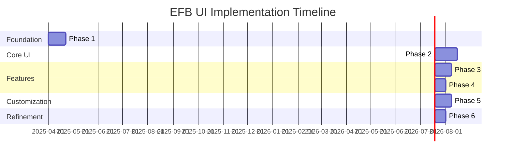

# EFB-Style UI Implementation Strategy for Prosim2GSX

## Overview

This document outlines a phased implementation strategy for creating a new Electronic Flight Bag (EFB) style user interface for Prosim2GSX. The new UI will provide a more realistic and intuitive experience that resembles actual EFBs used by A320 pilots, with customization options for different airlines and optimizations for secondary monitor use.

## Implementation Dependencies

This implementation should be scheduled after:
1. The .NET 8.0 migration (outlined in `dotnet8-migration-strategy.md`)
2. The modularisation of GSXController and ProsimController classes

## Phased Implementation Approach

The implementation is divided into six phases, each with clear deliverables and milestones. This approach allows for incremental development based on available time, with each phase building upon the previous one.

### Phase 1: Foundation Framework (3 weeks)

**Objective:** Establish the core architecture and framework for the new EFB UI.

#### Tasks:

1. **Project Structure Setup** (2-3 days)
   - Create the basic file organization in the to-do/efb-ui directory
   - Set up resource directories for themes, assets, and styles
   - Establish the build pipeline for the new UI components

2. **Multi-Window Support** (3-4 days)
   - Implement the ability to detach the EFB UI to a secondary monitor
   - Create window management system with "always on top" option
   - Add support for different window modes (normal, compact, full-screen)

3. **Navigation Framework** (4-5 days)
   - Develop the tab-based navigation system
   - Create the page transition animations
   - Implement the navigation history and state preservation

4. **Theme Engine Foundation** (4-5 days)
   - Create the JSON parser for theme configuration
   - Implement dynamic resource dictionary management
   - Develop the theme switching mechanism

5. **Data Binding Framework** (3-4 days)
   - Create view models for all data elements
   - Implement real-time data binding with the existing ServiceModel
   - Add throttling mechanisms for performance optimization

#### Deliverables:
- Working multi-window application framework
- Basic navigation between empty placeholder pages
- Theme switching capability with a default theme
- Data binding to existing ServiceModel

#### Time Required:
- Minimum: 16 days (focused effort)
- Average: 21 days (with other responsibilities)
- Maximum: 30 days (part-time development)

### Phase 2: Basic UI Components (4 weeks)

**Objective:** Implement the core UI components and basic page layouts.

#### Tasks:

1. **EFB Style Resource Dictionary** (3-4 days)
   - Create styles for all common controls (buttons, text, panels)
   - Implement EFB-specific control templates
   - Design animations and transitions

2. **Custom EFB Controls** (5-7 days)
   - Develop progress indicators (bar, circular, digital)
   - Create flight phase visualization control
   - Implement status indicators and alerts

3. **Home Dashboard** (4-5 days)
   - Create the main dashboard layout
   - Implement status overview panels
   - Add flight phase indicator

4. **Services Page** (3-4 days)
   - Implement refueling controls and indicators
   - Add boarding and catering service controls
   - Create cargo management interface

5. **Plan Page** (3-4 days)
   - Implement flight plan source selection
   - Add passenger configuration options
   - Create ACARS configuration interface

6. **Ground Page** (3-4 days)
   - Implement aircraft positioning controls
   - Add jetway and stairs management
   - Create ground equipment interface

7. **Audio and System Pages** (3-4 days)
   - Implement audio control interface
   - Add system configuration options
   - Create display settings controls

8. **Logs Page** (2-3 days)
   - Implement enhanced log display
   - Add filtering and search capabilities
   - Create log export options

#### Deliverables:
- Complete set of EFB-styled UI controls
- Functional implementation of all main pages
- Working settings controls mapped to existing functionality
- Basic status indicators and visualizations

#### Time Required:
- Minimum: 23 days (focused effort)
- Average: 28 days (with other responsibilities)
- Maximum: 40 days (part-time development)

### Phase 3: Aircraft Visualization (3 weeks)

**Objective:** Implement the interactive aircraft diagram and enhanced visualizations.

#### Tasks:

1. **Aircraft Diagram Component** (7-10 days)
   - Create the scalable A320 aircraft diagram
   - Implement interactive elements (doors, service points)
   - Add animation for state changes

2. **Service Vehicle Visualization** (4-5 days)
   - Implement visual representations of service vehicles
   - Add positioning and animation
   - Create state indicators for service operations

3. **Ground Equipment Visualization** (3-4 days)
   - Implement visual representations of ground equipment
   - Add connection/disconnection animations
   - Create state indicators for equipment status

4. **Enhanced Progress Visualization** (4-5 days)
   - Implement advanced progress indicators
   - Add estimated time remaining calculations
   - Create service completion notifications

#### Deliverables:
- Interactive aircraft diagram with door status visualization
- Animated service vehicle representations
- Visual ground equipment status indicators
- Enhanced progress visualization with time estimates

#### Time Required:
- Minimum: 18 days (focused effort)
- Average: 21 days (with other responsibilities)
- Maximum: 30 days (part-time development)

### Phase 4: Flight Phase Integration (2 weeks)

**Objective:** Implement the contextual awareness and flight phase adaptation features.

#### Tasks:

1. **Flight Phase Detection Enhancement** (3-4 days)
   - Refine the flight phase detection logic
   - Add transition events and notifications
   - Implement phase prediction based on aircraft state

2. **Contextual UI Adaptation** (5-7 days)
   - Create phase-specific UI configurations
   - Implement automatic UI adaptation based on phase
   - Add transition animations between phase-specific layouts

3. **Proactive Notifications** (3-4 days)
   - Implement the notification system
   - Add countdown timers for ongoing processes
   - Create next action indicators

4. **Voice Feedback System** (optional) (3-4 days)
   - Implement text-to-speech for critical events
   - Add configurable voice settings
   - Create voice notification filtering

#### Deliverables:
- Phase-aware UI that adapts to the current flight state
- Proactive notifications for upcoming actions
- Countdown timers for ongoing processes
- Optional voice feedback for critical events

#### Time Required:
- Minimum: 11 days (focused effort)
- Average: 14 days (with other responsibilities)
- Maximum: 20 days (part-time development)

### Phase 5: Airline Theming System (3 weeks)

**Objective:** Implement the comprehensive airline customization system.

#### Tasks:

1. **Theme Configuration System** (4-5 days)
   - Finalize the JSON theme schema
   - Implement theme validation
   - Create theme loading and error handling

2. **Visual Theming Components** (5-7 days)
   - Implement color scheme application
   - Add logo and branding integration
   - Create custom background support

3. **Default Airline Themes** (4-5 days)
   - Create themes for major airlines (Lufthansa, British Airways, etc.)
   - Design airline-specific assets
   - Implement airline-specific behavior variations

4. **Theme Editor** (optional) (5-7 days)
   - Create a visual theme editor
   - Implement theme preview
   - Add theme export and import

5. **User Documentation** (3-4 days)
   - Create comprehensive theming documentation
   - Add examples and templates
   - Include troubleshooting information

#### Deliverables:
- Complete airline theming system
- Set of default airline themes
- Comprehensive documentation for theme customization
- Optional visual theme editor

#### Time Required:
- Minimum: 16 days (focused effort)
- Average: 21 days (with other responsibilities)
- Maximum: 30 days (part-time development)

### Phase 6: Optimization and Polish (2 weeks)

**Objective:** Optimize performance, enhance usability, and add final polish.

#### Tasks:

1. **Performance Optimization** (4-5 days)
   - Implement resource loading optimization
   - Add caching for theme assets
   - Optimize rendering and animations

2. **Usability Enhancements** (3-4 days)
   - Conduct usability testing
   - Implement feedback from testing
   - Refine interaction patterns

3. **Accessibility Improvements** (3-4 days)
   - Add high contrast mode
   - Implement keyboard navigation
   - Create color blind friendly options

4. **Final Polish** (3-4 days)
   - Refine animations and transitions
   - Ensure consistent styling across all components
   - Add final touches and refinements

#### Deliverables:
- Optimized performance for all components
- Enhanced usability based on testing feedback
- Improved accessibility features
- Final polish and refinement

#### Time Required:
- Minimum: 13 days (focused effort)
- Average: 14 days (with other responsibilities)
- Maximum: 20 days (part-time development)

## Minimal Viable Product (MVP) Approach

If time constraints are significant, the following represents a minimal viable product approach that delivers core functionality:

1. **MVP Phase 1: Core Framework** (2 weeks)
   - Basic window management
   - Simple navigation system
   - Data binding to existing ServiceModel

2. **MVP Phase 2: Essential UI** (3 weeks)
   - Home dashboard with basic status indicators
   - Services page with core functionality
   - Simple aircraft status visualization

This MVP approach would require approximately 5 weeks of development time and would deliver a functional, if simplified, EFB-style interface.

## Incremental Feature Implementation

The following features can be implemented incrementally as time allows:

1. **Aircraft Visualization** - Can be added after the basic UI is functional
2. **Airline Theming** - Can be implemented with a basic theme first, then expanded
3. **Voice Feedback** - Optional feature that can be added at any time
4. **Advanced Logging** - Can be enhanced gradually after basic logging is in place
5. **Theme Editor** - Optional tool that can be developed separately

## Resource Requirements

### Development Tools
- Visual Studio 2022
- .NET 8.0 SDK
- WPF design tools
- JSON schema validation tools

### Assets
- Aircraft diagram SVG/XAML
- Airline logos and branding assets
- EFB control images and icons
- Font resources for airline-specific typography

## Testing Strategy

1. **Unit Testing**
   - Test theme engine components
   - Validate data binding mechanisms
   - Verify navigation and state preservation

2. **Integration Testing**
   - Test integration with existing ServiceModel
   - Verify interaction with GSXController and ProsimController
   - Validate multi-window functionality

3. **User Testing**
   - Conduct usability testing with virtual pilots
   - Gather feedback on layout and workflow
   - Validate readability on secondary monitors

## Conclusion

This phased implementation strategy allows for the development of a realistic EFB-style UI for Prosim2GSX that can be built incrementally based on available time. Each phase delivers tangible improvements to the user experience, with the complete implementation providing a highly realistic and intuitive interface optimized for use on secondary monitors.

The strategy prioritizes core functionality first, with more advanced features implemented in later phases. This approach ensures that even with limited development time, users can benefit from meaningful improvements to the interface.
