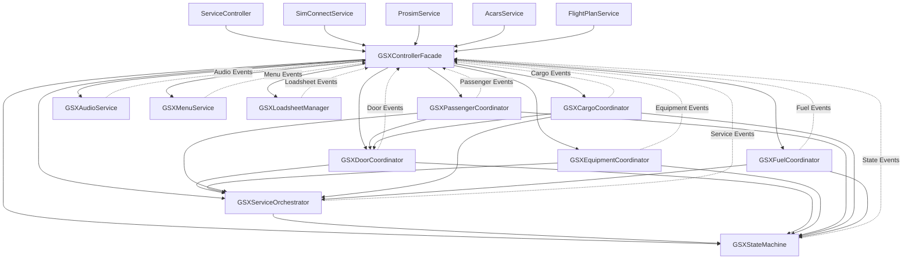
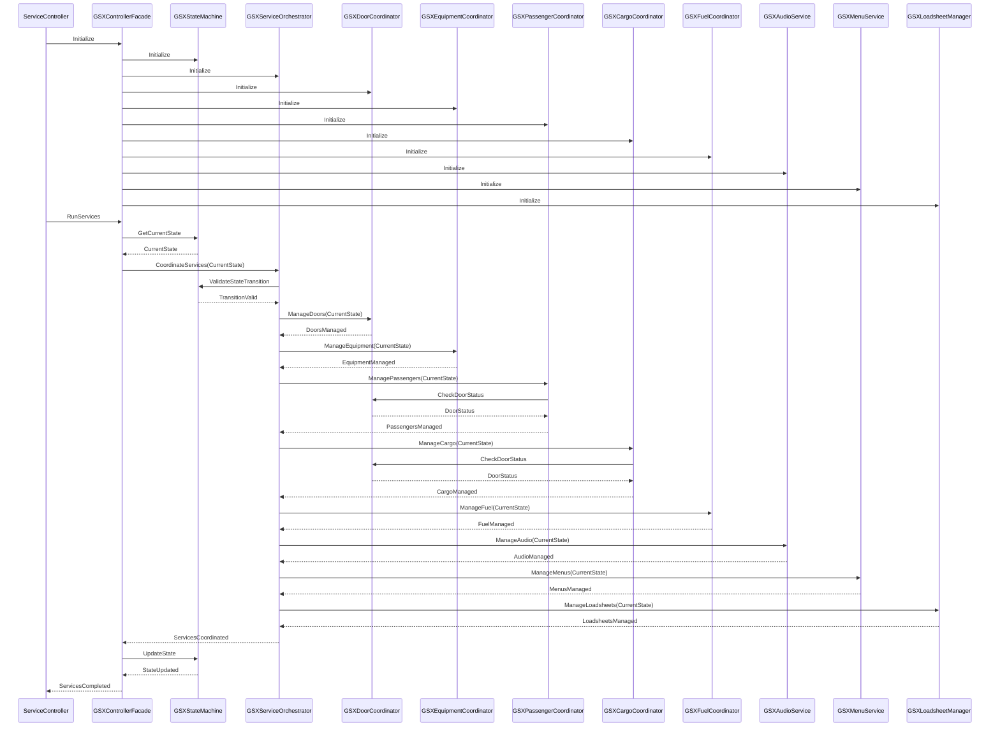
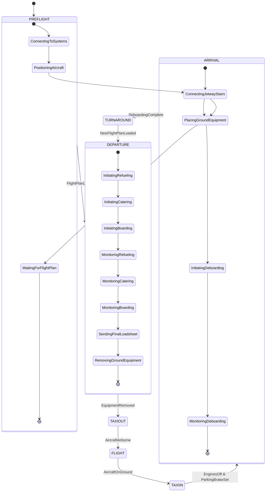
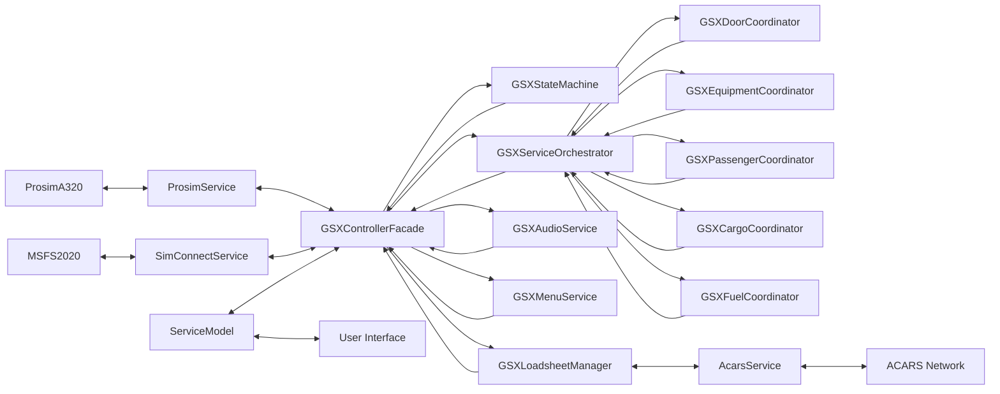

# Prosim2GSX Modularization Architecture - Phase 4

## Architecture Overview

This document provides a visual representation of the proposed architecture for Phase 4 of the Prosim2GSX modularization strategy. The diagrams illustrate the relationships between the different components and how they interact with each other.

## Component Diagram

## Interaction Diagram

## State Transition Diagram

## Component Responsibilities

### GSXControllerFacade
- Initializes and manages all GSX services
- Delegates operations to appropriate services
- Handles high-level error recovery
- Provides a simplified interface to the rest of the application

### GSXStateMachine
- Manages flight state transitions
- Enforces valid state transitions
- Notifies other components of state changes
- Provides state-specific behavior

### GSXServiceOrchestrator
- Coordinates service execution based on current state
- Manages service timing and sequencing
- Handles service dependencies
- Provides feedback on service execution

### GSXDoorCoordinator
- Manages aircraft door operations
- Coordinates door operations with services
- Handles door state tracking
- Provides door-related events

### GSXEquipmentCoordinator
- Manages ground equipment operations
- Coordinates equipment operations with services
- Handles equipment state tracking
- Provides equipment-related events

### GSXPassengerCoordinator
- Manages passenger boarding and deboarding
- Coordinates passenger operations with services
- Handles passenger count tracking
- Provides passenger-related events

### GSXCargoCoordinator
- Manages cargo loading and unloading
- Coordinates cargo operations with services
- Handles cargo state tracking
- Provides cargo-related events

### GSXFuelCoordinator
- Manages refueling operations
- Coordinates fuel operations with services
- Handles fuel state tracking
- Provides fuel-related events

### GSXAudioService
- Controls audio for GSX and other applications
- Adjusts volume based on cockpit controls
- Provides audio reset functionality
- Manages audio device detection and control

### GSXMenuService
- Interacts with GSX menu system
- Selects menu items and operators
- Manages menu navigation
- Provides abstraction for GSX menu interaction

### GSXLoadsheetManager
- Generates and sends loadsheets
- Formats loadsheet data for ACARS transmission
- Calculates weight and balance information
- Provides loadsheet-related events

## Data Flow

## Benefits of the New Architecture

1. **Improved Separation of Concerns**
   - Each component has a single responsibility
   - Components are focused on specific aspects of the system
   - GsxController is replaced with a thin facade

2. **Enhanced Testability**
   - Components can be tested in isolation
   - Dependencies are explicit and can be mocked
   - Unit tests can be written for each component

3. **Better Maintainability**
   - Changes to one component don't affect other components
   - New features can be added without modifying existing code
   - Code is more modular and easier to maintain

4. **Event-Based Communication**
   - Components communicate through events
   - Reduces tight coupling between components
   - Makes the system more extensible

5. **Clearer Responsibility Boundaries**
   - Each component has a clear responsibility
   - GSXControllerFacade orchestrates the components
   - Components don't need to know about each other

## Conclusion

The proposed architecture for Phase 4 of the Prosim2GSX modularization strategy provides a clear visualization of the relationships between the different components and how they interact with each other. This architecture will significantly improve the codebase's maintainability, testability, and extensibility by breaking down the GsxController into smaller, more focused components that follow the Single Responsibility Principle.
