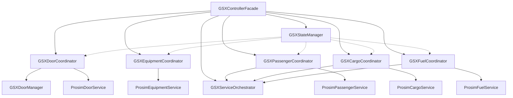

# Phase 4: Further GSX Controller Modularization - Implementation Summary

## Overview

Phase 4 of the modularization strategy focuses on further modularizing the GSX Controller by creating domain-specific coordinators and enhancing the state management capabilities. This phase builds upon the work done in Phase 3, where the GSX services were extracted into separate components.

The goal of Phase 4 is to improve separation of concerns, enhance testability, and provide better state management for the GSX integration. This is achieved by breaking down the GSX Controller into smaller, more focused components that each handle a specific domain of functionality.

## Phase 4 Components

Phase 4 consists of the following sub-phases:

1. **Phase 4.1: GSXControllerFacade**
   - Creates a facade for the GSX Controller that coordinates all GSX-related operations
   - Provides a simplified interface for other components to interact with GSX

2. **Phase 4.2: Enhanced GSXStateManager**
   - Enhances the state management capabilities with history tracking, prediction, and persistence
   - Provides better control over state transitions and validation

3. **Phase 4.3: GSXServiceOrchestrator**
   - Creates an orchestrator for GSX services that coordinates service execution based on state
   - Provides better control over service execution and error handling

4. **Phase 4.4: GSXDoorCoordinator**
   - Creates a coordinator for door operations that manages door states and operations
   - Coordinates between GSXDoorManager and ProsimDoorService

5. **Phase 4.5: GSXEquipmentCoordinator**
   - Creates a coordinator for ground equipment operations that manages equipment states and operations
   - Coordinates with ProsimEquipmentService

6. **Phase 4.6: GSXPassengerCoordinator**
   - Creates a coordinator for passenger operations that manages passenger boarding and deboarding
   - Coordinates between GSXServiceOrchestrator and ProsimPassengerService

7. **Phase 4.7: GSXCargoCoordinator**
   - Creates a coordinator for cargo operations that manages cargo loading and unloading
   - Coordinates between GSXServiceOrchestrator and ProsimCargoService

8. **Phase 4.8: GSXFuelCoordinator**
   - Creates a coordinator for fuel operations that manages refueling and defueling
   - Coordinates between GSXServiceOrchestrator and ProsimFuelService

9. **Phase 4.9: Comprehensive Testing**
   - Implements comprehensive testing for all Phase 4 components
   - Includes unit tests, integration tests, and performance tests

## Architecture

The architecture of Phase 4 follows a layered approach with clear separation of concerns:

## Implementation Strategy

### Phase 4.1: GSXControllerFacade

The GSXControllerFacade serves as a central point of coordination for all GSX-related operations. It delegates responsibilities to specialized components and provides a simplified interface for other components to interact with GSX.

**Key Components**:
- Interface: `IGSXControllerFacade`
- Implementation: `GSXControllerFacade`
- Dependencies: `IGSXStateManager`, `IGSXServiceOrchestrator`, `IGSXAudioService`

**Key Functionality**:
- Coordinates GSX services based on flight state
- Manages audio control
- Provides event-based communication for state and service status changes

**Implementation Details**: See `to-do/modularization-implementation-phase4.1.md`

### Phase 4.2: Enhanced GSXStateManager

The Enhanced GSXStateManager builds upon the existing GSXStateManager to provide more advanced state management capabilities. It adds features such as state history tracking, state prediction, and state persistence.

**Key Components**:
- Interface: `IGSXStateManager`
- Implementation: `GSXStateManager`
- Supporting Classes: `StateTransitionRecord`, `AircraftParameters`, `StateData`

**Key Functionality**:
- State history tracking with StateTransitionRecord
- State-specific behavior hooks with entry/exit/transition actions
- State prediction capabilities with AircraftParameters
- Conditional state transitions with validation
- Timeout handling with cancellation support
- State persistence with JSON serialization

**Implementation Details**: See `to-do/modularization-implementation-phase4.2.md`

### Phase 4.3: GSXServiceOrchestrator

The GSXServiceOrchestrator coordinates the execution of GSX services based on the current flight state. It provides better control over service execution and error handling.

**Key Components**:
- Interface: `IGSXServiceOrchestrator`
- Implementation: `GSXServiceOrchestrator`
- Dependencies: `IGSXStateManager`, `IGSXServiceCoordinator`

**Key Functionality**:
- Coordinates service execution based on state
- Provides pre/post service callbacks
- Handles service errors and recovery
- Provides event-based communication for service status changes

**Implementation Details**: See `to-do/modularization-implementation-phase4.3.md`

### Phase 4.4-4.8: Domain-Specific Coordinators

Phases 4.4-4.8 involve creating domain-specific coordinators for various aspects of the GSX integration. These coordinators serve as mediators between GSX and ProSim services, coordinating operations and state tracking for specific domains.

**Common Implementation Pattern**:
- Define a clear interface with methods for operations and state tracking
- Implement the interface with proper dependency injection
- Coordinate between GSX and ProSim services
- Manage state tracking with thread-safe operations
- Provide event-based communication
- Include comprehensive error handling and logging
- Implement proper resource cleanup in Dispose method

**Coordinator-Specific Details**:
- **GSXDoorCoordinator (Phase 4.4)**: Coordinates door operations between GSX and ProSim
- **GSXEquipmentCoordinator (Phase 4.5)**: Coordinates ground equipment operations
- **GSXPassengerCoordinator (Phase 4.6)**: Coordinates passenger boarding/deboarding
- **GSXCargoCoordinator (Phase 4.7)**: Coordinates cargo loading/unloading
- **GSXFuelCoordinator (Phase 4.8)**: Coordinates refueling operations

**Implementation Details**: See `to-do/modularization-implementation-phase4-coordinators.md`

### Phase 4.9: Comprehensive Testing

Phase 4.9 focuses on implementing comprehensive testing for all the components created in Phases 4.1-4.8. This includes unit tests, integration tests, and performance tests to ensure that the modularized architecture works correctly, maintains the existing functionality, and performs well under various conditions.

**Testing Strategy**:
- Unit Testing: Test individual components in isolation
- Integration Testing: Test component interactions
- Performance Testing: Test performance under various conditions

**Implementation Details**: See `to-do/modularization-implementation-phase4.9.md`

## Implementation Timeline

| Phase | Estimated Time |
|-------|----------------|
| Phase 4.1: GSXControllerFacade | 3-4 days |
| Phase 4.2: Enhanced GSXStateManager | 5-6 days |
| Phase 4.3: GSXServiceOrchestrator | 3-4 days |
| Phase 4.4: GSXDoorCoordinator | 3-4 days |
| Phase 4.5: GSXEquipmentCoordinator | 3-4 days |
| Phase 4.6: GSXPassengerCoordinator | 4-5 days |
| Phase 4.7: GSXCargoCoordinator | 3-4 days |
| Phase 4.8: GSXFuelCoordinator | 3-4 days |
| Phase 4.9: Comprehensive Testing | 20-24 days |

Total estimated time: 47-59 days

## Benefits

1. **Improved Separation of Concerns**
   - Each component focuses on a specific domain
   - Clear responsibilities and boundaries
   - Reduced complexity in the GSXControllerFacade

2. **Enhanced Testability**
   - Components can be tested in isolation
   - Mock implementations can be used for testing
   - Unit tests can verify domain-specific logic

3. **Better State Management**
   - Enhanced state tracking and prediction
   - State-based coordination of operations
   - Improved reliability and predictability

4. **Improved Error Handling**
   - Centralized error handling for domain-specific operations
   - Consistent logging and recovery strategies
   - Better resilience to failures

5. **Enhanced Event Communication**
   - Domain-specific events for state changes
   - Improved communication between components
   - Better decoupling of event producers and consumers

## Conclusion

Phase 4 of the modularization strategy focuses on further modularizing the GSX Controller by creating domain-specific coordinators and enhancing the state management capabilities. This phase builds upon the work done in Phase 3 and provides a solid foundation for Phase 5, which will focus on refining the architecture and improving integration.

The implementation strategy outlined in this document provides a clear roadmap for completing Phase 4, with detailed plans for each sub-phase and a comprehensive testing strategy. Following this plan will ensure a successful implementation of Phase 4 and set the stage for the final phase of the modularization effort.
