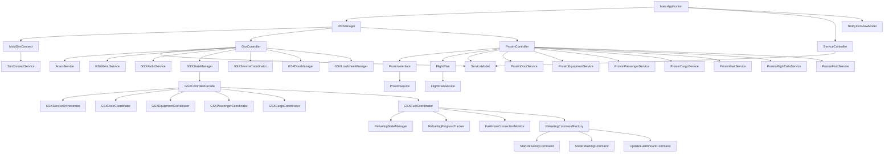
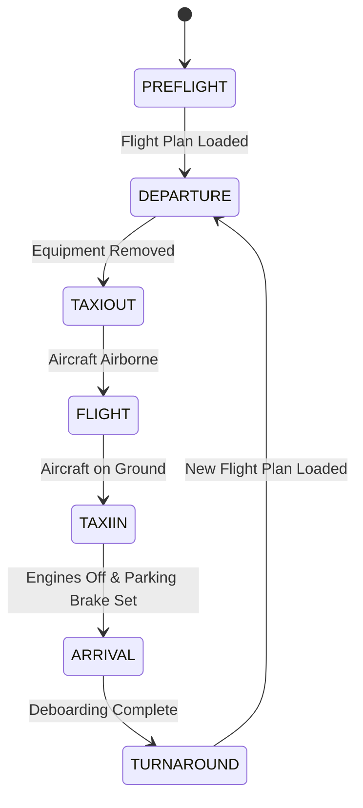
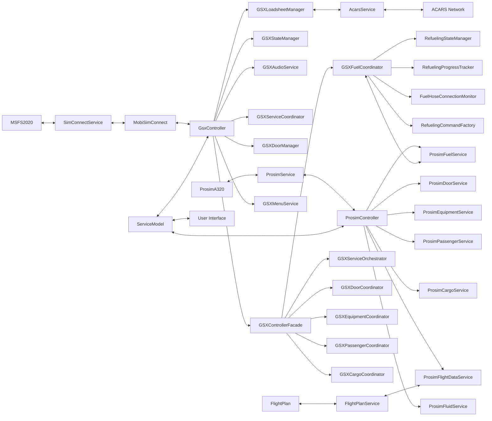
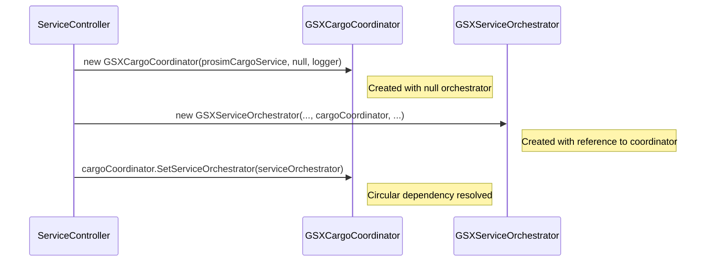

# Phase 5.6: Architecture Documentation

## Overview

Phase 5.6 is the final sub-phase of the modularization strategy's Phase 5, focusing on ensuring thorough documentation of the architecture. This phase aims to document the refined architecture to ensure that the modularization effort is well-documented and maintainable. This documentation will serve as a reference for future development and onboarding of new developers.

## Implementation Plan

The implementation of Phase 5.6 is divided into three main tasks:

1. Update Technical Documentation
2. Create Developer Guide
3. Update Memory Bank

### 1. Update Technical Documentation

#### 1.1 Update Architecture Diagrams

We will create and update the following architecture diagrams:



We will also create the following additional diagrams:

1. **Service Interaction Diagrams**
   - Detailed diagrams showing how services interact with each other
   - Focus on event flow and method calls between services
   - Highlight circular dependency resolution patterns

2. **State Transition Diagrams**
   - Diagram of the GSXStateManager state machine
   - Show all states and transitions
   - Include conditions for transitions
   - Document state-specific behaviors



3. **Data Flow Diagrams**
   - Show how data moves through the system
   - Include data sources and sinks
   - Document data transformations



4. **Component Interaction Diagrams**
   - Sequence diagrams for key workflows
   - Show interactions between components for specific scenarios
   - Document timing and dependencies



#### 1.2 Document Service Interfaces

We will document all public interfaces with method descriptions and parameters:

1. **Core Service Interfaces**
   - ISimConnectService
   - IProsimService
   - IFlightPlanService
   - IAcarsService

2. **ProSim Service Interfaces**
   - IProsimDoorService
   - IProsimEquipmentService
   - IProsimPassengerService
   - IProsimCargoService
   - IProsimFuelService
   - IProsimFlightDataService
   - IProsimFluidService

3. **GSX Service Interfaces**
   - IGSXMenuService
   - IGSXAudioService
   - IGSXStateManager
   - IGSXServiceCoordinator
   - IGSXDoorManager
   - IGSXLoadsheetManager

4. **GSX Coordinator Interfaces**
   - IGSXControllerFacade
   - IGSXServiceOrchestrator
   - IGSXDoorCoordinator
   - IGSXEquipmentCoordinator
   - IGSXPassengerCoordinator
   - IGSXCargoCoordinator
   - IGSXFuelCoordinator

For each interface, we will document:
- Purpose and responsibilities
- Method signatures with parameter descriptions
- Return values and exceptions
- Events and event handling patterns
- Dependencies and initialization requirements
- Usage examples

#### 1.3 Document Design Patterns

We will document all design patterns used in the codebase:

1. **Service-Oriented Architecture**
   - How services are organized and interact
   - Service boundaries and responsibilities
   - Service lifecycle management

2. **Dependency Injection**
   - How dependencies are injected
   - Constructor injection vs. property injection
   - Handling circular dependencies

3. **Event-Based Communication**
   - Event aggregation pattern
   - Publisher-subscriber pattern
   - Event argument standardization

4. **Interface-Based Design**
   - Interface segregation principle
   - Dependency inversion principle
   - Mock-friendly design

5. **Thread Safety Patterns**
   - Lock objects for critical sections
   - Async methods with cancellation support
   - Thread-safe event raising
   - Immutable data structures

6. **MVVM Pattern**
   - View models and data binding
   - Commands for user interactions
   - Property change notification

7. **Command Pattern**
   - Command objects for operations
   - Command factory pattern
   - Command composition

8. **State Machine Pattern**
   - State representation and transitions
   - State-specific behavior
   - State history and prediction

9. **Facade Pattern**
   - Simplified interfaces to complex subsystems
   - Delegation to specialized services
   - Coordination between services

10. **Observer Pattern**
    - Event-based notification
    - Subscription management
    - Weak references for event handlers

11. **Mediator Pattern**
    - EventAggregator implementation
    - Decoupling publishers and subscribers
    - Message routing and filtering

12. **Circuit Breaker Pattern**
    - Failure detection and recovery
    - Circuit states (closed, open, half-open)
    - Threshold configuration

13. **Retry Pattern**
    - Automatic retry for transient failures
    - Exponential backoff
    - Retry policy configuration

For each pattern, we will document:
- Purpose and benefits
- Implementation details
- Usage examples
- Best practices
- Potential pitfalls

### 2. Create Developer Guide

#### 2.1 Document Extension Methods

We will document how to extend the application:

1. **Adding New Services**
   - Creating a new service interface
   - Implementing the service
   - Registering the service with ServiceController
   - Handling dependencies

2. **Modifying Existing Services**
   - Identifying the service to modify
   - Understanding dependencies and consumers
   - Making changes safely
   - Testing changes

3. **Adding New Features**
   - Identifying the appropriate service
   - Implementing the feature
   - Integrating with existing code
   - Testing the feature

4. **Extending the State Machine**
   - Adding new states
   - Defining state transitions
   - Implementing state-specific behavior
   - Testing state transitions

5. **Adding New Coordinators**
   - Creating a new coordinator interface
   - Implementing the coordinator
   - Integrating with GSXControllerFacade
   - Handling dependencies

#### 2.2 Provide Examples

We will provide examples for common development tasks:

1. **Adding a New Service**
   - Example: Adding a new GSXWeatherService
   - Interface definition
   - Implementation
   - Registration with ServiceController
   - Usage in other services

2. **Implementing Event Handling**
   - Example: Subscribing to state changes
   - Defining event handlers
   - Registering event handlers
   - Handling events safely

3. **Implementing Error Handling**
   - Example: Adding retry and circuit breaker
   - Creating custom exceptions
   - Implementing retry policy
   - Implementing circuit breaker
   - Combining retry and circuit breaker

4. **Adding a New State**
   - Example: Adding a MAINTENANCE state
   - Defining the state
   - Implementing state transitions
   - Adding state-specific behavior
   - Testing the new state

5. **Implementing a New Coordinator**
   - Example: Adding a GSXWeatherCoordinator
   - Interface definition
   - Implementation
   - Integration with GSXControllerFacade
   - Handling dependencies

#### 2.3 Document Best Practices

We will document best practices for working with the codebase:

1. **Coding Standards**
   - Naming conventions
   - Code organization
   - Documentation standards
   - Error handling conventions

2. **Testing Practices**
   - Unit testing services
   - Mocking dependencies
   - Integration testing
   - Performance testing

3. **Performance Considerations**
   - Avoiding unnecessary allocations
   - Using appropriate data structures
   - Optimizing critical paths
   - Measuring performance

4. **Error Handling Guidelines**
   - Using appropriate exception types
   - Implementing retry mechanisms
   - Using circuit breakers
   - Logging errors appropriately

5. **Logging Guidelines**
   - Using appropriate log levels
   - Including relevant context
   - Structured logging
   - Log analysis

6. **Thread Safety Considerations**
   - Identifying thread safety requirements
   - Using appropriate synchronization mechanisms
   - Avoiding deadlocks
   - Testing thread safety

#### 2.4 Create Troubleshooting Guide

We will create a troubleshooting guide for common issues:

1. **Common Issues and Solutions**
   - Connection issues
   - Service coordination problems
   - State transition failures
   - Performance problems

2. **Debugging Techniques**
   - Using logging for debugging
   - Debugging state transitions
   - Debugging service interactions
   - Debugging performance issues

3. **Logging and Diagnostics**
   - Configuring log levels
   - Analyzing log files
   - Using structured logging
   - Correlating log entries

4. **Performance Troubleshooting**
   - Identifying performance bottlenecks
   - Measuring performance
   - Optimizing critical paths
   - Reducing allocations

5. **Integration Troubleshooting**
   - Debugging SimConnect issues
   - Debugging ProSim SDK issues
   - Debugging GSX integration
   - Debugging ACARS integration

### 3. Update Memory Bank

#### 3.1 Update All Memory Bank Files

We will update all memory bank files with the latest information:

1. **projectbrief.md**
   - Update project status
   - Reflect current requirements
   - Update success criteria

2. **productContext.md**
   - Update product context
   - Reflect current user experience goals
   - Update workflow integration

3. **systemPatterns.md**
   - Update architecture overview
   - Update component relationships
   - Update design patterns
   - Update data flow

4. **techContext.md**
   - Update technologies used
   - Update dependencies
   - Update technical constraints
   - Update configuration management

5. **activeContext.md**
   - Update current work focus
   - Update recent changes
   - Update next steps

6. **progress.md**
   - Update implementation status
   - Update what works
   - Update what's left to build
   - Update next steps

#### 3.2 Ensure Documentation Consistency

We will ensure consistency across all documentation:

1. **Terminology**
   - Use consistent terms for components
   - Use consistent names for patterns
   - Use consistent abbreviations

2. **Formatting**
   - Use consistent formatting for code examples
   - Use consistent formatting for diagrams
   - Use consistent formatting for lists

3. **Cross-References**
   - Add cross-references between related sections
   - Ensure cross-references are accurate
   - Make cross-references easy to follow

#### 3.3 Document Lessons Learned

We will document lessons learned from the modularization effort:

1. **What Worked Well**
   - Successful patterns and practices
   - Effective modularization strategies
   - Successful testing approaches

2. **What Could Be Improved**
   - Challenges encountered
   - Areas for improvement
   - Alternative approaches to consider

3. **Recommendations for Future Work**
   - Suggested improvements
   - Future enhancements
   - Long-term architecture goals

#### 3.4 Update Progress Tracking

We will update progress tracking:

1. **Implementation Status**
   - Update status of all phases
   - Update completion percentages
   - Document remaining work

2. **Roadmap**
   - Create roadmap for future enhancements
   - Prioritize remaining work
   - Set timeline for future phases

## Implementation Details

### Technical Documentation Updates

#### Architecture Diagrams

We will create and update architecture diagrams using Mermaid syntax for inclusion in Markdown files. These diagrams will be included in the systemPatterns.md file and other relevant documentation.

#### Service Interface Documentation

For each service interface, we will create a documentation section with the following structure:

```markdown
## IServiceName

### Purpose

Brief description of the service's purpose and responsibilities.

### Methods

#### Method1

```csharp
ReturnType Method1(ParameterType parameter1, ParameterType parameter2);
```

- **Purpose**: Description of what the method does.
- **Parameters**:
  - `parameter1`: Description of parameter1.
  - `parameter2`: Description of parameter2.
- **Returns**: Description of the return value.
- **Exceptions**: List of exceptions that can be thrown.
- **Thread Safety**: Thread safety considerations.
- **Example**:

```csharp
// Example usage of Method1
var result = service.Method1(value1, value2);
```

#### Events

##### EventName

```csharp
event EventHandler<EventArgsType> EventName;
```

- **Purpose**: Description of when the event is raised.
- **Event Args**: Description of the event arguments.
- **Example**:

```csharp
// Example of subscribing to the event
service.EventName += (sender, args) => {
    // Handle the event
};
```

### Dependencies

- List of dependencies required by the service.
- Initialization requirements.
- Lifecycle considerations.
```

#### Design Pattern Documentation

For each design pattern, we will create a documentation section with the following structure:

```markdown
## Pattern Name

### Purpose

Brief description of the pattern's purpose and benefits.

### Implementation

Description of how the pattern is implemented in the codebase.

### Example

```csharp
// Example implementation of the pattern
```

### Best Practices

- List of best practices for using the pattern.

### Potential Pitfalls

- List of potential pitfalls and how to avoid them.
```

### Developer Guide Creation

#### Extension Documentation

For each extension point, we will create a documentation section with the following structure:

```markdown
## Adding a New X

### Overview

Brief description of what adding a new X involves.

### Steps

1. Step 1: Description of step 1.
2. Step 2: Description of step 2.
3. Step 3: Description of step 3.

### Example

```csharp
// Example code for adding a new X
```

### Considerations

- List of considerations when adding a new X.
```

#### Best Practices Documentation

For each best practice area, we will create a documentation section with the following structure:

```markdown
## Best Practices for X

### Overview

Brief description of why these best practices are important.

### Guidelines

1. Guideline 1: Description of guideline 1.
2. Guideline 2: Description of guideline 2.
3. Guideline 3: Description of guideline 3.

### Example

```csharp
// Example code following the best practices
```

### Anti-Patterns

```csharp
// Example code NOT following the best practices
```
```

#### Troubleshooting Guide

For each troubleshooting area, we will create a documentation section with the following structure:

```markdown
## Troubleshooting X

### Symptoms

- Symptom 1: Description of symptom 1.
- Symptom 2: Description of symptom 2.
- Symptom 3: Description of symptom 3.

### Causes

- Cause 1: Description of cause 1.
- Cause 2: Description of cause 2.
- Cause 3: Description of cause 3.

### Solutions

1. Solution 1: Description of solution 1.
2. Solution 2: Description of solution 2.
3. Solution 3: Description of solution 3.

### Diagnostic Steps

1. Step 1: Description of diagnostic step 1.
2. Step 2: Description of diagnostic step 2.
3. Step 3: Description of diagnostic step 3.
```

### Memory Bank Updates

We will update all memory bank files to reflect the current state of the project. We will ensure that all files are consistent and up-to-date.

## Timeline

The implementation of Phase 5.6 will take approximately 5 days:

- Day 1-2: Update Technical Documentation
- Day 3-4: Create Developer Guide
- Day 5: Update Memory Bank

## Deliverables

1. **Updated Technical Documentation**
   - Architecture diagrams
   - Service interface documentation
   - Design pattern documentation
   - Component interaction diagrams

2. **Developer Guide**
   - Extension documentation
   - Code examples
   - Best practices guide
   - Troubleshooting guide

3. **Updated Memory Bank Files**
   - All memory bank files updated with latest information
   - Consistent terminology and formatting
   - Lessons learned documentation
   - Updated progress tracking

## Success Criteria

Phase 5.6 will be considered successful when:

1. All technical documentation is updated and accurate
2. A comprehensive developer guide is created
3. All memory bank files are updated and consistent
4. Documentation is clear, concise, and useful for future development

## Next Steps

After completing Phase 5.6, the project will be well-positioned to:

1. Complete Phase 5.5 (Comprehensive Testing)
2. Implement Phase 3 of the Catering Door Fix
3. Begin planning for the EFB UI implementation
4. Consider additional performance optimizations from Phase 2 of the .NET 8.0 performance improvements
