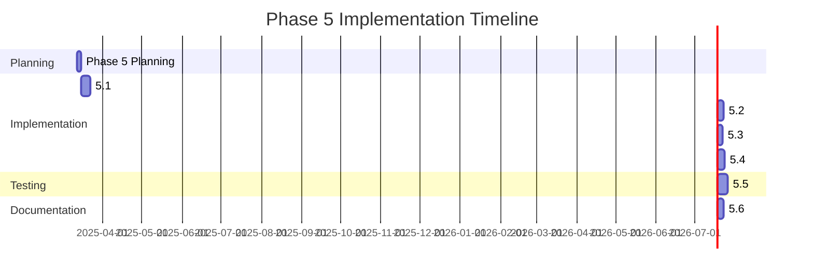

# Phase 5: Refine Architecture and Improve Integration

## Overview

Phase 5 of the modularization strategy focuses on refining the architecture and improving integration between all the modularized components. This phase builds upon the work done in Phases 1-4 and aims to optimize service interactions, improve controller architecture, enhance error handling, optimize performance, implement comprehensive testing, and complete documentation.

The goal is to ensure that the modularized architecture is robust, maintainable, and performs well under various conditions. This phase is crucial for validating the success of the modularization effort and preparing the codebase for future enhancements like the EFB UI implementation.

## Implementation Plan

Phase 5 is divided into six sub-phases, each focusing on a specific aspect of the architecture:



### Phase 5.1: Service Interaction Refinement (7 days)

This phase will focus on optimizing how services communicate and interact with each other.

#### Key Tasks

1. **Resolve Circular Dependencies (2 days)**
   - Identify and resolve any remaining circular dependencies between services
   - Implement appropriate design patterns (e.g., mediator, observer) to break circular dependencies
   - Focus particularly on interactions between GSXServiceOrchestrator and the various coordinators
   - Implement the following patterns where appropriate:
     - Mediator pattern for coordinating between services
     - Observer pattern for event-based communication
     - Dependency inversion for reducing direct coupling

2. **Standardize Event Communication (2 days)**
   - Review and standardize event-based communication patterns
   - Ensure consistent event naming and parameter conventions
   - Implement event aggregation where appropriate to reduce direct coupling
   - Create standardized event argument classes for common events
   - Document event handling patterns and best practices

3. **Optimize Service Dependencies (3 days)**
   - Review service dependencies and reduce unnecessary coupling
   - Implement lazy loading for services that aren't always needed
   - Consider using a lightweight dependency injection container
   - Refine service initialization order in ServiceController
   - Document service dependencies and initialization requirements

#### Implementation Details

1. **Circular Dependency Resolution**
   - Identify circular dependencies:
     - GSXServiceOrchestrator ↔ GSXDoorCoordinator
     - GSXServiceOrchestrator ↔ GSXCargoCoordinator
     - GSXServiceOrchestrator ↔ GSXFuelCoordinator
   - Apply resolution patterns:
     - Use setter injection instead of constructor injection
     - Implement mediator pattern for service communication
     - Use weak references where appropriate
   - Example implementation:

   ```csharp
   // Before
   public class GSXCargoCoordinator : IGSXCargoCoordinator
   {
       private readonly IGSXServiceOrchestrator _serviceOrchestrator;
       
       public GSXCargoCoordinator(IProsimCargoService cargoService, 
                                 IGSXServiceOrchestrator serviceOrchestrator,
                                 ILogger logger)
       {
           _serviceOrchestrator = serviceOrchestrator;
           // ...
       }
   }
   
   // After
   public class GSXCargoCoordinator : IGSXCargoCoordinator
   {
       private IGSXServiceOrchestrator _serviceOrchestrator;
       
       public GSXCargoCoordinator(IProsimCargoService cargoService, 
                                 ILogger logger)
       {
           // No direct dependency on serviceOrchestrator
       }
       
       public void SetServiceOrchestrator(IGSXServiceOrchestrator serviceOrchestrator)
       {
           _serviceOrchestrator = serviceOrchestrator;
       }
   }
   ```

2. **Event Communication Standardization**
   - Create base event argument classes:
     - `ServiceEventArgs` as the base class for all service events
     - `StateChangedEventArgs<T>` for state change events
     - `ProgressChangedEventArgs` for progress tracking events
   - Standardize event naming:
     - Use the pattern `[Entity][Action]` (e.g., `DoorOpened`, `FuelLevelChanged`)
     - Use past tense for completed actions
     - Use present continuous for ongoing actions
   - Implement event aggregation:
     - Create `EventAggregator` class for publishing and subscribing to events
     - Use weak references to prevent memory leaks
     - Support filtering and prioritization of event handlers

3. **Service Dependency Optimization**
   - Implement lazy loading:
     - Use `Lazy<T>` for services that aren't always needed
     - Initialize services on first use
     - Document lazy loading patterns
   - Consider dependency injection container:
     - Evaluate lightweight DI containers (e.g., SimpleInjector, DryIoc)
     - Configure container in ServiceController
     - Register services with appropriate lifecycles
   - Refine initialization order:
     - Create dependency graph of services
     - Initialize services in topological order
     - Handle circular dependencies appropriately

#### Deliverables

- Updated service interfaces with optimized dependencies
- Standardized event communication patterns
- Reduced coupling between services
- Implementation documentation
- Updated ServiceController with optimized service initialization

### Phase 5.2: Controller Architecture Improvements (5 days)

This phase will focus on further refining the controller layer to ensure it properly delegates to the appropriate services.

#### Key Tasks

1. **Refine ProsimController (2 days)**
   - Refactor ProsimController to be a thin facade like GSXControllerFacade
   - Ensure all business logic is delegated to appropriate services
   - Maintain backward compatibility with existing code
   - Implement consistent error handling and logging
   - Add event-based communication for state changes

2. **Enhance ServiceController (2 days)**
   - Update ServiceController to properly manage all services
   - Implement proper dependency injection
   - Improve service lifecycle management
   - Enhance error recovery mechanisms
   - Add support for service discovery and registration

3. **Standardize Controller Patterns (1 day)**
   - Ensure consistent patterns across all controllers
   - Standardize event handling and propagation
   - Implement consistent error handling and logging
   - Document controller patterns and best practices
   - Create base controller class for common functionality

#### Implementation Details

1. **ProsimController Refinement**
   - Identify remaining business logic in ProsimController
   - Extract business logic to appropriate services
   - Update ProsimController to delegate to services
   - Implement facade pattern for ProsimController
   - Example implementation:

   ```csharp
   // Before
   public class ProsimController
   {
       // Direct implementation of business logic
       public void SetInitialFuel(double centerTankKg, double leftTankKg, double rightTankKg)
       {
           // Direct implementation
       }
       
       // After refactoring
       public void SetInitialFuel(double centerTankKg, double leftTankKg, double rightTankKg)
       {
           _fuelService.SetInitialFuel(centerTankKg, leftTankKg, rightTankKg);
       }
   }
   
   // After
   public class ProsimController : IProsimController
   {
       private readonly IProsimDoorService _doorService;
       private readonly IProsimEquipmentService _equipmentService;
       private readonly IProsimFuelService _fuelService;
       // Other services
       
       public ProsimController(IProsimDoorService doorService,
                              IProsimEquipmentService equipmentService,
                              IProsimFuelService fuelService,
                              // Other services
                              ILogger logger)
       {
           _doorService = doorService;
           _equipmentService = equipmentService;
           _fuelService = fuelService;
           // Initialize other services
       }
       
       public void SetInitialFuel(double centerTankKg, double leftTankKg, double rightTankKg)
       {
           try
           {
               _fuelService.SetInitialFuel(centerTankKg, leftTankKg, rightTankKg);
           }
           catch (Exception ex)
           {
               _logger.Error(ex, "Failed to set initial fuel");
               throw;
           }
       }
       
       // Other methods delegating to services
   }
   ```

2. **ServiceController Enhancement**
   - Implement proper dependency injection:
     - Use constructor injection for required dependencies
     - Use property injection for optional dependencies
     - Document dependency requirements
   - Improve service lifecycle management:
     - Add initialization and cleanup methods for services
     - Handle service startup and shutdown in the correct order
     - Implement IDisposable pattern for proper resource cleanup
   - Enhance error recovery:
     - Add retry mechanisms for service initialization
     - Implement circuit breakers for external dependencies
     - Add fallback mechanisms for critical services

3. **Controller Pattern Standardization**
   - Create base controller class:
     - Implement common functionality (logging, error handling, etc.)
     - Define standard event handling patterns
     - Provide base implementation for lifecycle management
   - Standardize event handling:
     - Use consistent event naming and argument types
     - Implement event forwarding for controller events
     - Document event handling patterns
   - Implement consistent error handling:
     - Use try-catch blocks for all external calls
     - Log exceptions with appropriate context
     - Provide meaningful error messages to callers

#### Deliverables

- Refactored ProsimController
- Enhanced ServiceController
- Standardized controller patterns
- Implementation documentation
- Base controller class for common functionality

### Phase 5.3: Error Handling Enhancements (4 days)

This phase will focus on improving error handling and recovery mechanisms throughout the application.

#### Key Tasks

1. **Implement Service-Specific Exceptions (1 day)**
   - Create custom exception types for each service
   - Ensure exceptions include appropriate context information
   - Standardize exception handling patterns
   - Document exception types and usage
   - Implement exception filtering and categorization

2. **Add Retry Mechanisms (2 days)**
   - Implement retry policies for transient failures
   - Add circuit breakers for external dependencies
   - Ensure proper timeout handling
   - Document retry policies and circuit breaker configurations
   - Implement exponential backoff for retries

3. **Enhance Logging (1 day)**
   - Improve logging throughout the application
   - Ensure consistent log levels and formats
   - Add correlation IDs for tracking related log entries
   - Implement structured logging for better analysis
   - Document logging patterns and best practices

#### Implementation Details

1. **Service-Specific Exceptions**
   - Create base exception classes:
     - `ServiceException` as the base class for all service exceptions
     - `TransientException` for temporary failures that can be retried
     - `PermanentException` for failures that cannot be retried
   - Create service-specific exceptions:
     - `SimConnectException` for SimConnect-related errors
     - `ProsimException` for ProSim-related errors
     - `GSXException` for GSX-related errors
     - Additional exceptions for specific services
   - Include context information:
     - Operation being performed
     - Input parameters
     - Current state
     - Inner exception details
   - Example implementation:

   ```csharp
   public class ServiceException : Exception
   {
       public ServiceException(string message) : base(message) { }
       public ServiceException(string message, Exception innerException) : base(message, innerException) { }
   }
   
   public class TransientException : ServiceException
   {
       public TransientException(string message) : base(message) { }
       public TransientException(string message, Exception innerException) : base(message, innerException) { }
   }
   
   public class PermanentException : ServiceException
   {
       public PermanentException(string message) : base(message) { }
       public PermanentException(string message, Exception innerException) : base(message, innerException) { }
   }
   
   public class SimConnectException : ServiceException
   {
       public SimConnectException(string message) : base(message) { }
       public SimConnectException(string message, Exception innerException) : base(message, innerException) { }
   }
   ```

2. **Retry Mechanisms**
   - Implement retry policy:
     - Create `RetryPolicy` class for configuring retries
     - Support different retry strategies (fixed, exponential, etc.)
     - Allow customization of retry count, delay, and conditions
   - Implement circuit breaker:
     - Create `CircuitBreaker` class for protecting external dependencies
     - Support different circuit breaker states (closed, open, half-open)
     - Allow customization of failure threshold and recovery time
   - Ensure proper timeout handling:
     - Use CancellationToken for cancellable operations
     - Implement timeout for long-running operations
     - Handle timeout exceptions appropriately
   - Example implementation:

   ```csharp
   public class RetryPolicy
   {
       public int MaxRetries { get; set; } = 3;
       public TimeSpan InitialDelay { get; set; } = TimeSpan.FromSeconds(1);
       public bool UseExponentialBackoff { get; set; } = true;
       
       public async Task<T> ExecuteAsync<T>(Func<Task<T>> operation)
       {
           int retryCount = 0;
           TimeSpan delay = InitialDelay;
           
           while (true)
           {
               try
               {
                   return await operation();
               }
               catch (TransientException ex)
               {
                   if (retryCount >= MaxRetries)
                       throw;
                       
                   retryCount++;
                   
                   if (UseExponentialBackoff)
                       delay = TimeSpan.FromMilliseconds(delay.TotalMilliseconds * 2);
                       
                   await Task.Delay(delay);
               }
               catch (Exception ex) when (!(ex is TransientException))
               {
                   throw;
               }
           }
       }
   }
   
   public class CircuitBreaker
   {
       public enum CircuitState
       {
           Closed,
           Open,
           HalfOpen
       }
       
       public CircuitState State { get; private set; } = CircuitState.Closed;
       public int FailureThreshold { get; set; } = 5;
       public TimeSpan RecoveryTime { get; set; } = TimeSpan.FromMinutes(1);
       
       private int _failureCount;
       private DateTime _lastFailureTime;
       
       public async Task<T> ExecuteAsync<T>(Func<Task<T>> operation)
       {
           if (State == CircuitState.Open)
           {
               if (DateTime.Now - _lastFailureTime > RecoveryTime)
               {
                   State = CircuitState.HalfOpen;
               }
               else
               {
                   throw new CircuitBreakerOpenException("Circuit breaker is open");
               }
           }
           
           try
           {
               T result = await operation();
               
               if (State == CircuitState.HalfOpen)
               {
                   State = CircuitState.Closed;
                   _failureCount = 0;
               }
               
               return result;
           }
           catch (Exception ex)
           {
               _lastFailureTime = DateTime.Now;
               _failureCount++;
               
               if (_failureCount >= FailureThreshold || State == CircuitState.HalfOpen)
               {
                   State = CircuitState.Open;
               }
               
               throw;
           }
       }
   }
   ```

3. **Logging Enhancements**
   - Improve logging throughout the application:
     - Add logging to all services and controllers
     - Use appropriate log levels (Debug, Info, Warning, Error)
     - Include relevant context in log messages
   - Ensure consistent log formats:
     - Use structured logging with Serilog
     - Define standard log templates
     - Include timestamp, log level, and source
   - Add correlation IDs:
     - Generate unique ID for each operation
     - Include correlation ID in all related log entries
     - Use correlation ID for tracking operations across services
   - Implement structured logging:
     - Use Serilog's structured logging capabilities
     - Define standard property names
     - Enable filtering and searching by properties

#### Deliverables

- Custom exception types for each service
- Retry mechanisms for transient failures
- Circuit breakers for external dependencies
- Enhanced logging throughout the application
- Implementation documentation

### Phase 5.4: Performance Optimization (6 days)

This phase will focus on identifying and addressing performance bottlenecks in the application.

#### Key Tasks

1. **Implement .NET 8.0 Performance Features (3 days)**
   - Implement FrozenDictionary<TKey, TValue> for read-heavy dictionary operations
   - Use Span<T> for reducing string allocations
   - Implement ValueTask for optimizing asynchronous operations
   - Follow the implementation plan in dotnet8-performance-implementation-plan.md
   - Document performance improvements

2. **Optimize Critical Paths (2 days)**
   - Identify performance-critical paths in the application
   - Optimize algorithms and data structures
   - Reduce unnecessary allocations
   - Implement caching where appropriate
   - Document optimization techniques

3. **Measure and Validate Performance (1 day)**
   - Create performance benchmarks
   - Measure performance before and after optimizations
   - Validate that optimizations don't introduce regressions
   - Document performance improvements
   - Create performance testing framework

#### Implementation Details

1. **Implement .NET 8.0 Performance Features**
   - Implement FrozenDictionary<TKey, TValue>:
     - Identify read-heavy dictionary operations
     - Replace Dictionary<TKey, TValue> with FrozenDictionary<TKey, TValue>
     - Update code to handle immutable dictionaries
   - Use Span<T> for string operations:
     - Identify string manipulation operations
     - Replace string operations with Span<T> operations
     - Update code to handle spans
   - Implement ValueTask:
     - Identify asynchronous operations that often complete synchronously
     - Replace Task<T> with ValueTask<T>
     - Update code to handle ValueTask<T>
   - Example implementation:

   ```csharp
   // Before
   private readonly Dictionary<string, SimConnectVariable> _variables = new Dictionary<string, SimConnectVariable>();
   
   public SimConnectVariable GetVariable(string name)
   {
       if (_variables.TryGetValue(name, out var variable))
           return variable;
       return null;
   }
   
   // After
   private readonly FrozenDictionary<string, SimConnectVariable> _variables;
   
   public SimConnectService()
   {
       var builder = new Dictionary<string, SimConnectVariable>();
       // Add variables to builder
       _variables = builder.ToFrozenDictionary();
   }
   
   public SimConnectVariable GetVariable(string name)
   {
       if (_variables.TryGetValue(name, out var variable))
           return variable;
       return null;
   }
   ```

2. **Optimize Critical Paths**
   - Identify performance-critical paths:
     - SimConnect data processing
     - ProSim data processing
     - GSX service coordination
     - Audio control
   - Optimize algorithms and data structures:
     - Use more efficient algorithms
     - Choose appropriate data structures
     - Reduce computational complexity
   - Reduce unnecessary allocations:
     - Use object pooling for frequently allocated objects
     - Reuse objects where possible
     - Avoid boxing/unboxing
   - Implement caching:
     - Use memory cache for frequently accessed data
     - Implement cache invalidation strategies
     - Document cache usage and limitations

3. **Measure and Validate Performance**
   - Create performance benchmarks:
     - Define key performance indicators
     - Create benchmark tests for critical operations
     - Establish baseline performance
   - Measure performance:
     - Run benchmarks before and after optimizations
     - Collect performance metrics
     - Analyze performance data
   - Validate optimizations:
     - Ensure optimizations don't introduce regressions
     - Verify that optimizations improve performance
     - Document performance improvements

#### Deliverables

- Implemented .NET 8.0 performance features
- Optimized critical paths
- Performance benchmarks
- Performance validation results
- Implementation documentation

### Phase 5.5: Comprehensive Testing (8 days)

This phase will focus on implementing comprehensive testing for the entire application.

#### Key Tasks

1. **Complete Unit Testing (3 days)**
   - Implement unit tests for all services
   - Ensure high test coverage for critical components
   - Test error handling and edge cases
   - Document testing approach and patterns
   - Create test fixtures and helpers

2. **Implement Integration Testing (3 days)**
   - Create integration tests for service interactions
   - Test end-to-end workflows
   - Verify state transitions and service coordination
   - Document integration testing approach
   - Create test environments and configurations

3. **Add Performance Testing (2 days)**
   - Implement performance tests for critical paths
   - Measure response times and resource usage
   - Establish performance baselines for future comparison
   - Document performance testing approach
   - Create performance testing framework

#### Implementation Details

1. **Complete Unit Testing**
   - Implement unit tests for all services:
     - Create test classes for each service
     - Test all public methods and properties
     - Use mocking framework for dependencies
     - Verify correct behavior with various inputs
   - Ensure high test coverage:
     - Aim for at least 80% code coverage
     - Focus on critical components and complex logic
     - Identify and test edge cases
   - Test error handling:
     - Verify that exceptions are handled correctly
     - Test retry mechanisms and circuit breakers
     - Verify logging of errors
   - Example implementation:

   ```csharp
   [TestClass]
   public class GSXDoorCoordinatorTests
   {
       private Mock<IGSXDoorManager> _mockDoorManager;
       private Mock<IProsimDoorService> _mockProsimDoorService;
       private Mock<ILogger> _mockLogger;
       private GSXDoorCoordinator _doorCoordinator;
       
       [TestInitialize]
       public void Initialize()
       {
           _mockDoorManager = new Mock<IGSXDoorManager>();
           _mockProsimDoorService = new Mock<IProsimDoorService>();
           _mockLogger = new Mock<ILogger>();
           
           _doorCoordinator = new GSXDoorCoordinator(
               _mockDoorManager.Object,
               _mockProsimDoorService.Object,
               _mockLogger.Object);
       }
       
       [TestMethod]
       public void OpenDoor_ForwardRight_CallsGSXAndProSim()
       {
           // Arrange
           _mockDoorManager.Setup(m => m.OpenDoor(DoorType.ForwardRight)).Returns(true);
           
           // Act
           bool result = _doorCoordinator.OpenDoor(DoorType.ForwardRight);
           
           // Assert
           Assert.IsTrue(result);
           _mockDoorManager.Verify(m => m.OpenDoor(DoorType.ForwardRight), Times.Once);
           _mockProsimDoorService.Verify(m => m.SetForwardRightDoor(true), Times.Once);
       }
   }
   ```

2. **Implement Integration Testing**
   - Create integration tests for service interactions:
     - Test how services work together
     - Verify that events are propagated correctly
     - Test state transitions and service coordination
   - Test end-to-end workflows:
     - Simulate complete flight scenarios
     - Test turnaround scenarios
     - Verify that all components work together correctly
   - Verify state transitions:
     - Test state machine behavior
     - Verify that state transitions trigger appropriate actions
     - Test state history and prediction
   - Example implementation:

   ```csharp
   [TestClass]
   public class FlightWorkflowTests
   {
       private ServiceController _serviceController;
       private GSXControllerFacade _gsxFacade;
       private ProsimController _prosimController;
       
       [TestInitialize]
       public void Initialize()
       {
           // Initialize controllers and services
           // ...
       }
       
       [TestMethod]
       public async Task CompleteFlight_AllServicesCoordinated()
       {
           // Arrange
           // Set up initial state
           
           // Act
           // Simulate flight from preflight to arrival
           await _gsxFacade.StateManager.TransitionToPreflightAsync();
           // Verify preflight services
           
           await _gsxFacade.StateManager.TransitionToDepartureAsync();
           // Verify departure services
           
           await _gsxFacade.StateManager.TransitionToTaxioutAsync();
           // Verify taxiout services
           
           await _gsxFacade.StateManager.TransitionToFlightAsync();
           // Verify flight services
           
           await _gsxFacade.StateManager.TransitionToTaxiinAsync();
           // Verify taxiin services
           
           await _gsxFacade.StateManager.TransitionToArrivalAsync();
           // Verify arrival services
           
           // Assert
           // Verify final state and service status
       }
   }
   ```

3. **Add Performance Testing**
   - Implement performance tests for critical paths:
     - Test SimConnect data processing
     - Test ProSim data processing
     - Test GSX service coordination
     - Test audio control
   - Measure response times and resource usage:
     - Measure execution time for operations
     - Monitor CPU and memory usage
     - Track allocations and garbage collection
   - Establish performance baselines:
     - Document current performance
     - Set performance targets
     - Create benchmarks for future comparison
   - Example implementation:

   ```csharp
   [TestClass]
   public class PerformanceTests
   {
       private GSXControllerFacade _facade;
       private PerformanceMonitor _monitor;
       
       [TestInitialize]
       public void Initialize()
       {
           // Initialize facade and monitor
           // ...
       }
       
       [TestMethod]
       public void MeasureResponseTime_StateTransitions()
       {
           // Arrange
           _monitor.Start();
           
           // Act
           for (int i = 0; i < 100; i++)
           {
               _facade.StateManager.TransitionToPreflight();
               _facade.StateManager.TransitionToDeparture();
               _facade.StateManager.TransitionToTaxiout();
               _facade.StateManager.TransitionToFlight();
               _facade.StateManager.TransitionToTaxiin();
               _facade.StateManager.TransitionToArrival();
               _facade.StateManager.TransitionToTurnaround();
           }
           
           // Assert
           _monitor.Stop();
           var results = _monitor.GetResults();
           
           Assert.IsTrue(results.AverageResponseTime < 10); // Less than 10ms per transition
           Assert.IsTrue(results.MaxResponseTime < 50); // Less than 50ms max
           Assert.IsTrue(results.CpuUsage < 10); // Less than 10% CPU usage
           Assert.IsTrue(results.MemoryUsage < 100); // Less than 100MB memory usage
       }
   }
   ```

#### Deliverables

- Comprehensive unit tests
- Integration tests for service interactions
- Performance tests for critical paths
- Test documentation
- Test automation framework

### Phase 5.6: Architecture Documentation (5 days)

This phase will focus on ensuring thorough documentation of the architecture.

#### Key Tasks

1. **Update Technical Documentation (2 days)**
   - Update architecture diagrams
   - Document service interfaces and behaviors
   - Document design patterns and decisions
   - Create component interaction diagrams
   - Document system boundaries and integration points

2. **Create Developer Guide (2 days)**
   - Document how to extend the application
   - Provide examples of common tasks
   - Document best practices for working with the codebase
   - Create troubleshooting guide
   - Document development environment setup

3. **Update Memory Bank (1 day)**
   - Update all memory bank files with the latest information
   - Ensure consistency across all documentation
   - Document lessons learned and future improvements
   - Update progress tracking
   - Document open issues and future work

#### Implementation Details

1. **Update Technical Documentation**
   - Update architecture diagrams:
     - Create high-level architecture diagram
     - Create service interaction diagrams
     - Create state transition diagrams
     - Create data flow diagrams
   - Document service interfaces:
     - Document public methods and properties
     - Document events and event handling
     - Document dependencies and initialization requirements
   - Document design patterns:
     - Document patterns used in the codebase
     - Provide examples of pattern implementations
     - Explain rationale for pattern choices

2. **Create Developer Guide**
   - Document how to extend the application:
     - How to add new services
     - How to modify existing services
     - How to add new features
   - Provide examples of common tasks:
     - How to add a new service
     - How to handle events
     - How to implement error handling
   - Document best practices:
     - Coding standards
     - Testing practices
     - Performance considerations

3. **Update Memory Bank**
   - Update all memory bank files:
     - Update projectbrief.md with current project status
     - Update productContext.md with current product context
     - Update systemPatterns.md with current architecture
     - Update techContext.md with current technology context
     - Update activeContext.md with current work focus
     - Update progress.md with current progress
   - Ensure consistency across all documentation:
     - Use consistent terminology
     - Use consistent formatting
     - Cross-reference related information
   - Document lessons learned:
     - What worked well
     - What could be improved
     - Recommendations for future work

#### Deliverables

- Updated technical documentation
- Developer guide
- Updated memory bank files
- Architecture diagrams
- Component interaction diagrams

## Implementation Approach

The implementation of Phase 5 will follow these principles:

1. **Incremental Implementation**
   - Implement each sub-phase incrementally
   - Test thoroughly after each change
   - Maintain a working application throughout the process

2. **Continuous Integration**
   - Ensure all changes are tested in a CI environment
   - Verify that changes don't break existing functionality
   - Measure performance impact of changes

3. **Code Reviews**
   - Conduct thorough code reviews for all changes
   - Ensure adherence to coding standards and best practices
   - Verify that changes align with the overall architecture

4. **Documentation Updates**
   - Update documentation as changes are made
   - Ensure documentation reflects the current state of the codebase
   - Document design decisions and rationale

## Risks and Mitigations

| Risk | Impact | Likelihood | Mitigation |
|------|--------|------------|------------|
| Breaking existing functionality | High | Medium | Implement changes incrementally with thorough testing after each change |
| Performance regression | Medium | Medium | Measure performance before and after changes, optimize critical paths |
| Circular dependencies | High | Medium | Carefully design service interactions, use appropriate design patterns |
| Incomplete testing | High | Low | Follow comprehensive testing plan, ensure high test coverage |
| Documentation drift | Medium | Medium | Update documentation as changes are made, verify consistency |

## Success Criteria

Phase 5 will be considered successful when:

1. All service interactions are optimized and circular dependencies are resolved
2. The controller architecture is refined and standardized
3. Error handling and recovery mechanisms are improved throughout the application
4. Performance is optimized and validated
5. Comprehensive testing is implemented with high coverage
6. Architecture documentation is complete and up-to-date

## Next Steps

After completing Phase 5, the project will be well-positioned to:

1. Implement the EFB UI as outlined in the EFB UI implementation strategy
2. Address any remaining issues from the catering door fix implementation
3. Implement additional performance optimizations from Phases 2 an
