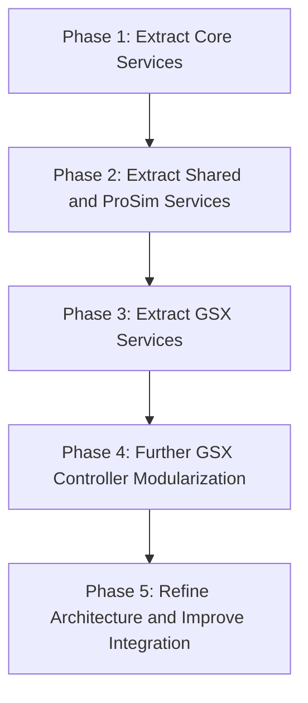

# Prosim2GSX Modularization Strategy

## Overview

This document outlines the strategy for implementing the modularization of the Prosim2GSX application. The modularization will improve code organization, maintainability, and testability by extracting functionality into well-defined services with clear interfaces.

## Current Environment

- **Application Type**: WPF Windows desktop application
- **Target Framework**: .NET 8.0-windows10.0.17763.0
- **Architecture**: Currently monolithic with some separation of concerns

## Modularization Approach

The modularization will be implemented in phases, with each phase focusing on a specific area of functionality. This approach allows for incremental improvements while maintaining a working application throughout the process.

## Phased Implementation Plan

### Phase 1: Extract Core Services

#### 1.1 SimConnectService

- [x] Create `Services` folder if it doesn't exist
- [x] Create `ISimConnectService.cs` interface file
- [x] Create `SimConnectService.cs` implementation file
- [x] Create or update `MobiDefinitions.cs` for required enums and structs
- [x] Update `MobiSimConnect.cs` to use SimConnectService
- [x] Update `IPCManager.cs` to work with SimConnectService
- [x] Add unit tests for SimConnectService
- [x] Test the implementation to ensure it works correctly

#### 1.2 ProsimService

- [x] Create `IProsimService.cs` interface file
- [x] Create `ProsimService.cs` implementation file
- [x] Update `ProsimInterface.cs` to use ProsimService
- [x] Update `ProsimController.cs` to work with the updated ProsimInterface
- [x] Add unit tests for ProsimService
- [x] Test the implementation to ensure it works correctly

### Phase 2: Extract Shared and ProSim Services

#### 2.1 AcarsService

- [x] Create `IAcarsService.cs` interface file
- [x] Create `AcarsService.cs` implementation file
- [x] Move ACARS-related methods from GsxController to AcarsService
  - [x] Move `FlightCallsignToOpsCallsign` method
  - [x] Move `FormatLoadSheet` method
  - [x] Move `GetWeightLimitation` method
  - [x] Move `GetLoadSheetDifferences` method
  - [x] Move `GetRandomName` method
  - [x] Move `GetRandomLicenceNumber` method
- [x] Update GsxController to use AcarsService
  - [x] Add AcarsService field
  - [x] Initialize AcarsService in constructor
  - [x] Update ACARS-related code to use AcarsService
- [x] Add unit tests for AcarsService
- [x] Test the implementation to ensure it works correctly

#### 2.2 FlightPlanService

- [x] Create `IFlightPlanService.cs` interface file
- [x] Create `FlightPlanService.cs` implementation file
- [x] Move flight plan loading and parsing logic from FlightPlan class to FlightPlanService
- [x] Update FlightPlan class to use FlightPlanService
- [ ] Add unit tests for FlightPlanService (see unit-testing-strategy.md)
- [x] Test the implementation to ensure it works correctly

#### 2.3 ProsimDoorService

- [x] Create `IProsimDoorService.cs` interface file
- [x] Create `ProsimDoorService.cs` implementation file
- [x] Move door-related methods from ProsimController to ProsimDoorService
  - [x] Move `SetAftRightDoor` method
  - [x] Move `SetForwardRightDoor` method
  - [x] Move `SetForwardCargoDoor` method
  - [x] Move `SetAftCargoDoor` method
- [x] Update ProsimController to use ProsimDoorService
- [ ] Add unit tests for ProsimDoorService (see unit-testing-strategy.md)
- [x] Test the implementation to ensure it works correctly

#### 2.4 ProsimEquipmentService

- [x] Create `IProsimEquipmentService.cs` interface file
- [x] Create `ProsimEquipmentService.cs` implementation file
- [x] Move equipment-related methods from ProsimController to ProsimEquipmentService
  - [x] Move `SetServicePCA` method
  - [x] Move `SetServiceChocks` method
  - [x] Move `SetServiceGPU` method
- [x] Update ProsimController to use ProsimEquipmentService
- [ ] Add unit tests for ProsimEquipmentService (see unit-testing-strategy.md)
- [x] Test the implementation to ensure it works correctly

#### 2.5 ProsimPassengerService

- [x] Create `IProsimPassengerService.cs` interface file
- [x] Create `ProsimPassengerService.cs` implementation file
- [x] Move passenger-related methods from ProsimController to ProsimPassengerService
  - [x] Move `RandomizePaxSeating` method
  - [x] Move `BoardingStart` method
  - [x] Move `Boarding` method
  - [x] Move `BoardPassengers` method
  - [x] Move `SendSeatString` method
  - [x] Move `BoardingStop` method
  - [x] Move `DeboardingStart` method
  - [x] Move `DeboardPassengers` method
  - [x] Move `Deboarding` method
  - [x] Move `DeboardingStop` method
- [x] Update ProsimController to use ProsimPassengerService
- [ ] Add unit tests for ProsimPassengerService (see unit-testing-strategy.md)
- [x] Test the implementation to ensure it works correctly

#### 2.6 ProsimCargoService

- [x] Create `IProsimCargoService.cs` interface file
- [x] Create `ProsimCargoService.cs` implementation file
- [x] Move cargo-related methods from ProsimController to ProsimCargoService
  - [x] Move `ChangeCargo` method
- [x] Update ProsimController to use ProsimCargoService
- [ ] Add unit tests for ProsimCargoService (see unit-testing-strategy.md)
- [x] Test the implementation to ensure it works correctly

#### 2.7 ProsimFuelService

- [x] Create `IProsimFuelService.cs` interface file
- [x] Create `ProsimFuelService.cs` implementation file
- [x] Create `WeightConversionUtility.cs` utility class
- [x] Move fuel-related methods from ProsimController to ProsimFuelService
  - [x] Move `SetInitialFuel` method
  - [x] Move `RefuelStart` method
  - [x] Move `Refuel` method
  - [x] Move `RefuelStop` method
  - [x] Move `GetFuelAmount` method
  - [x] Move `GetFuelRateKGS` method from ServiceModel
- [x] Update ProsimController to use ProsimFuelService
- [ ] Add unit tests for ProsimFuelService
- [x] Test the implementation to ensure it works correctly

#### 2.8 ProsimFlightDataService

- [x] Create `IProsimFlightDataService.cs` interface file
- [x] Create `ProsimFlightDataService.cs` implementation file
- [x] Move flight data-related methods from ProsimController to ProsimFlightDataService
  - [x] Move `GetLoadedData` method
  - [x] Move `GetFMSFlightNumber` method
  - [x] Move `GetZfwCG` method
  - [x] Move `GetTowCG` method
- [x] Update ProsimController to use ProsimFlightDataService
- [ ] Add unit tests for ProsimFlightDataService
- [x] Test the implementation to ensure it works correctly

#### 2.9 ProsimFluidService

- [x] Create `IProsimFluidService.cs` interface file
- [x] Create `ProsimFluidService.cs` implementation file
- [x] Move fluid-related methods from ProsimController to ProsimFluidService
  - [x] Move `SetInitialFluids` method
  - [x] Move `GetHydraulicFluidValues` method
- [x] Update ProsimController to use ProsimFluidService
- [ ] Add unit tests for ProsimFluidService
- [ ] Test the implementation to ensure it works correctly
- [x] Create implementation plan (available in to-do/modularization-implementation-phase2.9.md)

#### 2.10 Create Shared Service Interfaces

- [x] Create `IPassengerService.cs` interface file
  - [x] Define methods for passenger management
  - [x] Define boarding/deboarding operations
- [x] Create `ICargoService.cs` interface file
  - [x] Define methods for cargo management
  - [x] Define loading/unloading operations
- [x] Create `IFuelService.cs` interface file
  - [x] Define methods for fuel management
  - [x] Define refueling operations

### Phase 3: Extract GSX Services

The GSXController has grown too large and complex, handling multiple responsibilities. In Phase 3, we'll break it down into smaller, more focused services following the Single Responsibility Principle.

#### 3.1 GSXMenuService

This phase extracts menu interaction functionality from the GsxController into a separate service following the Single Responsibility Principle.

**Timeline: 2-3 days** ✅ **Completed**

- [x] Create `IGSXMenuService.cs` interface file (0.5 day)
  - [x] Define methods for menu interaction
  - [x] Define operator selection methods
  - [x] Add `OperatorWasSelected` property
- [x] Create `GSXMenuService.cs` implementation file (1 day)
  - [x] Move menu-related methods from GsxController
    - [x] Move `MenuOpen` method
    - [x] Move `MenuItem` method
    - [x] Move `MenuWaitReady` method
    - [x] Move `IsOperatorSelectionActive` method
    - [x] Move `OperatorSelection` method
  - [x] Implement interface methods
  - [x] Add proper error handling and logging
- [x] Update GsxController to use this service (0.5 day)
  - [x] Add service field and constructor parameter
  - [x] Replace direct method calls with service calls
  - [x] Update `RunServices` method to use `menuService.OperatorWasSelected`
- [x] Update ServiceController to initialize the new service
- [x] Test the implementation to ensure it works correctly
- [ ] Add unit tests for GSXMenuService
  - [ ] Test normal operation paths
  - [ ] Test error handling paths
  - [ ] Test edge cases

**Key Dependencies:**
- Windows Registry access for GSXMenuService
- SimConnect for reading/writing L-vars

**Implementation Summary:**
- Successfully extracted menu interaction functionality from GsxController
- Created a well-defined interface with clear methods for menu operations
- Implemented robust error handling with try-catch blocks and detailed logging
- Updated GsxController to delegate all menu operations to the new service
- Modified ServiceController to initialize and inject the service
- Achieved improved separation of concerns and better maintainability
- Implementation details available in to-do/modularization-implementation-phase3.1.md
- Implementation summary available in to-do/modularization-implementation-phase3.1-summary.md

#### 3.2 GSXAudioService

This phase extracts audio control functionality from the GsxController into a separate service following the Single Responsibility Principle, with enhanced testability, thread safety, and event-based communication.

**Timeline: 5-5.5 days** ✅ **Completed**
**Confidence Score: 10/10** (Improved from 9/10)

- [x] Create `IAudioSessionManager.cs` interface and implementation (0.5 day)
  - [x] Define abstraction for CoreAudio functionality
  - [x] Implement concrete version using actual CoreAudio APIs
  - [x] Add proper error handling and logging

- [x] Create `IGSXAudioService.cs` interface file (0.5 day)
  - [x] Define methods for audio control
  - [x] Define audio session management methods
  - [x] Add events for state changes (AudioSessionFound, VolumeChanged, MuteChanged)
  - [x] Add async methods with cancellation support

- [x] Create `GSXAudioService.cs` implementation file (2 days)
  - [x] Move audio-related methods from GsxController
    - [x] Move `GetAudioSessions` method
    - [x] Move `ResetAudio` method
    - [x] Move `ControlAudio` method
  - [x] Implement interface methods
  - [x] Break down large methods into smaller, focused methods:
    - [x] `ControlGsxAudio` method
    - [x] `ControlVhf1Audio` method
    - [x] `HandleAppChange` method
    - [x] `HandleProcessExits` method
  - [x] Add proper error handling and logging
  - [x] Implement thread safety with locks
  - [x] Add event-based communication
  - [x] Add retry mechanisms for audio session acquisition
  - [x] Implement async versions of methods with cancellation support
  - [x] Add configurable properties for retry counts, delays, etc.

- [x] Update GsxController to use this service (0.5 day)
  - [x] Add service field and constructor parameter
  - [x] Replace direct method calls with service calls
  - [x] Subscribe to service events

- [x] Update ServiceController to initialize the new service (0.5 day)
  - [x] Create AudioSessionManager
  - [x] Initialize GSXAudioService with dependencies
  - [x] Configure service properties

- [ ] Add unit tests for GSXAudioService (1.5 days)
  - [ ] Test normal operation paths
  - [ ] Test error handling paths
  - [ ] Test edge cases
  - [ ] Test thread safety
  - [ ] Test event raising
  - [ ] Test cancellation support
  - [ ] Test retry mechanisms

- [x] Test the implementation to ensure it works correctly

**Key Dependencies:**
- CoreAudio library for GSXAudioService (abstracted through IAudioSessionManager)
- SimConnect for reading/writing L-vars
- System.Threading for thread safety
- System.Threading.Tasks for async operations

**Implementation Summary:**
- Successfully extracted audio control functionality from GsxController
- Created IAudioSessionManager interface and CoreAudioSessionManager implementation
- Created IGSXAudioService interface with both synchronous and asynchronous methods
- Implemented GSXAudioService with proper thread safety using lock objects
- Added comprehensive error handling and detailed logging
- Implemented event-based communication for audio state changes
- Added retry mechanisms for audio session acquisition
- Updated GsxController to use the new service with event subscriptions
- Modified ServiceController to initialize and configure the service
- Achieved improved separation of concerns and better maintainability
- Implementation details available in to-do/modularization-implementation-phase3.2.md

#### 3.3 GSXStateManager

- [ ] Create `IGSXStateManager.cs` interface file
  - [ ] Define methods for state management
  - [ ] Define state transition methods
  - [ ] Define events for state changes
- [ ] Create `GSXStateManager.cs` implementation file
  - [ ] Move state-related fields and methods from GsxController
    - [ ] Move `state` field and related properties
    - [ ] Extract state transition logic from `RunServices`
  - [ ] Implement state transition logic
  - [ ] Add event-based notification for state changes
- [ ] Update GsxController to use this service
  - [ ] Add service field and constructor parameter
  - [ ] Replace direct state management with service calls
- [ ] Add unit tests for GSXStateManager
- [ ] Test the implementation to ensure it works correctly
- [ ] Create implementation plan (available in to-do/modularization-implementation-phase3.2.md)

#### 3.4 GSXServiceCoordinator

- [ ] Create `IGSXServiceCoordinator.cs` interface file
  - [ ] Define methods for service coordination
  - [ ] Define service operation methods
- [ ] Create `GSXServiceCoordinator.cs` implementation file
  - [ ] Move service-related methods from GsxController
    - [ ] Extract `RunLoadingServices` method
    - [ ] Extract `RunDEPARTUREServices` method
    - [ ] Extract `RunArrivalServices` method
    - [ ] Extract `RunDeboardingService` method
  - [ ] Implement service coordination logic
- [ ] Update GsxController to use this service
  - [ ] Add service field and constructor parameter
  - [ ] Replace direct service coordination with service calls
- [ ] Add unit tests for GSXServiceCoordinator
- [ ] Test the implementation to ensure it works correctly
- [ ] Create implementation plan (available in to-do/modularization-implementation-phase3.3.md)

#### 3.5 GSXDoorManager and GSXEquipmentManager

- [ ] Create `IGSXDoorManager.cs` interface file
  - [ ] Define methods for door management
  - [ ] Define door state tracking methods
- [ ] Create `GSXDoorManager.cs` implementation file
  - [ ] Move door-related methods and fields from GsxController
    - [ ] Extract door state fields (aftCargoDoorOpened, aftRightDoorOpened, etc.)
    - [ ] Extract door control logic
  - [ ] Implement door management logic
- [ ] Create `IGSXEquipmentManager.cs` interface file
  - [ ] Define methods for equipment management
  - [ ] Define equipment state tracking methods
- [ ] Create `GSXEquipmentManager.cs` implementation file
  - [ ] Move equipment-related methods and fields from GsxController
    - [ ] Extract equipment state fields
    - [ ] Extract equipment control logic
    - [ ] Move `CallJetwayStairs` method
  - [ ] Implement equipment management logic
- [ ] Update GsxController to use these services
  - [ ] Add service fields and constructor parameters
  - [ ] Replace direct door and equipment management with service calls
- [ ] Add unit tests for both services
- [ ] Test the implementation to ensure it works correctly
- [ ] Create implementation plan (available in to-do/modularization-implementation-phase3.4.md)

#### 3.6 GSXLoadsheetManager

- [ ] Create `IGSXLoadsheetManager.cs` interface file
  - [ ] Define methods for loadsheet management
  - [ ] Define loadsheet formatting methods
- [ ] Create `GSXLoadsheetManager.cs` implementation file
  - [ ] Move loadsheet-related methods from GsxController
    - [ ] Move `FormatLoadSheet` method
    - [ ] Move `GetWeightLimitation` method
    - [ ] Move `GetLoadSheetDifferences` method
    - [ ] Move `GetRandomName` method
    - [ ] Move `GetRandomLicenceNumber` method
  - [ ] Implement loadsheet management logic
- [ ] Update GsxController to use this service
  - [ ] Add service field and constructor parameter
  - [ ] Replace direct loadsheet management with service calls
- [ ] Add unit tests for GSXLoadsheetManager
- [ ] Test the implementation to ensure it works correctly
- [ ] Create implementation plan (available in to-do/modularization-implementation-phase3.5.md)

#### 3.7 Refine GsxController

- [ ] Refactor GsxController to be a thin facade
  - [ ] Remove all extracted functionality
  - [ ] Delegate to appropriate services
  - [ ] Maintain public interface
  - [ ] Simplify RunServices method
- [ ] Update ServiceController to use the new architecture
  - [ ] Ensure proper service initialization
  - [ ] Manage service lifecycle
- [ ] Add comprehensive integration tests
- [ ] Test the implementation to ensure it works correctly
- [ ] Create implementation plan (available in to-do/modularization-implementation-phase3.6.md)

### Phase 4: Further GSX Controller Modularization

The GSXController has been partially modularized in Phase 3, but it's still quite large and complex. Phase 4 will further break it down into smaller, more focused components following the Single Responsibility Principle.

#### 4.1 Create GSXControllerFacade

- [ ] Create `IGSXControllerFacade.cs` interface file
  - [ ] Define methods for initializing and managing GSX services
  - [ ] Define methods for handling high-level operations
  - [ ] Define events for major state changes
- [ ] Create `GSXControllerFacade.cs` implementation file
  - [ ] Implement interface methods
  - [ ] Initialize and manage all GSX services
  - [ ] Delegate operations to the appropriate services
  - [ ] Handle high-level error recovery
- [ ] Update ServiceController to use GSXControllerFacade
  - [ ] Replace direct GsxController usage with GSXControllerFacade
  - [ ] Update initialization and lifecycle management
- [ ] Create implementation plan (available in to-do/modularization-implementation-phase4.md)

#### 4.2 Enhance GSXStateMachine

- [ ] Enhance `IGSXStateManager.cs` interface
  - [ ] Add methods for state validation
  - [ ] Add methods for state-specific behavior
  - [ ] Add events for state transitions
- [ ] Enhance `GSXStateManager.cs` implementation
  - [ ] Implement enhanced interface methods
  - [ ] Improve state transition logic
  - [ ] Add validation for state transitions
  - [ ] Implement state-specific behavior
- [ ] Update GSXControllerFacade to use enhanced GSXStateManager
  - [ ] Delegate state management to GSXStateManager
  - [ ] React to state transition events

#### 4.3 Create GSXServiceOrchestrator

- [ ] Create `IGSXServiceOrchestrator.cs` interface file
  - [ ] Define methods for coordinating service execution
  - [ ] Define methods for managing service timing
  - [ ] Define events for service execution status
- [ ] Create `GSXServiceOrchestrator.cs` implementation file
  - [ ] Implement interface methods
  - [ ] Coordinate service execution based on state
  - [ ] Manage service timing and sequencing
  - [ ] Handle service dependencies
- [ ] Update GSXControllerFacade to use GSXServiceOrchestrator
  - [ ] Delegate service coordination to GSXServiceOrchestrator
  - [ ] React to service execution events

#### 4.4 Create GSXDoorCoordinator

- [ ] Create `IGSXDoorCoordinator.cs` interface file
  - [ ] Define methods for door operations
  - [ ] Define methods for door state tracking
  - [ ] Define events for door state changes
- [ ] Create `GSXDoorCoordinator.cs` implementation file
  - [ ] Implement interface methods
  - [ ] Manage door operations
  - [ ] Track door states
  - [ ] Coordinate door operations with services
- [ ] Update GSXControllerFacade to use GSXDoorCoordinator
  - [ ] Delegate door operations to GSXDoorCoordinator
  - [ ] React to door state change events

#### 4.5 Create GSXEquipmentCoordinator

- [ ] Create `IGSXEquipmentCoordinator.cs` interface file
  - [ ] Define methods for equipment operations
  - [ ] Define methods for equipment state tracking
  - [ ] Define events for equipment state changes
- [ ] Create `GSXEquipmentCoordinator.cs` implementation file
  - [ ] Implement interface methods
  - [ ] Manage equipment operations
  - [ ] Track equipment states
  - [ ] Coordinate equipment operations with services
- [ ] Update GSXControllerFacade to use GSXEquipmentCoordinator
  - [ ] Delegate equipment operations to GSXEquipmentCoordinator
  - [ ] React to equipment state change events

#### 4.6 Create GSXPassengerCoordinator

- [ ] Create `IGSXPassengerCoordinator.cs` interface file
  - [ ] Define methods for passenger operations
  - [ ] Define methods for passenger count tracking
  - [ ] Define events for passenger state changes
- [ ] Create `GSXPassengerCoordinator.cs` implementation file
  - [ ] Implement interface methods
  - [ ] Manage passenger boarding and deboarding
  - [ ] Track passenger counts
  - [ ] Coordinate passenger operations with services
- [ ] Update GSXControllerFacade to use GSXPassengerCoordinator
  - [ ] Delegate passenger operations to GSXPassengerCoordinator
  - [ ] React to passenger state change events

#### 4.7 Create GSXCargoCoordinator

- [ ] Create `IGSXCargoCoordinator.cs` interface file
  - [ ] Define methods for cargo operations
  - [ ] Define methods for cargo state tracking
  - [ ] Define events for cargo state changes
- [ ] Create `GSXCargoCoordinator.cs` implementation file
  - [ ] Implement interface methods
  - [ ] Manage cargo loading and unloading
  - [ ] Track cargo states
  - [ ] Coordinate cargo operations with services
- [ ] Update GSXControllerFacade to use GSXCargoCoordinator
  - [ ] Delegate cargo operations to GSXCargoCoordinator
  - [ ] React to cargo state change events

#### 4.8 Create GSXFuelCoordinator

- [ ] Create `IGSXFuelCoordinator.cs` interface file
  - [ ] Define methods for fuel operations
  - [ ] Define methods for fuel state tracking
  - [ ] Define events for fuel state changes
- [ ] Create `GSXFuelCoordinator.cs` implementation file
  - [ ] Implement interface methods
  - [ ] Manage refueling operations
  - [ ] Track fuel states
  - [ ] Coordinate fuel operations with services
- [ ] Update GSXControllerFacade to use GSXFuelCoordinator
  - [ ] Delegate fuel operations to GSXFuelCoordinator
  - [ ] React to fuel state change events

#### 4.9 Comprehensive Testing

- [ ] Create unit tests for all new components
  - [ ] Test component initialization
  - [ ] Test component methods
  - [ ] Test component events
  - [ ] Test component interactions
- [ ] Create integration tests for component interactions
  - [ ] Test state transitions
  - [ ] Test service coordination
  - [ ] Test error handling
  - [ ] Test end-to-end workflows
- [ ] Create performance tests
  - [ ] Test resource usage
  - [ ] Test response times
  - [ ] Test scalability

### Phase 5: Refine Architecture and Improve Integration

#### 5.1 Refine Service Interactions

- [ ] Review and refine service interactions
  - [ ] Identify and resolve circular dependencies
  - [ ] Optimize service dependencies
  - [ ] Ensure proper separation of concerns
- [ ] Implement event-based communication where appropriate
  - [ ] Define events for state changes
  - [ ] Define events for service operations
  - [ ] Reduce tight coupling between services
- [ ] Ensure proper error handling and recovery
  - [ ] Handle service failures
  - [ ] Implement retry mechanisms
  - [ ] Add comprehensive logging

#### 5.2 Improve Controller Architecture

- [ ] Refactor ProsimController to be a thin facade
  - [ ] Delegate to appropriate services
  - [ ] Maintain public interface
  - [ ] Remove any remaining business logic
- [ ] Update ServiceController to use the new architecture
  - [ ] Ensure proper service initialization
  - [ ] Manage service lifecycle
  - [ ] Implement proper dependency injection

#### 5.3 Comprehensive Testing

- [ ] Implement integration tests
  - [ ] Test interactions between services
  - [ ] Verify end-to-end workflows
  - [ ] Test with real external dependencies
- [ ] Implement performance tests
  - [ ] Measure resource usage
  - [ ] Identify bottlenecks
  - [ ] Optimize critical paths
- [ ] Implement regression tests
  - [ ] Ensure existing functionality continues to work
  - [ ] Verify that performance remains acceptable
  - [ ] Check for any unexpected side effects

## Unit Testing Strategy

A comprehensive unit testing strategy has been developed to ensure the quality and reliability of the modularized codebase. The strategy is documented in `unit-testing-strategy.md` and includes:

1. **Testing Framework and Tools**
   - MSTest as the primary testing framework
   - Moq for mocking dependencies
   - Optional FluentAssertions for more readable assertions

2. **Testing Approach**
   - Constructor tests to verify proper initialization
   - Method tests to verify behavior with various inputs
   - Event tests to verify events are raised correctly
   - Integration tests to verify interaction with dependencies

3. **Implementation Timeline**
   - Phase 1: Complete tests for existing services
   - Phase 2: Add tests for future services as they're implemented
   - Phase 3: Add tests for GSX services
   - Phase 4: Add tests for controllers

4. **Test Coverage Goals**
   - Services: 80%+ code coverage
   - Controllers: 70%+ code coverage
   - Core Logic: 90%+ code coverage
   - Edge Cases: Test all error handling paths

For detailed implementation examples and guidelines, refer to the `unit-testing-strategy.md` document.

## Benefits of Modularization

1. **Improved Maintainability**
   - Smaller, focused components are easier to understand and modify
   - Clear separation of concerns reduces side effects
   - Better organization makes code navigation easier

2. **Enhanced Testability**
   - Services with clear interfaces are easier to test in isolation
   - Dependency injection enables better mocking for tests
   - Reduced coupling makes unit testing more effective
   - Comprehensive test strategy ensures quality and reliability

3. **Better Extensibility**
   - New features can be added with minimal changes to existing code
   - Services can be enhanced independently
   - New integrations can be implemented without affecting core functionality

4. **Reduced Complexity**
   - Each service has a single responsibility
   - Dependencies are explicit and manageable
   - State management is more predictable

## Risks and Mitigations

| Risk | Impact | Likelihood | Mitigation |
|------|--------|------------|------------|
| Breaking existing functionality | High | Medium | Implement changes incrementally with thorough testing after each phase |
| Introducing performance overhead | Medium | Low | Monitor performance metrics and optimize as needed |
| Creating overly complex architecture | Medium | Medium | Regular code reviews to ensure appropriate abstraction levels |
| Circular dependencies | High | Medium | Careful design of service interfaces and use of dependency injection |

## Testing Strategy

1. **Unit Testing**
   - Create unit tests for each service
   - Test service interfaces thoroughly
   - Verify behavior with different inputs

2. **Integration Testing**
   - Test interactions between services
   - Verify end-to-end workflows
   - Test with real external dependencies

3. **Regression Testing**
   - Ensure existing functionality continues to work
   - Verify that performance remains acceptable
   - Check for any unexpected side effects

## Additional Modularization Improvements

To further enhance the modularization effort, the following improvements will be applied across all phases:

### 1. Enhanced Service Design

- **Interface Segregation**: Split large interfaces into more focused ones following the Interface Segregation Principle
- **Composable Services**: Design services to be composable, with each focusing on a single responsibility
- **Helper Classes**: Extract complex logic into dedicated helper classes
- **Factory Patterns**: Use factory patterns for creating complex objects

### 2. Improved Dependency Management

- **Explicit Dependencies**: Make all dependencies explicit through constructor injection
- **Optional Dependencies**: Handle optional dependencies gracefully
- **Lazy Initialization**: Use lazy initialization for services that aren't always needed
- **Service Locator**: Consider a lightweight service locator for complex dependency scenarios

### 3. Robust Error Handling

- **Service-Specific Exceptions**: Create custom exceptions for each service
- **Retry Mechanisms**: Implement retry policies for transient failures
- **Circuit Breaker Pattern**: Add circuit breakers for external dependencies
- **Graceful Degradation**: Ensure services can operate in degraded mode when dependencies fail

### 4. Comprehensive Testing Strategy

- **Test Fixtures**: Develop reusable test fixtures for common scenarios
- **Integration Tests**: Test interactions between services
- **Mock External Dependencies**: Create mocks for Windows Registry, CoreAudio, etc.
- **Test Configuration Variations**: Test with different service configurations
- **Performance Testing**: Add tests for performance-critical paths

### 5. Event-Based Communication

- **Service Events**: Add events for significant state changes
- **Observer Pattern**: Allow services to subscribe to events from other services
- **Loose Coupling**: Use events to reduce direct dependencies between services
- **State Change Notifications**: Notify interested parties of state changes

### 6. Threading Considerations

- **Thread Safety Documentation**: Clearly document thread safety guarantees
- **Synchronization Mechanisms**: Add appropriate locks or other synchronization mechanisms
- **Async Patterns**: Use async/await for I/O-bound operations
- **Thread Isolation**: Isolate thread-sensitive operations

### 7. Enhanced Documentation

- **XML Documentation**: Ensure comprehensive XML comments for all public members
- **Architecture Diagrams**: Add diagrams showing service interactions
- **Dependency Documentation**: Clearly document external dependencies
- **Usage Examples**: Include usage examples in documentation

### 8. Incremental Implementation

- **Core Functionality First**: Implement essential features before advanced ones
- **Phased Testing**: Test each increment before moving to the next
- **Continuous Integration**: Ensure each phase integrates with the existing system

### 9. Extension Points

- **Plugin Architecture**: Design for extensibility with clear extension points
- **Configuration-Driven Behavior**: Make behavior configurable where appropriate
- **Strategy Pattern**: Use strategy pattern for interchangeable algorithms

### 10. Progress Tracking

- **Clear Acceptance Criteria**: Define acceptance criteria for each phase
- **Milestone Checkpoints**: Add checkpoints within each implementation phase
- **Validation Tests**: Create tests that verify a phase is complete

## Conclusion

The modularization of Prosim2GSX will significantly improve the codebase's maintainability, testability, and extensibility. By following this phased approach and implementing the additional improvements, we can create a robust, flexible architecture while maintaining a working application throughout the process.
