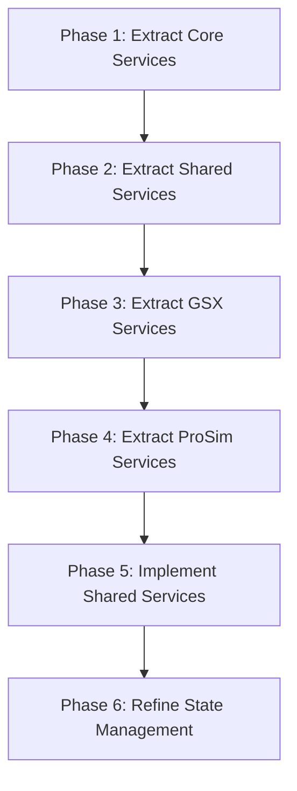

# Prosim2GSX Modularization Strategy

## Overview

This document outlines the strategy for implementing the modularization of the Prosim2GSX application. The modularization will improve code organization, maintainability, and testability by extracting functionality into well-defined services with clear interfaces.

## Current Environment

- **Application Type**: WPF Windows desktop application
- **Target Framework**: .NET 8.0-windows10.0.17763.0
- **Architecture**: Currently monolithic with some separation of concerns

## Modularization Approach

The modularization will be implemented in phases, with each phase focusing on a specific area of functionality. This approach allows for incremental improvements while maintaining a working application throughout the process.

## Phased Implementation Plan

### Phase 1: Extract Core Services

#### 1.1 SimConnectService

- [x] Create `Services` folder if it doesn't exist
- [x] Create `ISimConnectService.cs` interface file
- [x] Create `SimConnectService.cs` implementation file
- [x] Create or update `MobiDefinitions.cs` for required enums and structs
- [x] Update `MobiSimConnect.cs` to use SimConnectService
- [x] Update `IPCManager.cs` to work with SimConnectService
- [x] Add unit tests for SimConnectService
- [x] Test the implementation to ensure it works correctly

#### 1.2 ProsimService

- [ ] Create `IProsimService.cs` interface file
- [ ] Create `ProsimService.cs` implementation file
- [ ] Update `ProsimInterface.cs` to use ProsimService
- [ ] Update `ProsimController.cs` to work with the updated ProsimInterface
- [ ] Add unit tests for ProsimService
- [ ] Test the implementation to ensure it works correctly

### Phase 2: Extract Shared Services

#### 2.1 AcarsService

- [ ] Create `IAcarsService.cs` interface file
- [ ] Create `AcarsService.cs` implementation file
- [ ] Move ACARS-related methods from GsxController to AcarsService
  - [ ] Move `FlightCallsignToOpsCallsign` method
  - [ ] Move `FormatLoadSheet` method
  - [ ] Move `GetWeightLimitation` method
  - [ ] Move `GetLoadSheetDifferences` method
  - [ ] Move `GetRandomName` method
  - [ ] Move `GetRandomLicenceNumber` method
- [ ] Update GsxController to use AcarsService
  - [ ] Add AcarsService field
  - [ ] Initialize AcarsService in constructor
  - [ ] Update ACARS-related code to use AcarsService
- [ ] Add unit tests for AcarsService
- [ ] Test the implementation to ensure it works correctly

#### 2.2 FlightPlanService

- [ ] Create `IFlightPlanService.cs` interface file
- [ ] Create `FlightPlanService.cs` implementation file
- [ ] Move flight plan loading and parsing logic from FlightPlan class to FlightPlanService
- [ ] Update FlightPlan class to use FlightPlanService
- [ ] Add unit tests for FlightPlanService
- [ ] Test the implementation to ensure it works correctly

#### 2.3 Create Shared Service Interfaces

- [ ] Create `IPassengerService.cs` interface file
  - [ ] Define methods for passenger management
  - [ ] Define boarding/deboarding operations
- [ ] Create `ICargoService.cs` interface file
  - [ ] Define methods for cargo management
  - [ ] Define loading/unloading operations
- [ ] Create `IFuelService.cs` interface file
  - [ ] Define methods for fuel management
  - [ ] Define refueling operations

### Phase 3: Extract GSX Services

#### 3.1 GSXMenuService

- [ ] Create `IGSXMenuService.cs` interface file
- [ ] Create `GSXMenuService.cs` implementation file
- [ ] Move menu-related methods from GsxController to GSXMenuService
  - [ ] Move `MenuOpen` method
  - [ ] Move `MenuItem` method
  - [ ] Move `MenuWaitReady` method
  - [ ] Move `IsOperatorSelectionActive` method
  - [ ] Move `OperatorSelection` method
- [ ] Update GsxController to use GSXMenuService
- [ ] Add unit tests for GSXMenuService
- [ ] Test the implementation to ensure it works correctly

#### 3.2 GSXAudioService

- [ ] Create `IGSXAudioService.cs` interface file
- [ ] Create `GSXAudioService.cs` implementation file
- [ ] Move audio-related methods from GsxController to GSXAudioService
  - [ ] Move `GetAudioSessions` method
  - [ ] Move `ResetAudio` method
  - [ ] Move `ControlAudio` method
- [ ] Update GsxController to use GSXAudioService
- [ ] Add unit tests for GSXAudioService
- [ ] Test the implementation to ensure it works correctly

### Phase 4: Extract ProSim Services

#### 4.1 ProsimDoorService

- [ ] Create `IProsimDoorService.cs` interface file
- [ ] Create `ProsimDoorService.cs` implementation file
- [ ] Move door-related methods from ProsimController to ProsimDoorService
  - [ ] Move `SetAftRightDoor` method
  - [ ] Move `SetForwardRightDoor` method
  - [ ] Move `SetForwardCargoDoor` method
  - [ ] Move `SetAftCargoDoor` method
- [ ] Update ProsimController to use ProsimDoorService
- [ ] Add unit tests for ProsimDoorService
- [ ] Test the implementation to ensure it works correctly

#### 4.2 ProsimEquipmentService

- [ ] Create `IProsimEquipmentService.cs` interface file
- [ ] Create `ProsimEquipmentService.cs` implementation file
- [ ] Move equipment-related methods from ProsimController to ProsimEquipmentService
  - [ ] Move `SetServicePCA` method
  - [ ] Move `SetServiceChocks` method
  - [ ] Move `SetServiceGPU` method
- [ ] Update ProsimController to use ProsimEquipmentService
- [ ] Add unit tests for ProsimEquipmentService
- [ ] Test the implementation to ensure it works correctly

### Phase 5: Implement Shared Services

#### 5.1 PassengerService

- [ ] Create `PassengerService.cs` implementation file
- [ ] Move passenger-related methods from both controllers to PassengerService
  - [ ] Move `RandomizePaxSeating` method from ProsimController
  - [ ] Move `BoardingStart` method from ProsimController
  - [ ] Move `Boarding` method from ProsimController
  - [ ] Move `BoardPassengers` method from ProsimController
  - [ ] Move `SendSeatString` method from ProsimController
  - [ ] Move `BoardingStop` method from ProsimController
  - [ ] Move `DeboardingStart` method from ProsimController
  - [ ] Move `DeboardPassengers` method from ProsimController
  - [ ] Move `Deboarding` method from ProsimController
  - [ ] Move `DeboardingStop` method from ProsimController
  - [ ] Move `SetPassengers` method from GsxController
- [ ] Update GsxController to use PassengerService
- [ ] Update ProsimController to use PassengerService
- [ ] Add unit tests for PassengerService
- [ ] Test the implementation to ensure it works correctly

#### 5.2 CargoService

- [ ] Create `CargoService.cs` implementation file
- [ ] Move cargo-related methods from both controllers to CargoService
  - [ ] Move `ChangeCargo` method from ProsimController
- [ ] Update GsxController to use CargoService
- [ ] Update ProsimController to use CargoService
- [ ] Add unit tests for CargoService
- [ ] Test the implementation to ensure it works correctly

#### 5.3 FuelService

- [ ] Create `FuelService.cs` implementation file
- [ ] Move fuel-related methods from both controllers to FuelService
  - [ ] Move `SetInitialFuel` method from ProsimController
  - [ ] Move `RefuelStart` method from ProsimController
  - [ ] Move `Refuel` method from ProsimController
  - [ ] Move `RefuelStop` method from ProsimController
  - [ ] Move `GetFuelAmount` method from ProsimController
  - [ ] Move `GetFuelRateKGS` method from ServiceModel
- [ ] Update GsxController to use FuelService
- [ ] Update ProsimController to use FuelService
- [ ] Add unit tests for FuelService
- [ ] Test the implementation to ensure it works correctly

### Phase 6: Refine State Management

#### 6.1 GSXStateManager

- [ ] Create `IGSXStateManager.cs` interface file
- [ ] Create `GSXStateManager.cs` implementation file
- [ ] Move state-related methods from GsxController to GSXStateManager
  - [ ] Move state transition logic
  - [ ] Move state-specific behavior
  - [ ] Extract `RunLoadingServices` method
  - [ ] Extract `RunDEPARTUREServices` method
  - [ ] Extract `RunArrivalServices` method
  - [ ] Extract `RunDeboardingService` method
- [ ] Update GsxController to use GSXStateManager
- [ ] Add unit tests for GSXStateManager
- [ ] Test the implementation to ensure it works correctly

#### 6.2 Refine Service Coordination

- [ ] Review and refine service interactions
  - [ ] Identify and resolve circular dependencies
  - [ ] Optimize service dependencies
- [ ] Implement event-based communication where appropriate
  - [ ] Define events for state changes
  - [ ] Define events for service operations
- [ ] Ensure proper error handling and recovery
  - [ ] Handle service failures
  - [ ] Implement retry mechanisms

#### 6.3 Update Controllers

- [ ] Refactor GsxController to be a thin facade
  - [ ] Delegate to appropriate services
  - [ ] Maintain public interface
- [ ] Refactor ProsimController to be a thin facade
  - [ ] Delegate to appropriate services
  - [ ] Maintain public interface
- [ ] Update ServiceController to use the new architecture
  - [ ] Ensure proper service initialization
  - [ ] Manage service lifecycle

## Benefits of Modularization

1. **Improved Maintainability**
   - Smaller, focused components are easier to understand and modify
   - Clear separation of concerns reduces side effects
   - Better organization makes code navigation easier

2. **Enhanced Testability**
   - Services with clear interfaces are easier to test in isolation
   - Dependency injection enables better mocking for tests
   - Reduced coupling makes unit testing more effective

3. **Better Extensibility**
   - New features can be added with minimal changes to existing code
   - Services can be enhanced independently
   - New integrations can be implemented without affecting core functionality

4. **Reduced Complexity**
   - Each service has a single responsibility
   - Dependencies are explicit and manageable
   - State management is more predictable

## Risks and Mitigations

| Risk | Impact | Likelihood | Mitigation |
|------|--------|------------|------------|
| Breaking existing functionality | High | Medium | Implement changes incrementally with thorough testing after each phase |
| Introducing performance overhead | Medium | Low | Monitor performance metrics and optimize as needed |
| Creating overly complex architecture | Medium | Medium | Regular code reviews to ensure appropriate abstraction levels |
| Circular dependencies | High | Medium | Careful design of service interfaces and use of dependency injection |

## Testing Strategy

1. **Unit Testing**
   - Create unit tests for each service
   - Test service interfaces thoroughly
   - Verify behavior with different inputs

2. **Integration Testing**
   - Test interactions between services
   - Verify end-to-end workflows
   - Test with real external dependencies

3. **Regression Testing**
   - Ensure existing functionality continues to work
   - Verify that performance remains acceptable
   - Check for any unexpected side effects

## Conclusion

The modularization of Prosim2GSX will significantly improve the codebase's maintainability, testability, and extensibility. By following this phased approach, we can implement the changes incrementally while maintaining a working application throughout the process.
